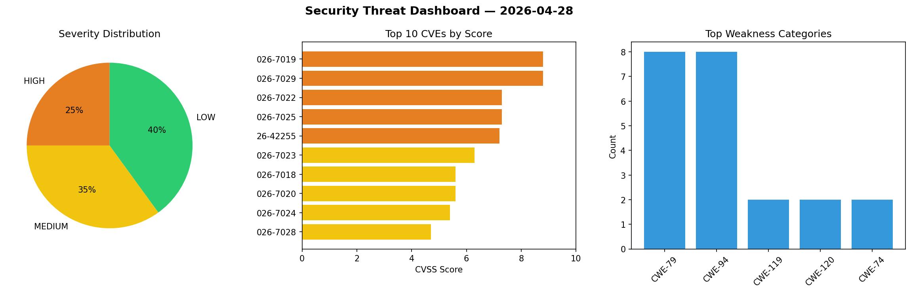
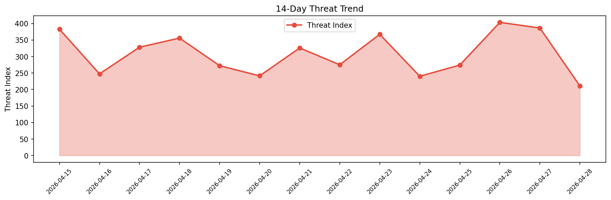

# Security Scan Report — 2026-04-28

**Scan ID:** `23a8fa0fef` | **CVEs:** 20 | **Threat Index:** 210.7

## Threat Overview

| Metric | Value |
|--------|-------|
| Threat Index | 210.7 |
| Critical CVEs | 0 |
| HIGH | 5 |
| MEDIUM | 7 |
| LOW | 8 |

## Delta vs Yesterday

| Metric | Today | Yesterday | Change |
|--------|-------|-----------|--------|
| total_cves | 20 | 20 | ➡️ 0.0% |
| threat_index | 210.7 | 386.3 | 📉 -45.5% |
| critical_count | 0 | 3 | 📉 -100.0% |

## Top Weakness Categories

| CWE | Count |
|-----|-------|
| CWE-79 | 8 |
| CWE-94 | 8 |
| CWE-119 | 2 |
| CWE-120 | 2 |
| CWE-74 | 2 |

## CVE Details

| CVE ID | Score | Severity | Description |
|--------|-------|----------|-------------|
| CVE-2026-7019 | 8.8 | HIGH | A vulnerability was identified in Tenda F456 1.0.0.5. The impacted element is th... |
| CVE-2026-7029 | 8.8 | HIGH | A weakness has been identified in Tenda F456 1.0.0.5. The impacted element is th... |
| CVE-2026-7022 | 7.3 | HIGH | A security vulnerability has been detected in SmythOS sre up to 0.0.15. Affected... |
| CVE-2026-7025 | 7.3 | HIGH | A vulnerability was found in Typecho up to 1.3.0. This vulnerability affects the... |
| CVE-2026-42255 | 7.2 | HIGH | Technitium DNS Server before 15.0 allows DNS traffic amplification via cyclic na... |
| CVE-2026-7023 | 6.3 | MEDIUM | A vulnerability was detected in ByteDance coze-studio up to 0.5.1. Affected by t... |
| CVE-2026-7018 | 5.6 | MEDIUM | A vulnerability was determined in Datavane Datavines up to 13607645e14a4982468cf... |
| CVE-2026-7020 | 5.6 | MEDIUM | A security flaw has been discovered in Ollama up to 0.20.2. This affects the fun... |
| CVE-2026-7024 | 5.4 | MEDIUM | A flaw has been found in rawchen sims up to 004f783b1db5ecdfad81c8fdc3b341712111... |
| CVE-2026-7028 | 4.7 | MEDIUM | A security flaw has been discovered in CodeAstro Online Job Portal 1.0. The affe... |
| CVE-2026-7026 | 4.5 | MEDIUM | A vulnerability was determined in D-Link DGS-3420 1.50.018. This issue affects s... |
| CVE-2026-42254 | 4.0 | MEDIUM | Hickory DNS hickory-recursor 0.1 through 0.25.2 allows cross-zone poisoning beca... |
| CVE-2026-7021 | 3.5 | LOW | A weakness has been identified in SmythOS sre up to 0.0.15. This impacts an unkn... |
| CVE-2026-7011 | 2.4 | LOW | A weakness has been identified in MaxSite CMS up to 109.3. Affected by this vuln... |
| CVE-2026-7012 | 2.4 | LOW | A vulnerability was detected in MaxSite CMS up to 109.3. This affects an unknown... |