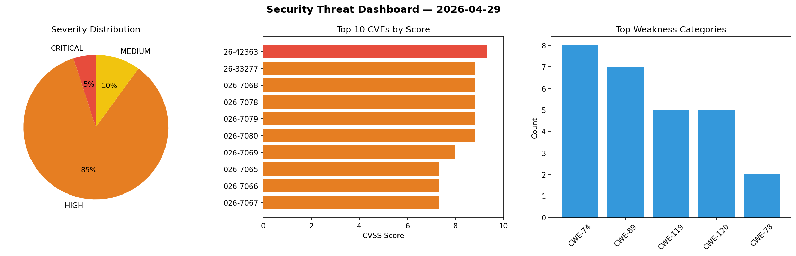
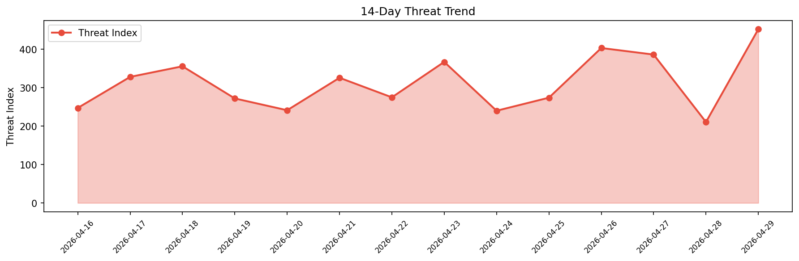

# Security Scan Report — 2026-04-29

**Scan ID:** `c885f2fc5c` | **CVEs:** 20 | **Threat Index:** 452.4

## Threat Overview

| Metric | Value |
|--------|-------|
| Threat Index | 452.4 |
| Critical CVEs | 1 |
| CRITICAL | 1 |
| HIGH | 17 |
| MEDIUM | 2 |

## Delta vs Yesterday

| Metric | Today | Yesterday | Change |
|--------|-------|-----------|--------|
| total_cves | 20 | 20 | ➡️ 0.0% |
| threat_index | 452.4 | 210.7 | 📈 114.7% |
| critical_count | 1 | 0 | ➡️ 0% |

## Top Weakness Categories

| CWE | Count |
|-----|-------|
| CWE-74 | 8 |
| CWE-89 | 7 |
| CWE-119 | 5 |
| CWE-120 | 5 |
| CWE-78 | 2 |

## CVE Details

| CVE ID | Score | Severity | Description |
|--------|-------|----------|-------------|
| CVE-2026-42363 | 9.3 | CRITICAL | An insufficient encryption vulnerability exists in the Device Authentication fun... |
| CVE-2026-33277 | 8.8 | HIGH | An OS command Injection issue exists in LogonTracer prior to v2.0.0. An arbitrar... |
| CVE-2026-7068 | 8.8 | HIGH | A vulnerability was identified in D-Link DIR-825 3.00b32. This affects the funct... |
| CVE-2026-7078 | 8.8 | HIGH | A security flaw has been discovered in Tenda F456 1.0.0.5. The impacted element ... |
| CVE-2026-7079 | 8.8 | HIGH | A weakness has been identified in Tenda F456 1.0.0.5. This affects the function ... |
| CVE-2026-7080 | 8.8 | HIGH | A security vulnerability has been detected in Tenda F456 1.0.0.5. This impacts t... |
| CVE-2026-7069 | 8.0 | HIGH | A security flaw has been discovered in D-Link DIR-825 up to 3.00b32. This impact... |
| CVE-2026-7065 | 7.3 | HIGH | A vulnerability has been found in BidingCC BuildingAI up to 26.0.1. Impacted is ... |
| CVE-2026-7066 | 7.3 | HIGH | A vulnerability was found in choieastsea simple-openstack-mcp up to 767b2f4a8154... |
| CVE-2026-7067 | 7.3 | HIGH | A vulnerability was determined in D-Link DIR-822 A_101. The impacted element is ... |
| CVE-2026-7070 | 7.3 | HIGH | A weakness has been identified in code-projects Inventory Management System 1.0.... |
| CVE-2026-7072 | 7.3 | HIGH | A vulnerability was detected in CodePanda Source canteen_management_system 1.0. ... |
| CVE-2026-7073 | 7.3 | HIGH | A flaw has been found in itsourcecode Construction Management System 1.0. This a... |
| CVE-2026-7074 | 7.3 | HIGH | A vulnerability has been found in itsourcecode Construction Management System 1.... |
| CVE-2026-7075 | 7.3 | HIGH | A vulnerability was found in itsourcecode Construction Management System 1.0. Th... |