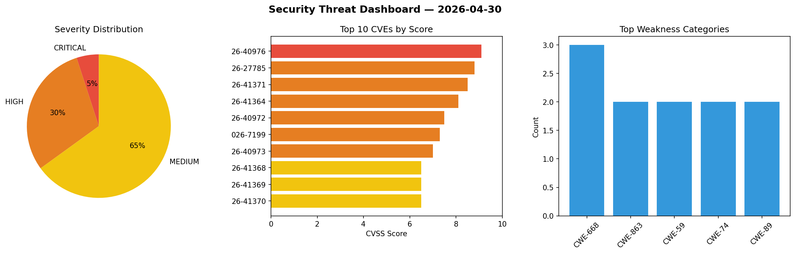
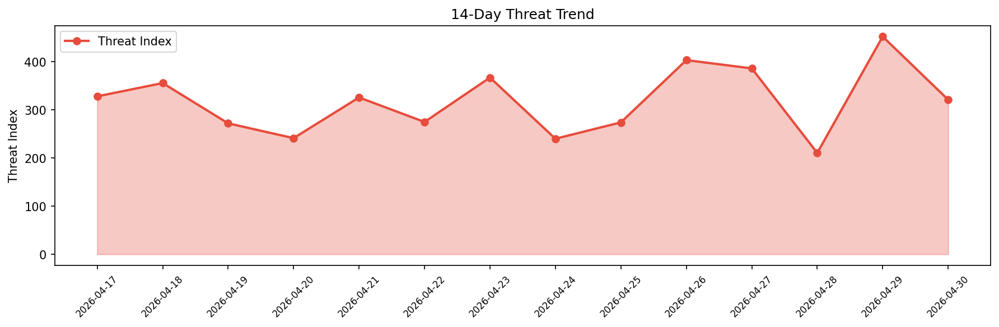

# Security Scan Report — 2026-04-30

**Scan ID:** `0a3261f928` | **CVEs:** 20 | **Threat Index:** 321.2

## Threat Overview

| Metric | Value |
|--------|-------|
| Threat Index | 321.2 |
| Critical CVEs | 1 |
| CRITICAL | 1 |
| HIGH | 6 |
| MEDIUM | 13 |

## Delta vs Yesterday

| Metric | Today | Yesterday | Change |
|--------|-------|-----------|--------|
| total_cves | 20 | 20 | ➡️ 0.0% |
| threat_index | 321.2 | 452.4 | 📉 -29.0% |
| critical_count | 1 | 1 | ➡️ 0.0% |

## Top Weakness Categories

| CWE | Count |
|-----|-------|
| CWE-668 | 3 |
| CWE-863 | 2 |
| CWE-59 | 2 |
| CWE-74 | 2 |
| CWE-89 | 2 |

## CVE Details

| CVE ID | Score | Severity | Description |
|--------|-------|----------|-------------|
| CVE-2026-40976 | 9.1 | CRITICAL | In certain circumstances, Spring Boot's default web security is ineffective allo... |
| CVE-2026-27785 | 8.8 | HIGH | Specific firmware versions of Milesight AIOT camera firmware contain hard-coded ... |
| CVE-2026-41371 | 8.5 | HIGH | OpenClaw before 2026.3.28 contains a privilege escalation vulnerability in chat.... |
| CVE-2026-41364 | 8.1 | HIGH | OpenClaw before 2026.3.31 contains a symlink following vulnerability in SSH sand... |
| CVE-2026-40972 | 7.5 | HIGH | An attacker on the same network as the remote application may be able to utilize... |
| CVE-2026-7199 | 7.3 | HIGH | A vulnerability was detected in SourceCodester Pharmacy Sales and Inventory Syst... |
| CVE-2026-40973 | 7.0 | HIGH | A local attacker on the same host as the application may be able to take control... |
| CVE-2026-41368 | 6.5 | MEDIUM | OpenClaw before 2026.3.28 contains an environment variable disclosure vulnerabil... |
| CVE-2026-41369 | 6.5 | MEDIUM | OpenClaw before 2026.3.31 contains insufficient environment variable sanitizatio... |
| CVE-2026-41370 | 6.5 | MEDIUM | OpenClaw before 2026.3.31 contains a path traversal vulnerability in ACP dispatc... |
| CVE-2026-7196 | 6.3 | MEDIUM | A security vulnerability has been detected in CodeAstro Online Classroom 1.0. Af... |
| CVE-2026-41372 | 5.8 | MEDIUM | OpenClaw before 2026.4.2 fails to normalize trailing-dot localhost hosts in remo... |
| CVE-2026-41366 | 5.5 | MEDIUM | OpenClaw before 2026.3.31 contains a local roots self-whitelisting vulnerability... |
| CVE-2026-41365 | 5.4 | MEDIUM | OpenClaw before 2026.3.31 contains a sender allowlist bypass vulnerability in MS... |
| CVE-2026-41363 | 5.3 | MEDIUM | OpenClaw versions 2026.2.6 through 2026.3.24 contain a path traversal vulnerabil... |