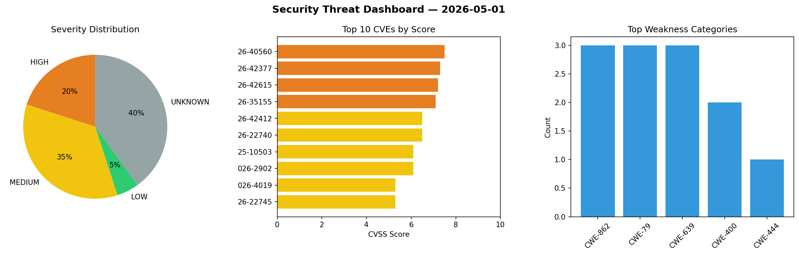
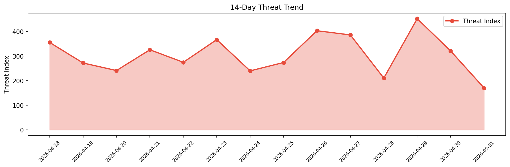

# Security Scan Report — 2026-05-01

**Scan ID:** `2319bb5c20` | **CVEs:** 20 | **Threat Index:** 170.6

## Threat Overview

| Metric | Value |
|--------|-------|
| Threat Index | 170.6 |
| Critical CVEs | 0 |
| HIGH | 4 |
| MEDIUM | 7 |
| LOW | 1 |
| UNKNOWN | 8 |

## Delta vs Yesterday

| Metric | Today | Yesterday | Change |
|--------|-------|-----------|--------|
| total_cves | 20 | 20 | ➡️ 0.0% |
| threat_index | 170.6 | 321.2 | 📉 -46.9% |
| critical_count | 0 | 1 | 📉 -100.0% |

## Top Weakness Categories

| CWE | Count |
|-----|-------|
| CWE-862 | 3 |
| CWE-79 | 3 |
| CWE-639 | 3 |
| CWE-400 | 2 |
| CWE-444 | 1 |

## CVE Details

| CVE ID | Score | Severity | Description |
|--------|-------|----------|-------------|
| CVE-2026-40560 | 7.5 | HIGH | Starman versions before 0.4018 for Perl allows HTTP Request Smuggling via Improp... |
| CVE-2026-42377 | 7.3 | HIGH | Missing Authorization vulnerability in Brainstorm Force SureForms Pro allows Exp... |
| CVE-2026-42615 | 7.2 | HIGH | GCHQ CyberChef before 11.0.0 allows XSS via Show Base64 offsets, as demonstrated... |
| CVE-2026-35155 | 7.1 | HIGH | Dell iDRAC10, versions 1.20.70.50 and 1.30.05.10, contains an Insufficiently Pro... |
| CVE-2026-42412 | 6.5 | MEDIUM | Missing Authorization vulnerability in weDevs WP User Frontend allows Exploiting... |
| CVE-2026-22740 | 6.5 | MEDIUM | A WebFlux server application that processes multipart requests creates temp file... |
| CVE-2025-10503 | 6.1 | MEDIUM | The authentication endpoint accepts user-supplied input without enforcing expect... |
| CVE-2026-2902 | 6.1 | MEDIUM | The WP Meteor Website Speed Optimization Addon plugin for WordPress is vulnerabl... |
| CVE-2026-4019 | 5.3 | MEDIUM | The Complianz – GDPR/CCPA Cookie Consent plugin for WordPress is vulnerable to u... |
| CVE-2026-22745 | 5.3 | MEDIUM | Spring MVC and WebFlux applications are vulnerable to Denial of Service attacks ... |
| CVE-2026-23773 | 4.3 | MEDIUM | Dell Disk Library for Mainframe, version(s) DLm 8700/2700 contain(s) a Server-Si... |
| CVE-2026-22741 | 3.1 | LOW | Spring MVC and WebFlux applications are vulnerable to cache poisoning when resol... |
| CVE-2026-21023 | 0.0 | UNKNOWN | Insufficient verification of data authenticity in PackageManagerService prior to... |
| CVE-2026-3325 | 0.0 | UNKNOWN | SQL injection (SQLi) in MegaCMS v12.0.0, specifically in the “id_territorio” par... |
| CVE-2026-42513 | 0.0 | UNKNOWN | This vulnerability exists in e-Sushrut due to improper authentication logic that... |