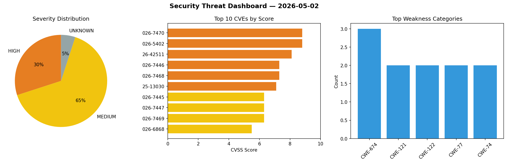
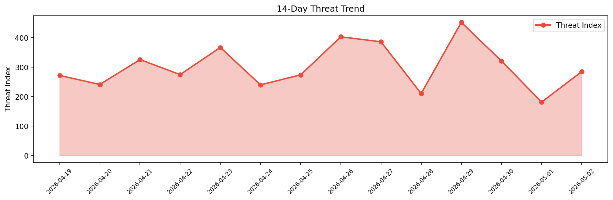

# Security Scan Report — 2026-05-02

**Scan ID:** `b26dd9e538` | **CVEs:** 20 | **Threat Index:** 285.4

## Threat Overview

| Metric | Value |
|--------|-------|
| Threat Index | 285.4 |
| Critical CVEs | 0 |
| HIGH | 6 |
| MEDIUM | 13 |
| UNKNOWN | 1 |

## Delta vs Yesterday

| Metric | Today | Yesterday | Change |
|--------|-------|-----------|--------|
| total_cves | 20 | 20 | ➡️ 0.0% |
| threat_index | 285.4 | 181.6 | 📈 57.2% |
| critical_count | 0 | 0 | ➡️ 0% |

## Top Weakness Categories

| CWE | Count |
|-----|-------|
| CWE-674 | 3 |
| CWE-121 | 2 |
| CWE-122 | 2 |
| CWE-77 | 2 |
| CWE-74 | 2 |

## CVE Details

| CVE ID | Score | Severity | Description |
|--------|-------|----------|-------------|
| CVE-2026-7470 | 8.8 | HIGH | A flaw has been found in Tenda 4G300 US_4G300V1.0Mt_V1.01.42_CN_TDC01. Affected ... |
| CVE-2026-5402 | 8.8 | HIGH | TLS protocol dissector heap overflow in Wireshark 4.6.0 to 4.6.4 allows denial o... |
| CVE-2026-42511 | 8.1 | HIGH | The BOOTP file field is written to the lease file without escaping embedded doub... |
| CVE-2026-7446 | 7.3 | HIGH | A vulnerability was detected in VetCoders mcp-server-semgrep 1.0.0. This affects... |
| CVE-2026-7468 | 7.3 | HIGH | A security vulnerability has been detected in 1024-lab smart-admin up to 3.30.0.... |
| CVE-2025-13030 | 7.1 | HIGH | All versions of the package django-mdeditor are vulnerable to Missing Authentica... |
| CVE-2026-7445 | 6.3 | MEDIUM | A security vulnerability has been detected in ZachHandley ZMCPTools up to 0.2.2.... |
| CVE-2026-7447 | 6.3 | MEDIUM | A flaw has been found in SourceCodester Pet Grooming Management Software 1.0. Th... |
| CVE-2026-7469 | 6.3 | MEDIUM | A vulnerability was detected in Tenda 4G300 US_4G300V1.0Mt_V1.01.42_CN_TDC01. Th... |
| CVE-2026-6868 | 5.5 | MEDIUM | HTTP protocol dissector crash in Wireshark 4.6.0 to 4.6.4 and 4.4.0 to 4.4.14 al... |
| CVE-2026-7375 | 5.5 | MEDIUM | UDS protocol dissector infinite loop in Wireshark 4.6.0 to 4.6.4 and 4.4.0 to 4.... |
| CVE-2026-7376 | 5.5 | MEDIUM | Crash in sharkd 4.6.0 to 4.6.4 and 4.4.0 to 4.4.14 allows denial of service... |
| CVE-2026-7378 | 5.5 | MEDIUM | Crash in sharkd 4.6.0 to 4.6.4 and 4.4.0 to 4.4.14 allows denial of service... |
| CVE-2026-7379 | 5.5 | MEDIUM | Memory leak in sharkd 4.6.0 to 4.6.4 and 4.4.0 to 4.4.14 allows denial of servic... |
| CVE-2026-5299 | 5.5 | MEDIUM | ICMPv6 PvD protocol dissector crash in Wireshark 4.6.0 to 4.6.4 and 4.4.0 to 4.4... |