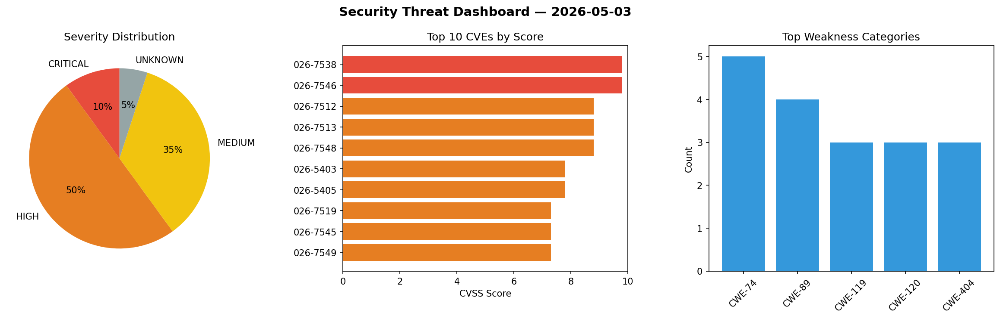
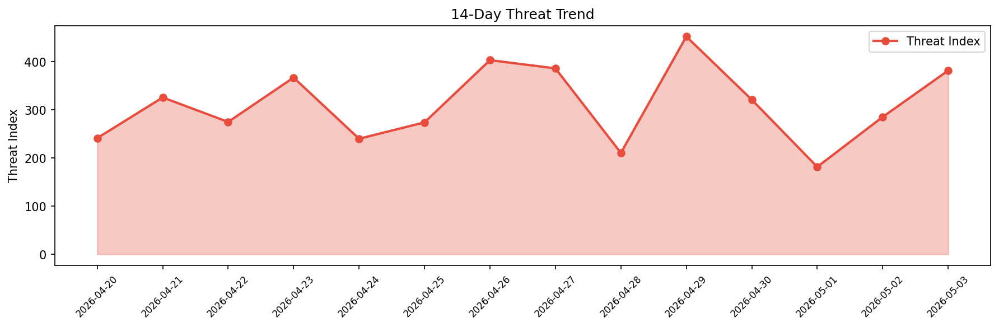

# Security Scan Report — 2026-05-03

**Scan ID:** `fb4d830feb` | **CVEs:** 20 | **Threat Index:** 381.8

## Threat Overview

| Metric | Value |
|--------|-------|
| Threat Index | 381.8 |
| Critical CVEs | 2 |
| CRITICAL | 2 |
| HIGH | 10 |
| MEDIUM | 7 |
| UNKNOWN | 1 |

## Delta vs Yesterday

| Metric | Today | Yesterday | Change |
|--------|-------|-----------|--------|
| total_cves | 20 | 20 | ➡️ 0.0% |
| threat_index | 381.8 | 285.4 | 📈 33.8% |
| critical_count | 2 | 0 | ➡️ 0% |

## Top Weakness Categories

| CWE | Count |
|-----|-------|
| CWE-74 | 5 |
| CWE-89 | 4 |
| CWE-119 | 3 |
| CWE-120 | 3 |
| CWE-404 | 3 |

## CVE Details

| CVE ID | Score | Severity | Description |
|--------|-------|----------|-------------|
| CVE-2026-7538 | 9.8 | CRITICAL | A vulnerability was identified in Totolink A8000RU 7.1cu.643_b20200521. This iss... |
| CVE-2026-7546 | 9.8 | CRITICAL | A security vulnerability has been detected in Totolink NR1800X 9.1.0u.6279_B2021... |
| CVE-2026-7512 | 8.8 | HIGH | A flaw has been found in UTT HiPER 1200GW up to 2.5.3-1703. The affected element... |
| CVE-2026-7513 | 8.8 | HIGH | A vulnerability has been found in UTT HiPER 1200GW up to 2.5.3-170306. The impac... |
| CVE-2026-7548 | 8.8 | HIGH | A vulnerability was detected in Totolink NR1800X 9.1.0u.6279_B20210910. This aff... |
| CVE-2026-5403 | 7.8 | HIGH | SBC codec crash in Wireshark 4.6.0 to 4.6.4 and 4.4.0 to 4.4.14 allows denial of... |
| CVE-2026-5405 | 7.8 | HIGH | RDP protocol dissector crash in Wireshark 4.6.0 to 4.6.4 and 4.4.0 to 4.4.14 all... |
| CVE-2026-7519 | 7.3 | HIGH | A vulnerability has been found in Fujian Apex LiveBOS up to 2.0. Impacted is an ... |
| CVE-2026-7545 | 7.3 | HIGH | A weakness has been identified in SourceCodester Advanced School Management Syst... |
| CVE-2026-7549 | 7.3 | HIGH | A flaw has been found in SourceCodester Pharmacy Sales and Inventory System 1.0.... |
| CVE-2026-7550 | 7.3 | HIGH | A vulnerability has been found in SourceCodester Pharmacy Sales and Inventory Sy... |
| CVE-2026-5656 | 7.0 | HIGH | Profile import path traversal in Wireshark 4.6.0 to 4.6.4 and 4.4.0 to 4.4.14 al... |
| CVE-2024-13362 | 6.1 | MEDIUM | Multiple plugins and/or themes for WordPress are vulnerable to Reflected Cross-S... |
| CVE-2026-7536 | 5.3 | MEDIUM | A vulnerability was determined in Open5GS up to 2.7.7. This vulnerability affect... |
| CVE-2026-22726 | 5.0 | MEDIUM | Route Services can be leveraged to send app traffic to network destinations outs... |