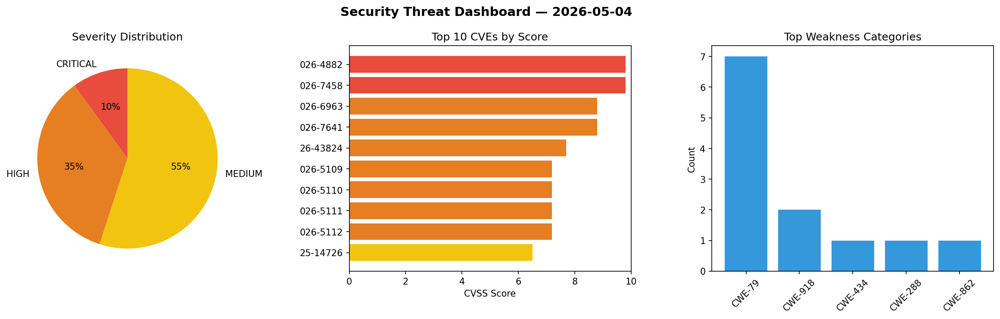
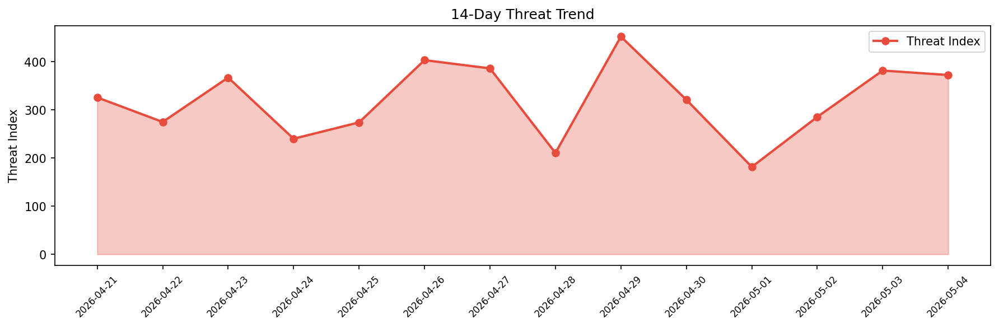

# Security Scan Report — 2026-05-04

**Scan ID:** `a318590aad` | **CVEs:** 20 | **Threat Index:** 372.5

## Threat Overview

| Metric | Value |
|--------|-------|
| Threat Index | 372.5 |
| Critical CVEs | 2 |
| CRITICAL | 2 |
| HIGH | 7 |
| MEDIUM | 11 |

## Delta vs Yesterday

| Metric | Today | Yesterday | Change |
|--------|-------|-----------|--------|
| total_cves | 20 | 20 | ➡️ 0.0% |
| threat_index | 372.5 | 381.8 | 📉 -2.4% |
| critical_count | 2 | 2 | ➡️ 0.0% |

## Top Weakness Categories

| CWE | Count |
|-----|-------|
| CWE-79 | 7 |
| CWE-918 | 2 |
| CWE-434 | 1 |
| CWE-288 | 1 |
| CWE-862 | 1 |

## CVE Details

| CVE ID | Score | Severity | Description |
|--------|-------|----------|-------------|
| CVE-2026-4882 | 9.8 | CRITICAL | The User Registration Advanced Fields plugin for WordPress is vulnerable to arbi... |
| CVE-2026-7458 | 9.8 | CRITICAL | The User Verification by PickPlugins plugin for WordPress is vulnerable to authe... |
| CVE-2026-6963 | 8.8 | HIGH | The WP Mail Gateway plugin for WordPress is vulnerable to unauthorized access du... |
| CVE-2026-7641 | 8.8 | HIGH | The Import and export users and customers plugin for WordPress is vulnerable to ... |
| CVE-2026-43824 | 7.7 | HIGH | In Argo CD 3.2.0 before 3.2.11 and 3.3.0 before 3.3.9, ServerSideDiff allows rea... |
| CVE-2026-5109 | 7.2 | HIGH | The Gravity Forms plugin for WordPress is vulnerable to Stored Cross-Site Script... |
| CVE-2026-5110 | 7.2 | HIGH | The Gravity Forms plugin for WordPress is vulnerable to Unauthenticated Stored C... |
| CVE-2026-5111 | 7.2 | HIGH | The Gravity Forms plugin for WordPress is vulnerable to Stored Cross-Site Script... |
| CVE-2026-5112 | 7.2 | HIGH | The Gravity Forms plugin for WordPress is vulnerable to Unauthenticated Stored C... |
| CVE-2025-14726 | 6.5 | MEDIUM | The Widgets for Social Photo Feed plugin for WordPress is vulnerable to unauthor... |
| CVE-2026-6378 | 6.4 | MEDIUM | The Maxi Blocks plugin for WordPress is vulnerable to Stored Cross-Site Scriptin... |
| CVE-2026-7209 | 6.4 | MEDIUM | The Simple Link Directory plugin for WordPress is vulnerable to Stored Cross-Sit... |
| CVE-2026-4658 | 6.4 | MEDIUM | The Essential Blocks – Page Builder Gutenberg Blocks, Patterns & Templates plugi... |
| CVE-2026-7600 | 6.3 | MEDIUM | A flaw has been found in ArtMin96 yii2-mcp-server 1.0.2. This impacts the functi... |
| CVE-2026-7602 | 6.3 | MEDIUM | A vulnerability was found in JeecgBoot up to 3.9.1. Affected by this vulnerabili... |