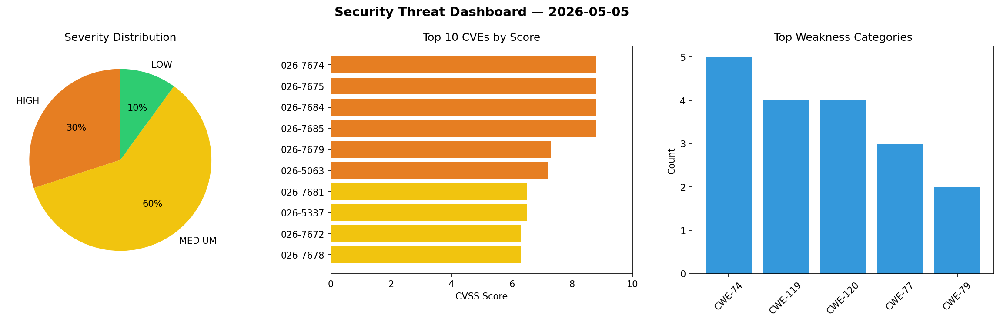
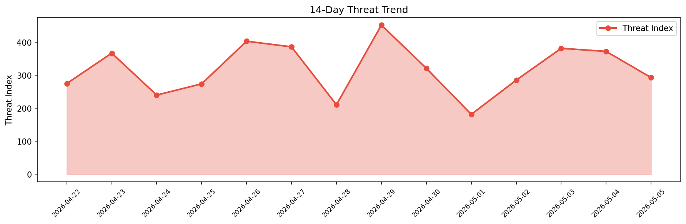

# Security Scan Report — 2026-05-05

**Scan ID:** `8a61d3241e` | **CVEs:** 20 | **Threat Index:** 293.1

## Threat Overview

| Metric | Value |
|--------|-------|
| Threat Index | 293.1 |
| Critical CVEs | 0 |
| HIGH | 6 |
| MEDIUM | 12 |
| LOW | 2 |

## Delta vs Yesterday

| Metric | Today | Yesterday | Change |
|--------|-------|-----------|--------|
| total_cves | 20 | 20 | ➡️ 0.0% |
| threat_index | 293.1 | 372.5 | 📉 -21.3% |
| critical_count | 0 | 2 | 📉 -100.0% |

## Top Weakness Categories

| CWE | Count |
|-----|-------|
| CWE-74 | 5 |
| CWE-119 | 4 |
| CWE-120 | 4 |
| CWE-77 | 3 |
| CWE-79 | 2 |

## CVE Details

| CVE ID | Score | Severity | Description |
|--------|-------|----------|-------------|
| CVE-2026-7674 | 8.8 | HIGH | A flaw has been found in Shenzhen Libituo Technology LBT-T300-HW1 up to 1.2.8. T... |
| CVE-2026-7675 | 8.8 | HIGH | A vulnerability has been found in Shenzhen Libituo Technology LBT-T300-HW1 up to... |
| CVE-2026-7684 | 8.8 | HIGH | A security vulnerability has been detected in Edimax BR-6428nC up to 1.16. This ... |
| CVE-2026-7685 | 8.8 | HIGH | A vulnerability was detected in Edimax BR-6208AC up to 1.02. Affected is an unkn... |
| CVE-2026-7679 | 7.3 | HIGH | A security flaw has been discovered in YunaiV yudao-cloud up to 2026.01. This im... |
| CVE-2026-5063 | 7.2 | HIGH | The NEX-Forms – Ultimate Forms Plugin for WordPress plugin for WordPress is vuln... |
| CVE-2026-7681 | 6.5 | MEDIUM | A security vulnerability has been detected in jsbroks COCO Annotator up to 0.11.... |
| CVE-2026-5337 | 6.5 | MEDIUM | During the analysis, it was identified that authenticated attackers with Subscri... |
| CVE-2026-7672 | 6.3 | MEDIUM | A security vulnerability has been detected in youlaitech youlai-boot up to 2.21.... |
| CVE-2026-7678 | 6.3 | MEDIUM | A vulnerability was identified in YunaiV yudao-cloud up to 2026.01. This affects... |
| CVE-2026-7682 | 6.3 | MEDIUM | A security flaw has been discovered in Edimax BR-6208AC 1.02. The impacted eleme... |
| CVE-2026-7683 | 6.3 | MEDIUM | A weakness has been identified in Edimax BR-6428nC up to 1.16. This affects an u... |
| CVE-2026-7687 | 6.3 | MEDIUM | A vulnerability was determined in langflow-ai langflow up to 1.8.4. Affected by ... |
| CVE-2026-40561 | 5.3 | MEDIUM | Starlet versions through 0.31 for Perl allows HTTP Request Smuggling via Imprope... |
| CVE-2026-7686 | 5.3 | MEDIUM | A vulnerability was found in eyeo Adblock Plus up to 4.36.2 on Chrome. Affected ... |