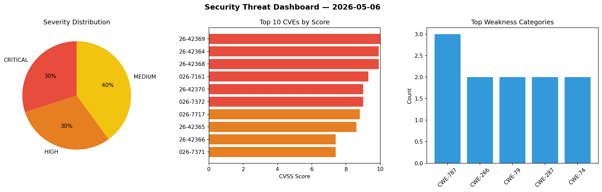
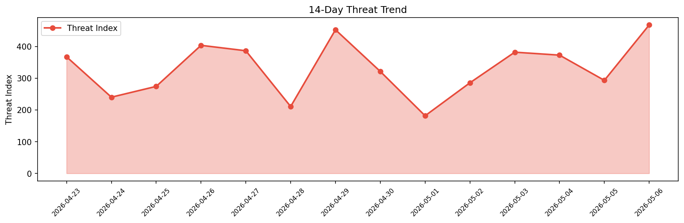

# Security Scan Report — 2026-05-06

**Scan ID:** `6efe176649` | **CVEs:** 20 | **Threat Index:** 467.6

## Threat Overview

| Metric | Value |
|--------|-------|
| Threat Index | 467.6 |
| Critical CVEs | 6 |
| CRITICAL | 6 |
| HIGH | 6 |
| MEDIUM | 8 |

## Delta vs Yesterday

| Metric | Today | Yesterday | Change |
|--------|-------|-----------|--------|
| total_cves | 20 | 20 | ➡️ 0.0% |
| threat_index | 467.6 | 293.1 | 📈 59.5% |
| critical_count | 6 | 0 | ➡️ 0% |

## Top Weakness Categories

| CWE | Count |
|-----|-------|
| CWE-787 | 3 |
| CWE-266 | 2 |
| CWE-79 | 2 |
| CWE-287 | 2 |
| CWE-74 | 2 |

## CVE Details

| CVE ID | Score | Severity | Description |
|--------|-------|----------|-------------|
| CVE-2026-42369 | 10.0 | CRITICAL | GV-VMS V20 is a Video Monitoring Software used to gather the feeds of many surve... |
| CVE-2026-42364 | 9.9 | CRITICAL | An os command injection vulnerability exists in the DdnsSetting.cgi functionalit... |
| CVE-2026-42368 | 9.9 | CRITICAL | A privilege escalation vulnerability exists in the Web Interface functionality o... |
| CVE-2026-7161 | 9.3 | CRITICAL | An insufficient encryption vulnerability exists in the Device Authentication fun... |
| CVE-2026-42370 | 9.0 | CRITICAL | A stack overflow vulnerability exists in the WebCam Server Login functionality o... |
| CVE-2026-7372 | 9.0 | CRITICAL | A stack overflow vulnerability exists in the WebCam Server Login functionality o... |
| CVE-2026-7717 | 8.8 | HIGH | A vulnerability was determined in Totolink WA300 5.2cu.7112_B20190227. This issu... |
| CVE-2026-42365 | 8.6 | HIGH | A guessable session cookie vulnerability exists in the Web Interface functionali... |
| CVE-2026-42366 | 7.4 | HIGH | Multiple reflected cross-site scripting (xss) vulnerabilities exist in the Web I... |
| CVE-2026-7371 | 7.4 | HIGH | Multiple reflected cross-site scripting (xss) vulnerabilities exist in the Web I... |
| CVE-2026-7710 | 7.3 | HIGH | A security flaw has been discovered in YunaiV yudao-cloud up to 3.8.0. This affe... |
| CVE-2026-7711 | 7.3 | HIGH | A weakness has been identified in MindsDB up to 26.01. This impacts the function... |
| CVE-2026-42367 | 6.5 | MEDIUM | A privilege escalation vulnerability exists in the Web Interface / ssi.cgi funct... |
| CVE-2026-7714 | 6.5 | MEDIUM | A flaw has been found in crocodilestick Calibre-Web-Automated up to 4.0.6. Affec... |
| CVE-2026-7712 | 6.3 | MEDIUM | A security vulnerability has been detected in MindsDB up to 26.01. Affected is t... |