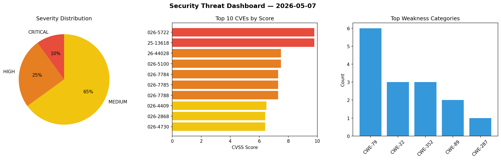
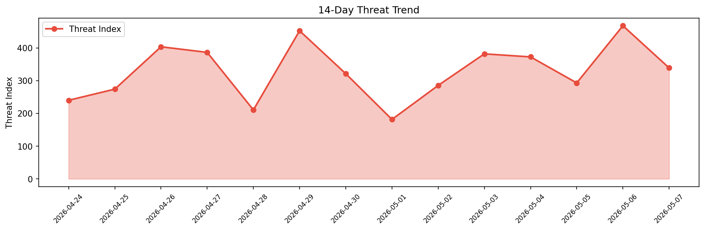

# Security Scan Report — 2026-05-07

**Scan ID:** `eadcddf7a9` | **CVEs:** 20 | **Threat Index:** 338.9

## Threat Overview

| Metric | Value |
|--------|-------|
| Threat Index | 338.9 |
| Critical CVEs | 2 |
| CRITICAL | 2 |
| HIGH | 5 |
| MEDIUM | 13 |

## Delta vs Yesterday

| Metric | Today | Yesterday | Change |
|--------|-------|-----------|--------|
| total_cves | 20 | 20 | ➡️ 0.0% |
| threat_index | 338.9 | 467.6 | 📉 -27.5% |
| critical_count | 2 | 6 | 📉 -66.7% |

## Top Weakness Categories

| CWE | Count |
|-----|-------|
| CWE-79 | 6 |
| CWE-22 | 3 |
| CWE-352 | 3 |
| CWE-89 | 2 |
| CWE-287 | 1 |

## CVE Details

| CVE ID | Score | Severity | Description |
|--------|-------|----------|-------------|
| CVE-2026-5722 | 9.8 | CRITICAL | The MoreConvert Pro plugin for WordPress is vulnerable to Authentication Bypass ... |
| CVE-2025-13618 | 9.8 | CRITICAL | The Mentoring plugin for WordPress is vulnerable to privilege escalation in all ... |
| CVE-2026-44028 | 7.5 | HIGH | An issue was discovered in Nix before 2.34.7 and Lix before 2.95.2. Unbounded re... |
| CVE-2026-5100 | 7.5 | HIGH | The AWP Classifieds plugin for WordPress is vulnerable to SQL Injection via the ... |
| CVE-2026-7784 | 7.3 | HIGH | A vulnerability has been found in RTGS2017 NagaAgent up to 5.1.0. This issue aff... |
| CVE-2026-7785 | 7.3 | HIGH | A security flaw has been discovered in A-G-U-P-T-A wireshark-mcp edaf604416fbc94... |
| CVE-2026-7788 | 7.3 | HIGH | A security flaw has been discovered in Axle-Bucamp MCP-Docusaurus up to 404bc028... |
| CVE-2026-4409 | 6.5 | MEDIUM | The Subscribe To Comments Reloaded plugin for WordPress is vulnerable to unautho... |
| CVE-2026-2868 | 6.4 | MEDIUM | The Gutenverse – Ultimate WordPress FSE Blocks Addons & Ecosystem plugin for Wor... |
| CVE-2026-4730 | 6.4 | MEDIUM | The Charts Ninja: Create Beautiful Graphs & Charts and Easily Add Them to Your W... |
| CVE-2026-5505 | 6.4 | MEDIUM | The WP-Clippy plugin for WordPress is vulnerable to Stored Cross-Site Scripting ... |
| CVE-2026-6255 | 6.4 | MEDIUM | The Simple Owl Shortcodes plugin for WordPress is vulnerable to Stored Cross-Sit... |
| CVE-2026-7783 | 6.3 | MEDIUM | A flaw has been found in CodeCanyon Perfex CRM up to 3.4.1. This vulnerability a... |
| CVE-2026-6696 | 6.1 | MEDIUM | The Zingaya Click-to-Call plugin for WordPress is vulnerable to Reflected Cross-... |
| CVE-2026-6702 | 6.1 | MEDIUM | The Publish 2 Ping.fm plugin for WordPress is vulnerable to Cross-Site Request F... |