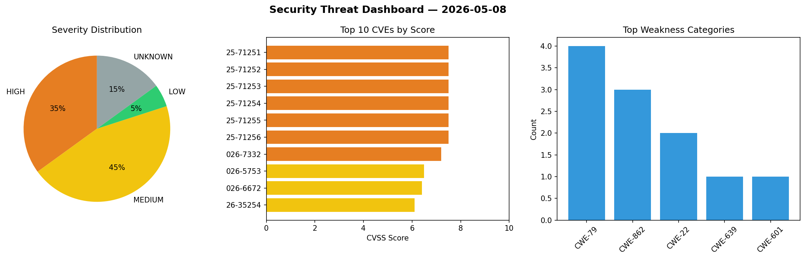
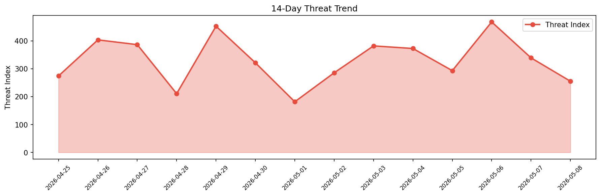

# Security Scan Report — 2026-05-08

**Scan ID:** `6596d77765` | **CVEs:** 20 | **Threat Index:** 255.2

## Threat Overview

| Metric | Value |
|--------|-------|
| Threat Index | 255.2 |
| Critical CVEs | 0 |
| HIGH | 7 |
| MEDIUM | 9 |
| LOW | 1 |
| UNKNOWN | 3 |

## Delta vs Yesterday

| Metric | Today | Yesterday | Change |
|--------|-------|-----------|--------|
| total_cves | 20 | 20 | ➡️ 0.0% |
| threat_index | 255.2 | 338.9 | 📉 -24.7% |
| critical_count | 0 | 2 | 📉 -100.0% |

## Top Weakness Categories

| CWE | Count |
|-----|-------|
| CWE-79 | 4 |
| CWE-862 | 3 |
| CWE-22 | 2 |
| CWE-639 | 1 |
| CWE-601 | 1 |

## CVE Details

| CVE ID | Score | Severity | Description |
|--------|-------|----------|-------------|
| CVE-2025-71251 | 7.5 | HIGH | In IMS, there is a possible system crash due to improper input validation. This ... |
| CVE-2025-71252 | 7.5 | HIGH | In Modem IMS, there is a possible improper input validation. This could lead to ... |
| CVE-2025-71253 | 7.5 | HIGH | In Modem IMS, there is a possible improper input validation. This could lead to ... |
| CVE-2025-71254 | 7.5 | HIGH | In Modem IMS, there is a possible improper input validation. This could lead to ... |
| CVE-2025-71255 | 7.5 | HIGH | In Modem IMS, there is a possible improper input validation. This could lead to ... |
| CVE-2025-71256 | 7.5 | HIGH | In nr modem, there is a possible improper input validation. This could lead to r... |
| CVE-2026-7332 | 7.2 | HIGH | The LatePoint – Calendar Booking Plugin for Appointments and Events plugin for W... |
| CVE-2026-5753 | 6.5 | MEDIUM | The All-in-One WP Migration Unlimited Extension plugin for WordPress is vulnerab... |
| CVE-2026-6672 | 6.4 | MEDIUM | The Affiliate Program Suite — SliceWP Affiliates plugin for WordPress is vulnera... |
| CVE-2026-35254 | 6.1 | MEDIUM | Vulnerability in the Oracle OCI CLI product of Oracle Open Source Projects. The ... |
| CVE-2026-3208 | 5.3 | MEDIUM | The Mercado Pago payments for WooCommerce plugin for WordPress is vulnerable to ... |
| CVE-2026-7573 | 5.0 | MEDIUM | An authorization bypass (CWE-639) in the GetUserRoles gRPC API endpoint in Veloc... |
| CVE-2026-6344 | 4.9 | MEDIUM | The Fluent Forms plugin for WordPress is vulnerable to Arbitrary File Read in ve... |
| CVE-2026-35253 | 4.7 | MEDIUM | Vulnerability in the Oracle Macoron Tool product of Oracle Open Source Projects.... |
| CVE-2026-7572 | 4.4 | MEDIUM | An off-by-one error (CWE-193) in the ConsumeUnit16Array and ConsumeUnit64Array f... |