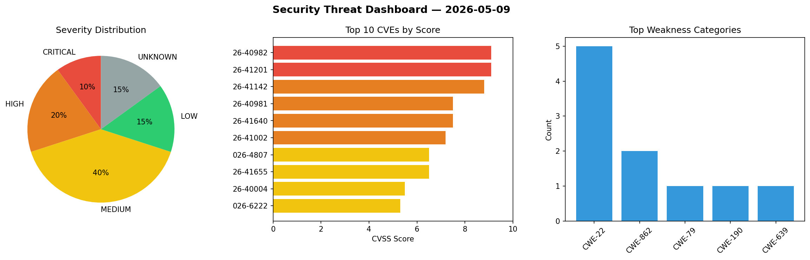
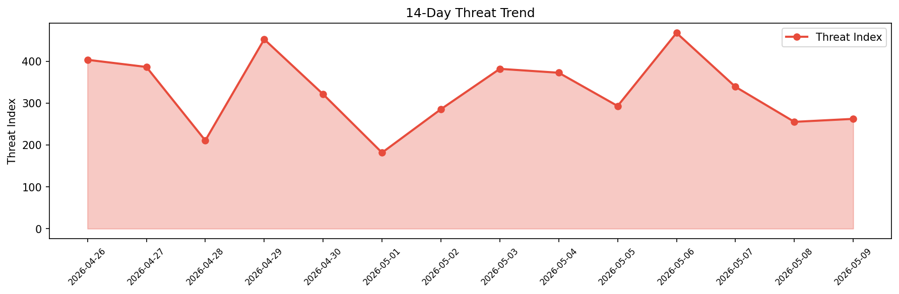

# Security Scan Report — 2026-05-09

**Scan ID:** `d5bd8b2241` | **CVEs:** 20 | **Threat Index:** 262.3

## Threat Overview

| Metric | Value |
|--------|-------|
| Threat Index | 262.3 |
| Critical CVEs | 2 |
| CRITICAL | 2 |
| HIGH | 4 |
| MEDIUM | 8 |
| LOW | 3 |
| UNKNOWN | 3 |

## Delta vs Yesterday

| Metric | Today | Yesterday | Change |
|--------|-------|-----------|--------|
| total_cves | 20 | 20 | ➡️ 0.0% |
| threat_index | 262.3 | 255.2 | 📈 2.8% |
| critical_count | 2 | 0 | ➡️ 0% |

## Top Weakness Categories

| CWE | Count |
|-----|-------|
| CWE-22 | 5 |
| CWE-862 | 2 |
| CWE-79 | 1 |
| CWE-190 | 1 |
| CWE-639 | 1 |

## CVE Details

| CVE ID | Score | Severity | Description |
|--------|-------|----------|-------------|
| CVE-2026-40982 | 9.1 | CRITICAL | Spring Cloud Config allows applications to serve arbitrary text and binary files... |
| CVE-2026-41201 | 9.1 | CRITICAL | CI4MS is a CodeIgniter 4-based CMS skeleton that delivers a production-ready, mo... |
| CVE-2026-41142 | 8.8 | HIGH | OpenEXR provides the specification and reference implementation of the EXR file ... |
| CVE-2026-40981 | 7.5 | HIGH | When using Google Secrets Manager as a backend for the Spring Cloud Config serve... |
| CVE-2026-41640 | 7.5 | HIGH | NocoBase is an AI-powered no-code/low-code platform for building business applic... |
| CVE-2026-41002 | 7.2 | HIGH | The base directory (`spring.cloud.config.server.git.basedir`) used by the Spring... |
| CVE-2026-4807 | 6.5 | MEDIUM | The Appointment Booking Calendar plugin for WordPress is vulnerable to Missing A... |
| CVE-2026-41655 | 6.5 | MEDIUM | Admidio is an open-source user management solution. Prior to version 5.0.9, the ... |
| CVE-2026-40004 | 5.5 | MEDIUM | There exists an openssl.cnf privilege escalation vulnerability in ZTE Cloud PC c... |
| CVE-2026-6222 | 5.3 | MEDIUM | The Forminator Forms plugin for WordPress is vulnerable to Missing Authorization... |
| CVE-2026-40003 | 5.1 | MEDIUM | ZTE ZX297520V3 BootROM contains a vulnerability that allows arbitrary memory wri... |
| CVE-2026-41657 | 4.9 | MEDIUM | Admidio is an open-source user management solution. Prior to version 5.0.9, the ... |
| CVE-2026-41656 | 4.5 | MEDIUM | Admidio is an open-source user management solution. Prior to version 5.0.9, the ... |
| CVE-2026-41004 | 4.4 | MEDIUM | When enabling trace logging in Spring Cloud Config Server sensitive information ... |
| CVE-2026-44597 | 3.7 | LOW | Tor before 0.4.9.7 has an out-of-bounds read when an END, a TRUNCATE, or a TRUNC... |