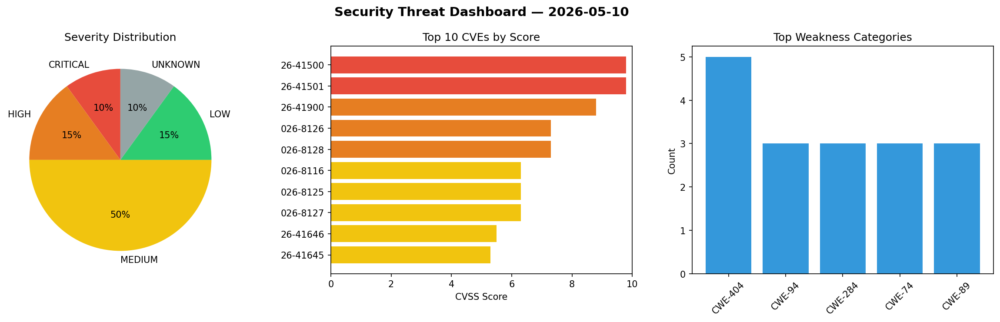
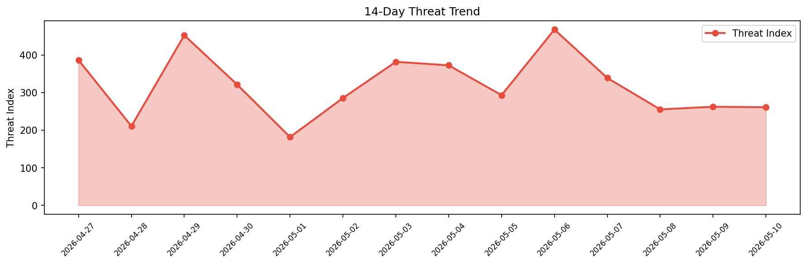

# Security Scan Report — 2026-05-10

**Scan ID:** `77a0499a1e` | **CVEs:** 20 | **Threat Index:** 260.9

## Threat Overview

| Metric | Value |
|--------|-------|
| Threat Index | 260.9 |
| Critical CVEs | 2 |
| CRITICAL | 2 |
| HIGH | 3 |
| MEDIUM | 10 |
| LOW | 3 |
| UNKNOWN | 2 |

## Delta vs Yesterday

| Metric | Today | Yesterday | Change |
|--------|-------|-----------|--------|
| total_cves | 20 | 20 | ➡️ 0.0% |
| threat_index | 260.9 | 262.3 | 📉 -0.5% |
| critical_count | 2 | 2 | ➡️ 0.0% |

## Top Weakness Categories

| CWE | Count |
|-----|-------|
| CWE-404 | 5 |
| CWE-94 | 3 |
| CWE-284 | 3 |
| CWE-74 | 3 |
| CWE-89 | 3 |

## CVE Details

| CVE ID | Score | Severity | Description |
|--------|-------|----------|-------------|
| CVE-2026-41500 | 9.8 | CRITICAL | electerm is an open-sourced terminal/ssh/sftp/telnet/serialport/RDP/VNC/Spice/ft... |
| CVE-2026-41501 | 9.8 | CRITICAL | electerm is an open-sourced terminal/ssh/sftp/telnet/serialport/RDP/VNC/Spice/ft... |
| CVE-2026-41900 | 8.8 | HIGH | OpenLearnX is an open-source, decentralized learning and assessment platform. Pr... |
| CVE-2026-8126 | 7.3 | HIGH | A flaw has been found in SourceCodester Comment System 1.0. This issue affects s... |
| CVE-2026-8128 | 7.3 | HIGH | A vulnerability was found in SourceCodester SUP Online Shopping 1.0. The affecte... |
| CVE-2026-8116 | 6.3 | MEDIUM | A weakness has been identified in huangjunsen0406 xiaozhi-mcphub up to 1.0.3. Th... |
| CVE-2026-8125 | 6.3 | MEDIUM | A vulnerability was detected in code-projects Simple Chat System 1.0. This vulne... |
| CVE-2026-8127 | 6.3 | MEDIUM | A vulnerability has been found in eladmin up to 2.7. Impacted is the function ch... |
| CVE-2026-41646 | 5.5 | MEDIUM | Nuclei is a vulnerability scanner built on a simple YAML-based DSL. From version... |
| CVE-2026-41645 | 5.3 | MEDIUM | Nuclei is a vulnerability scanner built on a simple YAML-based DSL. From version... |
| CVE-2026-8117 | 4.3 | MEDIUM | A security vulnerability has been detected in SourceCodester Pizzafy Ecommerce S... |
| CVE-2026-8120 | 4.3 | MEDIUM | A flaw has been found in Open5GS up to 2.7.7. The affected element is the functi... |
| CVE-2026-8121 | 4.3 | MEDIUM | A vulnerability has been found in Open5GS up to 2.7.7. The impacted element is t... |
| CVE-2026-8122 | 4.3 | MEDIUM | A vulnerability was found in Open5GS up to 2.7.7. This affects the function ogs_... |
| CVE-2026-8123 | 4.3 | MEDIUM | A vulnerability was determined in Open5GS up to 2.7.7. This impacts the function... |