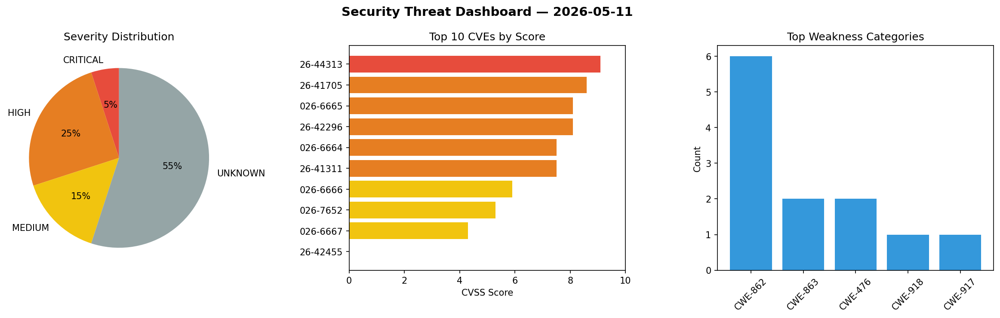
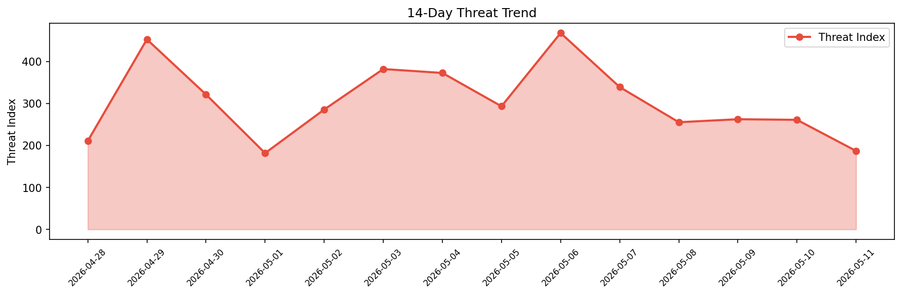

# Security Scan Report — 2026-05-11

**Scan ID:** `8da51a0e58` | **CVEs:** 20 | **Threat Index:** 186.8

## Threat Overview

| Metric | Value |
|--------|-------|
| Threat Index | 186.8 |
| Critical CVEs | 1 |
| CRITICAL | 1 |
| HIGH | 5 |
| MEDIUM | 3 |
| UNKNOWN | 11 |

## Delta vs Yesterday

| Metric | Today | Yesterday | Change |
|--------|-------|-----------|--------|
| total_cves | 20 | 20 | ➡️ 0.0% |
| threat_index | 186.8 | 260.9 | 📉 -28.4% |
| critical_count | 1 | 2 | 📉 -50.0% |

## Top Weakness Categories

| CWE | Count |
|-----|-------|
| CWE-862 | 6 |
| CWE-863 | 2 |
| CWE-476 | 2 |
| CWE-918 | 1 |
| CWE-917 | 1 |

## CVE Details

| CVE ID | Score | Severity | Description |
|--------|-------|----------|-------------|
| CVE-2026-44313 | 9.1 | CRITICAL | Linkwarden is a self-hosted, open-source collaborative bookmark manager to colle... |
| CVE-2026-41705 | 8.6 | HIGH | Spring AI's MilvusVectorStore#doDelete(List) implementation is vulnerable to fil... |
| CVE-2026-6665 | 8.1 | HIGH | The SCRAM code in PgBouncer before 1.25.2 did not check the return value of strl... |
| CVE-2026-42296 | 8.1 | HIGH | Argo Workflows is an open source container-native workflow engine for orchestrat... |
| CVE-2026-6664 | 7.5 | HIGH | An integer overflow in network packet parsing code in PgBouncer before 1.25.2 by... |
| CVE-2026-41311 | 7.5 | HIGH | LiquidJS is a Shopify / GitHub Pages compatible template engine in pure JavaScri... |
| CVE-2026-6666 | 5.9 | MEDIUM | A possible null pointer reference in PgBouncer before 1.25.2 could lead to a cra... |
| CVE-2026-7652 | 5.3 | MEDIUM | The LatePoint plugin for WordPress is vulnerable to Account Takeover via Weak Pa... |
| CVE-2026-6667 | 4.3 | MEDIUM | PgBouncer before 1.25.2 did not perform an appropriate authorization check for t... |
| CVE-2026-42455 | 0.0 | UNKNOWN | Linkwarden is a self-hosted, open-source collaborative bookmark manager to colle... |
| CVE-2026-8207 | 0.0 | UNKNOWN | Gibbon versions before v30.0.01 are affected by an authenticated SQL Injection v... |
| CVE-2026-41163 | 0.0 | UNKNOWN | bubblewrap is a low-level unprivileged sandboxing tool. From version 0.11.0 to b... |
| CVE-2026-42051 | 0.0 | UNKNOWN | Kirby is an open-source content management system. Prior to versions 4.9.0 and 5... |
| CVE-2026-42069 | 0.0 | UNKNOWN | Kirby is an open-source content management system. Prior to versions 4.9.0 and 5... |
| CVE-2026-42137 | 0.0 | UNKNOWN | Kirby is an open-source content management system. Prior to versions 4.9.0 and 5... |