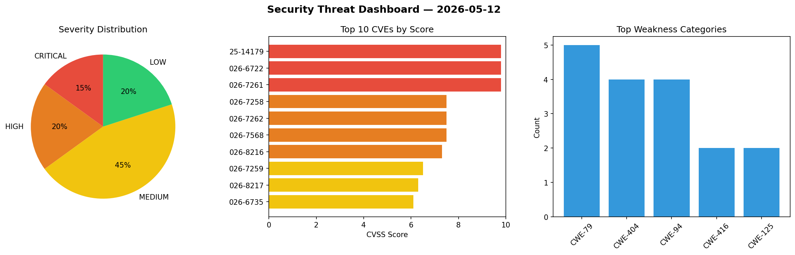
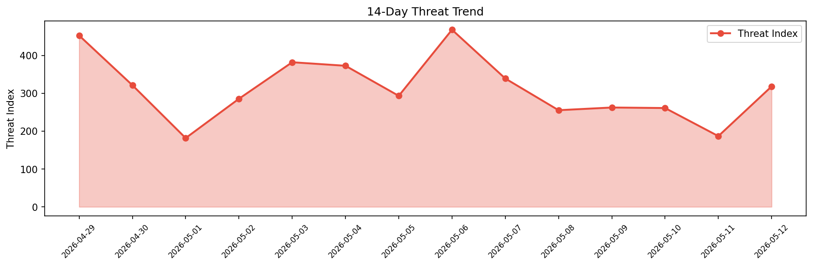

# Security Scan Report — 2026-05-12

**Scan ID:** `6a6d467ca7` | **CVEs:** 20 | **Threat Index:** 318.0

## Threat Overview

| Metric | Value |
|--------|-------|
| Threat Index | 318.0 |
| Critical CVEs | 3 |
| CRITICAL | 3 |
| HIGH | 4 |
| MEDIUM | 9 |
| LOW | 4 |

## Delta vs Yesterday

| Metric | Today | Yesterday | Change |
|--------|-------|-----------|--------|
| total_cves | 20 | 20 | ➡️ 0.0% |
| threat_index | 318.0 | 186.8 | 📈 70.2% |
| critical_count | 3 | 1 | 📈 200.0% |

## Top Weakness Categories

| CWE | Count |
|-----|-------|
| CWE-79 | 5 |
| CWE-404 | 4 |
| CWE-94 | 4 |
| CWE-416 | 2 |
| CWE-125 | 2 |

## CVE Details

| CVE ID | Score | Severity | Description |
|--------|-------|----------|-------------|
| CVE-2025-14179 | 9.8 | CRITICAL | In PHP versions 8.2.* before 8.2.31, 8.3.* before 8.3.31, 8.4.* before 8.4.21, a... |
| CVE-2026-6722 | 9.8 | CRITICAL | In PHP versions 8.2.* before 8.2.31, 8.3.* before 8.3.31, 8.4.* before 8.4.21, a... |
| CVE-2026-7261 | 9.8 | CRITICAL | In PHP versions 8.2.* before 8.2.31, 8.3.* before 8.3.31, 8.4.* before 8.4.21, a... |
| CVE-2026-7258 | 7.5 | HIGH | In PHP versions 8.2.* before 8.2.31, 8.3.* before 8.3.31, 8.4.* before 8.4.21, a... |
| CVE-2026-7262 | 7.5 | HIGH | In PHP versions 8.2.* before 8.2.31, 8.3.* before 8.3.31, 8.4.* before 8.4.21, a... |
| CVE-2026-7568 | 7.5 | HIGH | In PHP versions 8.2.* before 8.2.31, 8.3.* before 8.3.31, 8.4.* before 8.4.21, a... |
| CVE-2026-8216 | 7.3 | HIGH | A vulnerability was identified in Industrial Application Software IAS Canias ERP... |
| CVE-2026-7259 | 6.5 | MEDIUM | In PHP versions 8.2.* before 8.2.31, 8.3.* before 8.3.31, 8.4.* before 8.4.21, a... |
| CVE-2026-8217 | 6.3 | MEDIUM | A security flaw has been discovered in Industrial Application Software IAS Cania... |
| CVE-2026-6735 | 6.1 | MEDIUM | In PHP versions 8.2.* before 8.2.31, 8.3.* before 8.3.31, 8.4.* before 8.4.21, 8... |
| CVE-2026-8214 | 5.3 | MEDIUM | A vulnerability was found in Industrial Application Software IAS Canias ERP 8.03... |
| CVE-2026-8215 | 5.3 | MEDIUM | A vulnerability was determined in Industrial Application Software IAS Canias ERP... |
| CVE-2026-8222 | 5.3 | MEDIUM | A vulnerability has been found in Open5GS up to 2.7.7. Affected is the function ... |
| CVE-2026-8223 | 5.3 | MEDIUM | A vulnerability was found in Open5GS up to 2.7.7. Affected by this vulnerability... |
| CVE-2026-8224 | 5.3 | MEDIUM | A vulnerability was determined in Open5GS up to 2.7.7. Affected by this issue is... |