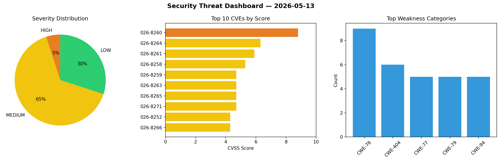
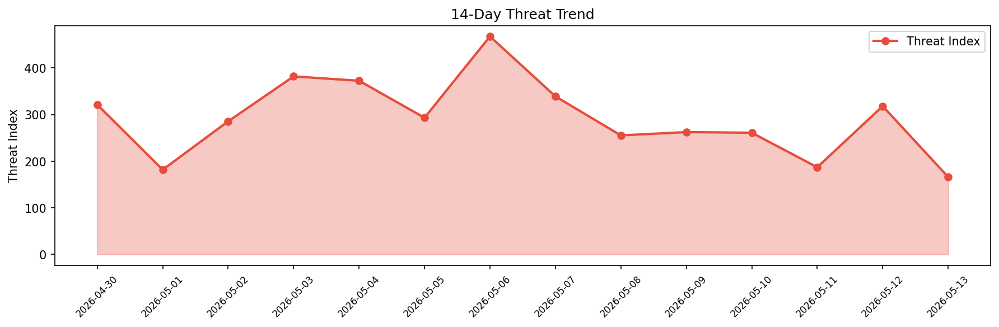

# Security Scan Report — 2026-05-13

**Scan ID:** `6ae46e4e67` | **CVEs:** 20 | **Threat Index:** 165.9

## Threat Overview

| Metric | Value |
|--------|-------|
| Threat Index | 165.9 |
| Critical CVEs | 0 |
| HIGH | 1 |
| MEDIUM | 13 |
| LOW | 6 |

## Delta vs Yesterday

| Metric | Today | Yesterday | Change |
|--------|-------|-----------|--------|
| total_cves | 20 | 20 | ➡️ 0.0% |
| threat_index | 165.9 | 318.0 | 📉 -47.8% |
| critical_count | 0 | 3 | 📉 -100.0% |

## Top Weakness Categories

| CWE | Count |
|-----|-------|
| CWE-78 | 9 |
| CWE-404 | 6 |
| CWE-77 | 5 |
| CWE-79 | 5 |
| CWE-94 | 5 |

## CVE Details

| CVE ID | Score | Severity | Description |
|--------|-------|----------|-------------|
| CVE-2026-8260 | 8.8 | HIGH | A vulnerability was found in D-Link DCS-935L up to 1.10.01. The impacted element... |
| CVE-2026-8264 | 6.3 | MEDIUM | A weakness has been identified in Tenda AC6 15.03.06.23. Affected by this vulner... |
| CVE-2026-8261 | 5.9 | MEDIUM | A vulnerability was determined in Squirrel up to 3.2. This affects the function ... |
| CVE-2026-8258 | 5.3 | MEDIUM | A flaw has been found in Squirrel up to 3.2. Impacted is the function validate_f... |
| CVE-2026-8259 | 4.7 | MEDIUM | A vulnerability has been found in Tenda AC6 2.0/15.03.06.23. The affected elemen... |
| CVE-2026-8263 | 4.7 | MEDIUM | A security flaw has been discovered in Tenda AC6 15.03.06.49_multi_TDE01. Affect... |
| CVE-2026-8265 | 4.7 | MEDIUM | A security vulnerability has been detected in Tenda AC6 15.03.06.23. Affected by... |
| CVE-2026-8271 | 4.7 | MEDIUM | A vulnerability was identified in D-Link DNS-320 2.06B01. The impacted element i... |
| CVE-2026-8252 | 4.3 | MEDIUM | A vulnerability was determined in Open5GS up to 2.7.7. Affected is the function ... |
| CVE-2026-8266 | 4.3 | MEDIUM | A vulnerability was detected in Open5GS up to 2.7.7. This affects the function g... |
| CVE-2026-8267 | 4.3 | MEDIUM | A flaw has been found in Open5GS up to 2.7.7. This vulnerability affects the fun... |
| CVE-2026-8268 | 4.3 | MEDIUM | A vulnerability has been found in Open5GS up to 2.7.7. This issue affects the fu... |
| CVE-2026-8269 | 4.3 | MEDIUM | A vulnerability was found in Open5GS up to 2.7.7. Impacted is the function smf_n... |
| CVE-2026-8270 | 4.3 | MEDIUM | A vulnerability was determined in Open5GS up to 2.7.7. The affected element is t... |
| CVE-2026-8257 | 3.3 | LOW | A vulnerability was detected in WebAssembly Binaryen up to 117. This issue affec... |