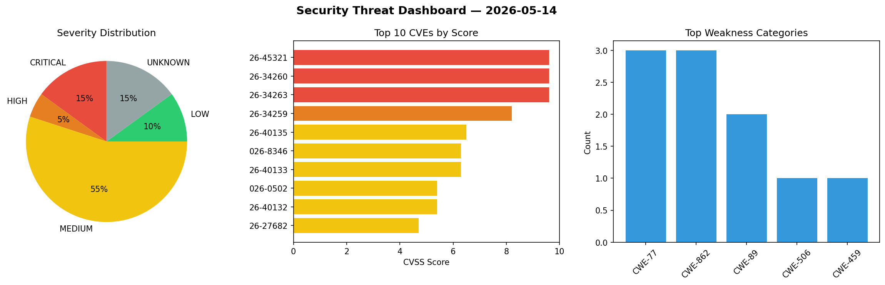
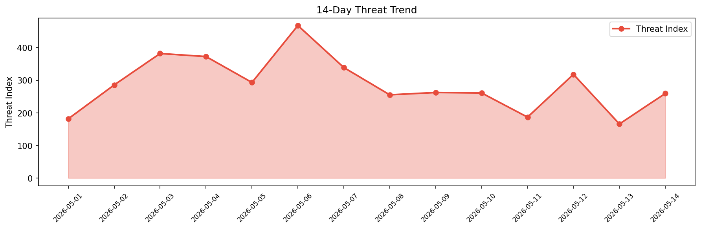

# Security Scan Report — 2026-05-14

**Scan ID:** `d49fd7d6fe` | **CVEs:** 20 | **Threat Index:** 259.4

## Threat Overview

| Metric | Value |
|--------|-------|
| Threat Index | 259.4 |
| Critical CVEs | 3 |
| CRITICAL | 3 |
| HIGH | 1 |
| MEDIUM | 11 |
| LOW | 2 |
| UNKNOWN | 3 |

## Delta vs Yesterday

| Metric | Today | Yesterday | Change |
|--------|-------|-----------|--------|
| total_cves | 20 | 20 | ➡️ 0.0% |
| threat_index | 259.4 | 165.9 | 📈 56.4% |
| critical_count | 3 | 0 | ➡️ 0% |

## Top Weakness Categories

| CWE | Count |
|-----|-------|
| CWE-77 | 3 |
| CWE-862 | 3 |
| CWE-89 | 2 |
| CWE-506 | 1 |
| CWE-459 | 1 |

## CVE Details

| CVE ID | Score | Severity | Description |
|--------|-------|----------|-------------|
| CVE-2026-45321 | 9.6 | CRITICAL | On 2026-05-11, between approximately 19:20 and 19:26 UTC, 84 malicious versions ... |
| CVE-2026-34260 | 9.6 | CRITICAL | SAP S/4HANA (SAP Enterprise Search for ABAP) contains a SQL injection vulnerabil... |
| CVE-2026-34263 | 9.6 | CRITICAL | Due to improper Spring Security configuration, SAP Commerce cloud allows an unau... |
| CVE-2026-34259 | 8.2 | HIGH | Due to an OS Command Execution vulnerability in SAP Forecasting & Replenishment,... |
| CVE-2026-40135 | 6.5 | MEDIUM | An OS Command Injection vulnerability exists in the SAP NetWeaver Application Se... |
| CVE-2026-8346 | 6.3 | MEDIUM | A vulnerability was detected in D-Link DIR-816 1.10CNB05_R1B011D88210. This affe... |
| CVE-2026-40133 | 6.3 | MEDIUM | Due to missing authorization check in SAP S/4HANA Condition Maintenance, an auth... |
| CVE-2026-0502 | 5.4 | MEDIUM | Due to insufficient CSRF protection in SAP BusinessObjects Business Intelligence... |
| CVE-2026-40132 | 5.4 | MEDIUM | Due to missing authorization check in SAP Strategic Enterprise Management (Score... |
| CVE-2026-27682 | 4.7 | MEDIUM | Due to a reflected cross-site scripting (XSS) vulnerability in SAP NetWeaver App... |
| CVE-2026-34258 | 4.7 | MEDIUM | SAPUI5 (Search UI) allows an unauthenticated attacker to manipulate specific URL... |
| CVE-2026-8349 | 4.3 | MEDIUM | A flaw has been found in omec-project amf up to 2.1.1. This vulnerability affect... |
| CVE-2026-40129 | 4.3 | MEDIUM | Due to a Code Injection vulnerability in SAP Application Server ABAP for SAP Net... |
| CVE-2026-40134 | 4.3 | MEDIUM | Due to insufficient authorization checks in the SAP Incentive and Commission Man... |
| CVE-2026-40136 | 4.3 | MEDIUM | SAP Financial Consolidation allows an authenticated attacker to disconnect other... |