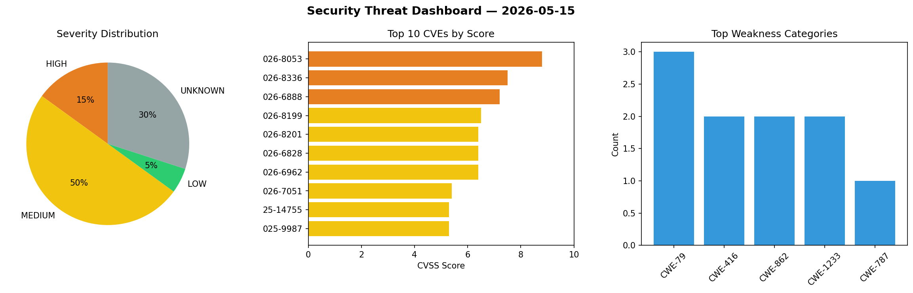
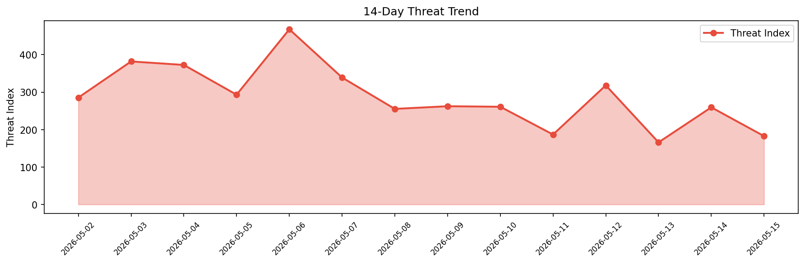

# Security Scan Report — 2026-05-15

**Scan ID:** `c3be65fc82` | **CVEs:** 20 | **Threat Index:** 182.6

## Threat Overview

| Metric | Value |
|--------|-------|
| Threat Index | 182.6 |
| Critical CVEs | 0 |
| HIGH | 3 |
| MEDIUM | 10 |
| LOW | 1 |
| UNKNOWN | 6 |

## Delta vs Yesterday

| Metric | Today | Yesterday | Change |
|--------|-------|-----------|--------|
| total_cves | 20 | 20 | ➡️ 0.0% |
| threat_index | 182.6 | 259.4 | 📉 -29.6% |
| critical_count | 0 | 3 | 📉 -100.0% |

## Top Weakness Categories

| CWE | Count |
|-----|-------|
| CWE-79 | 3 |
| CWE-416 | 2 |
| CWE-862 | 2 |
| CWE-1233 | 2 |
| CWE-787 | 1 |

## CVE Details

| CVE ID | Score | Severity | Description |
|--------|-------|----------|-------------|
| CVE-2026-8053 | 8.8 | HIGH | An issue in MongoDB Server's time-series collection implementation allows an aut... |
| CVE-2026-8336 | 7.5 | HIGH | After invoking $_internalJsEmit, which is not intended to be directly accessible... |
| CVE-2026-6888 | 7.2 | HIGH | Successful exploitation of the SQL injection vulnerability could allow a remote ... |
| CVE-2026-8199 | 6.5 | MEDIUM | An authenticated user can cause excess memory usage via bitwise match expression... |
| CVE-2026-8201 | 6.4 | MEDIUM | A use-after-free vulnerability exists in MongoDB's Field-Level Encryption (FLE) ... |
| CVE-2026-6828 | 6.4 | MEDIUM | The Fluent Forms – Customizable Contact Forms, Survey, Quiz, & Conversational Fo... |
| CVE-2026-6962 | 6.4 | MEDIUM | The Cost of Goods: Product Cost & Profit Calculator for WooCommerce plugin for W... |
| CVE-2026-7051 | 5.4 | MEDIUM | The Blog2Social: Social Media Auto Post & Scheduler plugin for WordPress is vuln... |
| CVE-2025-14755 | 5.3 | MEDIUM | The Cost Calculator Builder plugin for WordPress is vulnerable to Unauthenticate... |
| CVE-2025-9987 | 5.3 | MEDIUM | The Broadstreet plugin for WordPress is vulnerable to Sensitive Information Expo... |
| CVE-2025-9989 | 4.4 | MEDIUM | The Broadstreet plugin for WordPress is vulnerable to Stored Cross-Site Scriptin... |
| CVE-2026-8202 | 4.3 | MEDIUM | Using a densely populated chars mask and a large input string in the MongoDB agg... |
| CVE-2025-9988 | 4.3 | MEDIUM | The Broadstreet plugin for WordPress is vulnerable to unauthorized access due to... |
| CVE-2026-8200 | 2.7 | LOW | When schema validation is enabled on a collection and an update or insert would ... |
| CVE-2024-36315 | 0.0 | UNKNOWN | Improper enforcement of the LFENCE serialization property may allow an attacker ... |