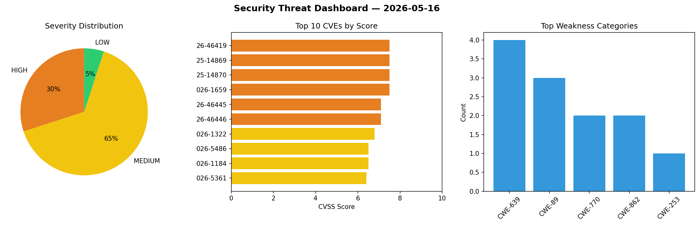
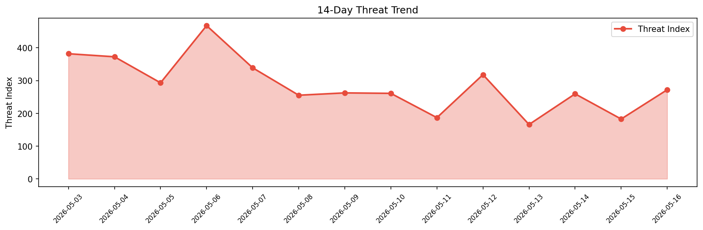

# Security Scan Report — 2026-05-16

**Scan ID:** `c864662586` | **CVEs:** 20 | **Threat Index:** 271.9

## Threat Overview

| Metric | Value |
|--------|-------|
| Threat Index | 271.9 |
| Critical CVEs | 0 |
| HIGH | 6 |
| MEDIUM | 13 |
| LOW | 1 |

## Delta vs Yesterday

| Metric | Today | Yesterday | Change |
|--------|-------|-----------|--------|
| total_cves | 20 | 20 | ➡️ 0.0% |
| threat_index | 271.9 | 182.6 | 📈 48.9% |
| critical_count | 0 | 0 | ➡️ 0% |

## Top Weakness Categories

| CWE | Count |
|-----|-------|
| CWE-639 | 4 |
| CWE-89 | 3 |
| CWE-770 | 2 |
| CWE-862 | 2 |
| CWE-253 | 1 |

## CVE Details

| CVE ID | Score | Severity | Description |
|--------|-------|----------|-------------|
| CVE-2026-46419 | 7.5 | HIGH | Yubico webauthn-server-core (aka java-webauthn-server) 2.8.0 before 2.8.2 incorr... |
| CVE-2025-14869 | 7.5 | HIGH | GitLab has remediated an issue in GitLab CE/EE affecting all versions from 18.5 ... |
| CVE-2025-14870 | 7.5 | HIGH | GitLab has remediated an issue in GitLab CE/EE affecting all versions from 18.5 ... |
| CVE-2026-1659 | 7.5 | HIGH | GitLab has remediated an issue in GitLab CE/EE affecting all versions from 9.0 b... |
| CVE-2026-46445 | 7.1 | HIGH | SOGo before 5.12.7, when PostgreSQL is used, allows SQL injection.... |
| CVE-2026-46446 | 7.1 | HIGH | SOGo before 5.12.7, when PostgreSQL or MariaDB is used, and cleartext passwords ... |
| CVE-2026-1322 | 6.8 | MEDIUM | GitLab has remediated an issue in GitLab CE/EE affecting all versions from 16.0 ... |
| CVE-2026-5486 | 6.5 | MEDIUM | The Unlimited Elements for Elementor plugin for WordPress is vulnerable to SQL I... |
| CVE-2026-1184 | 6.5 | MEDIUM | GitLab has remediated an issue in GitLab EE affecting all versions from 11.9 bef... |
| CVE-2026-5361 | 6.4 | MEDIUM | The Envira Gallery Lite plugin for WordPress is vulnerable to Stored Cross-Site ... |
| CVE-2025-15345 | 6.1 | MEDIUM | The MapGeo – Interactive Geo Maps plugin for WordPress is vulnerable to Reflecte... |
| CVE-2025-12669 | 5.4 | MEDIUM | GitLab has remediated an issue in GitLab CE/EE affecting all versions from 15.11... |
| CVE-2026-41281 | 4.8 | MEDIUM | Android App "あんしんフィルター for au" provided by KDDI CORPORATION contains Cleartext T... |
| CVE-2026-44919 | 4.3 | MEDIUM | In OpenStack Ironic through 35.x before a3f6d73, during image handling, an infin... |
| CVE-2026-7525 | 4.3 | MEDIUM | The My Calendar – Accessible Event Manager plugin for WordPress is vulnerable to... |