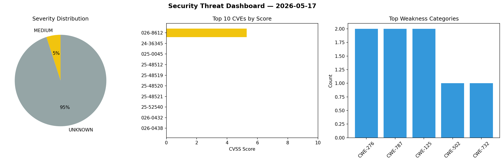
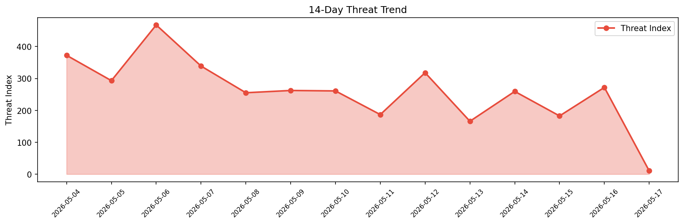

# Security Scan Report — 2026-05-17

**Scan ID:** `61962bb682` | **CVEs:** 20 | **Threat Index:** 10.6

## Threat Overview

| Metric | Value |
|--------|-------|
| Threat Index | 10.6 |
| Critical CVEs | 0 |
| MEDIUM | 1 |
| UNKNOWN | 19 |

## Delta vs Yesterday

| Metric | Today | Yesterday | Change |
|--------|-------|-----------|--------|
| total_cves | 20 | 20 | ➡️ 0.0% |
| threat_index | 10.6 | 271.9 | 📉 -96.1% |
| critical_count | 0 | 0 | ➡️ 0% |

## Top Weakness Categories

| CWE | Count |
|-----|-------|
| CWE-276 | 2 |
| CWE-787 | 2 |
| CWE-125 | 2 |
| CWE-502 | 1 |
| CWE-732 | 1 |

## CVE Details

| CVE ID | Score | Severity | Description |
|--------|-------|----------|-------------|
| CVE-2026-8612 | 5.3 | MEDIUM | WWW::Mechanize::Cached versions before 2.00 for Perl deserialize cached HTTP res... |
| CVE-2024-36345 | 0.0 | UNKNOWN | Improper input validation in the AMD OverDrive (AOD) System Management Mode (SMM... |
| CVE-2025-0045 | 0.0 | UNKNOWN | Improper Input validation in the AMD Secure Processor (ASP) PCI driver may allow... |
| CVE-2025-48512 | 0.0 | UNKNOWN | Incorrect default permissions in the installation directory for the AMD general-... |
| CVE-2025-48519 | 0.0 | UNKNOWN | An improper input validation vulnerability within the AMD Platform Management Fr... |
| CVE-2025-48520 | 0.0 | UNKNOWN | An improper input validation vulnerability within the AMD Platform Management Fr... |
| CVE-2025-48521 | 0.0 | UNKNOWN | Improper input validation in the AMD Secure Processor (ASP) PCI driver could all... |
| CVE-2025-52540 | 0.0 | UNKNOWN | An improper input validation vulnerability within the AMD Platform Management Fr... |
| CVE-2026-0432 | 0.0 | UNKNOWN | Incorrect default permissions in the installation directory for the AMD chipset ... |
| CVE-2026-0438 | 0.0 | UNKNOWN | A System Management Mode (SMM) handler could perform a callout to code located i... |
| CVE-2021-26380 | 0.0 | UNKNOWN | A compromised Trusted OS (TOS) driver could issue a malformed call that could po... |
| CVE-2022-23826 | 0.0 | UNKNOWN | A TOCTOU (Time-Of-Check to Time-Of-Use) in the graphics interface may allow an a... |
| CVE-2023-31309 | 0.0 | UNKNOWN | Improper validation in Power Management Firmware (PMFW) may allow an attacker wi... |
| CVE-2023-31316 | 0.0 | UNKNOWN | Improperly preserved integrity of hardware configuration state during a power sa... |
| CVE-2023-31317 | 0.0 | UNKNOWN | Improper restriction of operations within the bounds of a memory buffer in the A... |