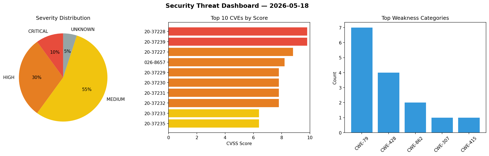
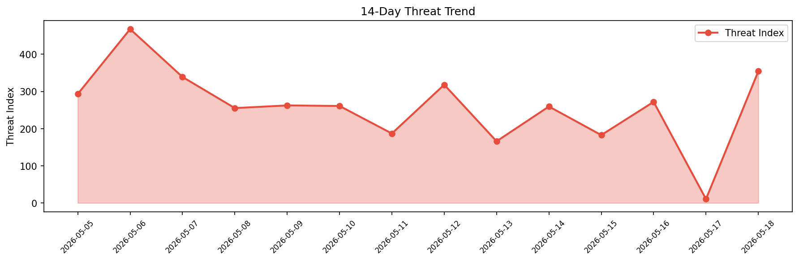

# Security Scan Report — 2026-05-18

**Scan ID:** `6e9908e5d6` | **CVEs:** 20 | **Threat Index:** 354.2

## Threat Overview

| Metric | Value |
|--------|-------|
| Threat Index | 354.2 |
| Critical CVEs | 2 |
| CRITICAL | 2 |
| HIGH | 6 |
| MEDIUM | 11 |
| UNKNOWN | 1 |

## Delta vs Yesterday

| Metric | Today | Yesterday | Change |
|--------|-------|-----------|--------|
| total_cves | 20 | 20 | ➡️ 0.0% |
| threat_index | 354.2 | 10.6 | 📈 3241.5% |
| critical_count | 2 | 0 | ➡️ 0% |

## Top Weakness Categories

| CWE | Count |
|-----|-------|
| CWE-79 | 7 |
| CWE-428 | 4 |
| CWE-862 | 2 |
| CWE-307 | 1 |
| CWE-415 | 1 |

## CVE Details

| CVE ID | Score | Severity | Description |
|--------|-------|----------|-------------|
| CVE-2020-37228 | 9.8 | CRITICAL | iDS6 DSSPro Digital Signage System 6.2 contains a CAPTCHA security bypass vulner... |
| CVE-2020-37239 | 9.8 | CRITICAL | libbabl 0.1.62 contains a broken double free detection vulnerability that allows... |
| CVE-2020-37227 | 8.8 | HIGH | HS Brand Logo Slider 2.1 contains an unrestricted file upload vulnerability that... |
| CVE-2026-8657 | 8.2 | HIGH | Versions of the package jsondiffpatch before 0.7.6 are vulnerable to Prototype P... |
| CVE-2020-37229 | 7.8 | HIGH | OKI sPSV Port Manager 1.0.41 contains an unquoted service path vulnerability in ... |
| CVE-2020-37230 | 7.8 | HIGH | Syncplify.me Server! 5.0.37 contains an unquoted service path vulnerability in t... |
| CVE-2020-37231 | 7.8 | HIGH | Privacy Drive 3.17.0 contains an unquoted service path vulnerability in the pdsv... |
| CVE-2020-37232 | 7.8 | HIGH | Advanced System Care Service 13.0.0.157 contains an unquoted service path vulner... |
| CVE-2020-37233 | 6.4 | MEDIUM | WordPress Plugin Buddypress 6.2.0 contains a persistent cross-site scripting vul... |
| CVE-2020-37235 | 6.4 | MEDIUM | WordPress Theme Wibar 1.1.8 contains a stored cross-site scripting vulnerability... |
| CVE-2020-37236 | 6.4 | MEDIUM | NewsLister contains an authenticated persistent cross-site scripting vulnerabili... |
| CVE-2020-37237 | 6.4 | MEDIUM | Composr CMS 10.0.34 contains a persistent cross-site scripting vulnerability tha... |
| CVE-2020-37238 | 6.4 | MEDIUM | CMS Made Simple 2.2.15 contains a stored cross-site scripting vulnerability that... |
| CVE-2020-37240 | 6.4 | MEDIUM | Queue Management System 4.0.0 contains a stored cross-site scripting vulnerabili... |
| CVE-2020-37234 | 6.2 | MEDIUM | Internet Download Manager 6.38.12 contains a buffer overflow vulnerability in th... |