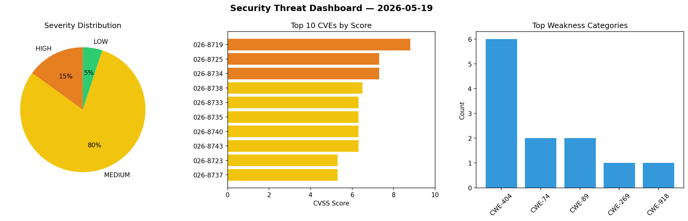
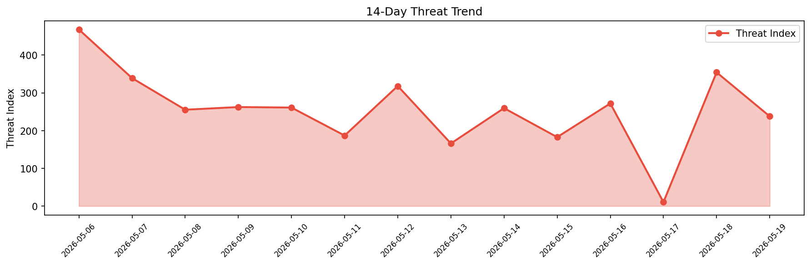

# Security Scan Report — 2026-05-19

**Scan ID:** `13c9631a15` | **CVEs:** 20 | **Threat Index:** 237.7

## Threat Overview

| Metric | Value |
|--------|-------|
| Threat Index | 237.7 |
| Critical CVEs | 0 |
| HIGH | 3 |
| MEDIUM | 16 |
| LOW | 1 |

## Delta vs Yesterday

| Metric | Today | Yesterday | Change |
|--------|-------|-----------|--------|
| total_cves | 20 | 20 | ➡️ 0.0% |
| threat_index | 237.7 | 354.2 | 📉 -32.9% |
| critical_count | 0 | 2 | 📉 -100.0% |

## Top Weakness Categories

| CWE | Count |
|-----|-------|
| CWE-404 | 6 |
| CWE-74 | 2 |
| CWE-89 | 2 |
| CWE-269 | 1 |
| CWE-918 | 1 |

## CVE Details

| CVE ID | Score | Severity | Description |
|--------|-------|----------|-------------|
| CVE-2026-8719 | 8.8 | HIGH | The AI Engine – The Chatbot, AI Framework & MCP for WordPress plugin for WordPre... |
| CVE-2026-8725 | 7.3 | HIGH | A weakness has been identified in CoreWorxLab CAAL up to 1.6.0. The affected ele... |
| CVE-2026-8734 | 7.3 | HIGH | A vulnerability was determined in Oinone Pamirs up to 7.2.0. Affected by this is... |
| CVE-2026-8738 | 6.5 | MEDIUM | A security vulnerability has been detected in Sanluan PublicCMS 5.202506.d. Impa... |
| CVE-2026-8733 | 6.3 | MEDIUM | A vulnerability was found in Investintech SlimPDFReader up to 2.0.13. Affected b... |
| CVE-2026-8735 | 6.3 | MEDIUM | A vulnerability was identified in Oinone Pamirs up to 7.2.0. This affects the fu... |
| CVE-2026-8740 | 6.3 | MEDIUM | A flaw has been found in Sanluan PublicCMS 5.202506.d. The impacted element is t... |
| CVE-2026-8743 | 6.3 | MEDIUM | A vulnerability was found in Open5GS up to 2.7.6. This impacts the function ran_... |
| CVE-2026-8723 | 5.3 | MEDIUM | ### Summary

`qs.stringify` throws `TypeError` when called with `arrayFormat: ... |
| CVE-2026-8737 | 5.3 | MEDIUM | A weakness has been identified in Sanluan PublicCMS 5.202506.d. This issue affec... |
| CVE-2026-8739 | 5.3 | MEDIUM | A vulnerability was detected in Sanluan PublicCMS 5.202506.d. The affected eleme... |
| CVE-2026-8724 | 4.7 | MEDIUM | A security flaw has been discovered in Dataease 2.10.20. Impacted is the functio... |
| CVE-2026-8728 | 4.3 | MEDIUM | A security vulnerability has been detected in Open5GS up to 2.7.7. The impacted ... |
| CVE-2026-8729 | 4.3 | MEDIUM | A vulnerability was detected in Open5GS up to 2.7.7. This affects an unknown fun... |
| CVE-2026-8730 | 4.3 | MEDIUM | A flaw has been found in Open5GS up to 2.7.6. This impacts the function ogs_sbi_... |