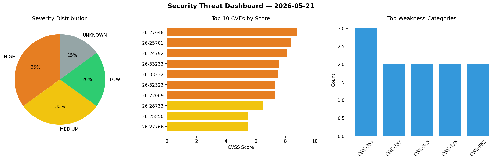
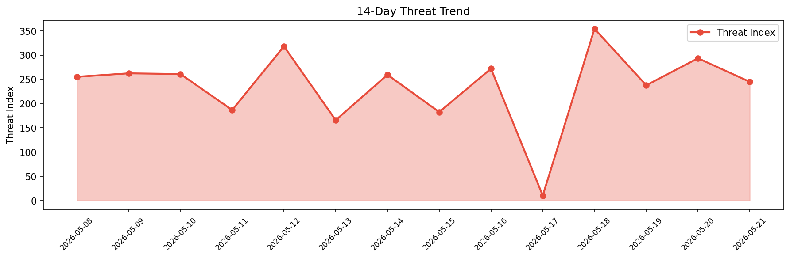

# Security Scan Report — 2026-05-21

**Scan ID:** `b79d2d2b10` | **CVEs:** 20 | **Threat Index:** 244.8

## Threat Overview

| Metric | Value |
|--------|-------|
| Threat Index | 244.8 |
| Critical CVEs | 0 |
| HIGH | 7 |
| MEDIUM | 6 |
| LOW | 4 |
| UNKNOWN | 3 |

## Delta vs Yesterday

| Metric | Today | Yesterday | Change |
|--------|-------|-----------|--------|
| total_cves | 20 | 20 | ➡️ 0.0% |
| threat_index | 244.8 | 293.4 | 📉 -16.6% |
| critical_count | 0 | 0 | ➡️ 0% |

## Top Weakness Categories

| CWE | Count |
|-----|-------|
| CWE-364 | 3 |
| CWE-787 | 2 |
| CWE-345 | 2 |
| CWE-476 | 2 |
| CWE-862 | 2 |

## CVE Details

| CVE ID | Score | Severity | Description |
|--------|-------|----------|-------------|
| CVE-2026-27648 | 8.8 | HIGH | in OpenHarmony v6.0 and prior versions allow a remote attacker arbitrary code ex... |
| CVE-2026-25781 | 8.4 | HIGH | in OpenHarmony v6.0 and prior versions allow a local attacker cause DOS and it c... |
| CVE-2026-24792 | 8.1 | HIGH | in OpenHarmony v6.0 and prior versions allow a remote attacker arbitrary code ex... |
| CVE-2026-33233 | 7.6 | HIGH | AutoGPT is a workflow automation platform for creating, deploying, and managing ... |
| CVE-2026-33232 | 7.5 | HIGH | AutoGPT is a workflow automation platform for creating, deploying, and managing ... |
| CVE-2026-32323 | 7.3 | HIGH | Mullvad VPN is a VPN client app for desktop and mobile. When using macOS with ve... |
| CVE-2026-22069 | 7.3 | HIGH | A local privilege escalation vulnerability exists in O+ Connect because it fails... |
| CVE-2026-28733 | 6.5 | MEDIUM | in OpenHarmony v6.0 and prior versions allow a local attacker arbitrary code exe... |
| CVE-2026-25850 | 5.5 | MEDIUM | in OpenHarmony v6.0 and prior versions allow a local attacker cause information ... |
| CVE-2026-27766 | 5.5 | MEDIUM | in OpenHarmony v6.0 and prior versions allow a local attacker cause information ... |
| CVE-2026-47307 | 5.5 | MEDIUM | NULL pointer dereference vulnerability in Samsung Open Source Walrus allows an a... |
| CVE-2026-32244 | 5.3 | MEDIUM | Discourse is an open-source discussion platform. In versions prior to 2026.1.4, ... |
| CVE-2026-33234 | 5.0 | MEDIUM | AutoGPT is a workflow automation platform for creating, deploying, and managing ... |
| CVE-2026-25110 | 3.3 | LOW | in OpenHarmony v6.0 and prior versions allow a local attacker cause DOS.... |
| CVE-2026-27781 | 3.3 | LOW | in OpenHarmony v6.0 and prior versions allow a local attacker cause DOS.... |