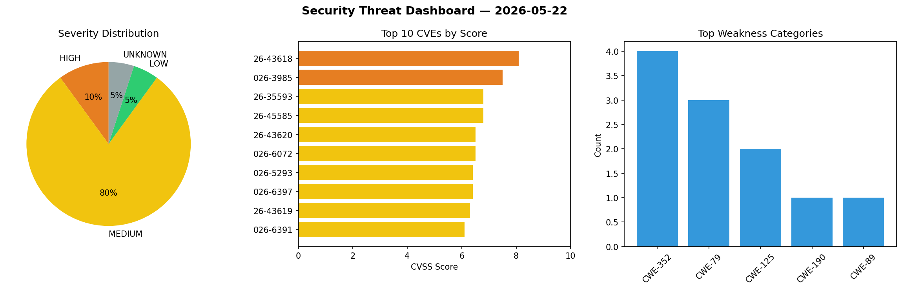
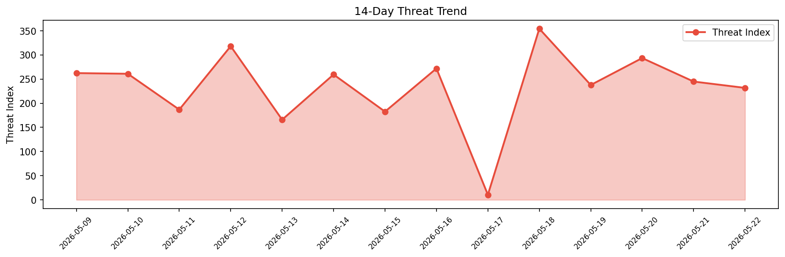

# Security Scan Report — 2026-05-22

**Scan ID:** `449c81d3f9` | **CVEs:** 20 | **Threat Index:** 231.7

## Threat Overview

| Metric | Value |
|--------|-------|
| Threat Index | 231.7 |
| Critical CVEs | 0 |
| HIGH | 2 |
| MEDIUM | 16 |
| LOW | 1 |
| UNKNOWN | 1 |

## Delta vs Yesterday

| Metric | Today | Yesterday | Change |
|--------|-------|-----------|--------|
| total_cves | 20 | 20 | ➡️ 0.0% |
| threat_index | 231.7 | 244.8 | 📉 -5.4% |
| critical_count | 0 | 0 | ➡️ 0% |

## Top Weakness Categories

| CWE | Count |
|-----|-------|
| CWE-352 | 4 |
| CWE-79 | 3 |
| CWE-125 | 2 |
| CWE-190 | 1 |
| CWE-89 | 1 |

## CVE Details

| CVE ID | Score | Severity | Description |
|--------|-------|----------|-------------|
| CVE-2026-43618 | 8.1 | HIGH | Rsync version 3.4.2 and prior contain an integer overflow vulnerability in the c... |
| CVE-2026-3985 | 7.5 | HIGH | The Creative Mail – Easier WordPress & WooCommerce Email Marketing plugin for Wo... |
| CVE-2026-35593 | 6.8 | MEDIUM | Trilium Notes is an open-source, cross-platform hierarchical note taking applica... |
| CVE-2026-45585 | 6.8 | MEDIUM | Microsoft is aware of a security feature bypass vulnerability in Windows publicl... |
| CVE-2026-43620 | 6.5 | MEDIUM | Rsync version 3.4.2 and prior contain a receiver-side out-of-bounds array read v... |
| CVE-2026-6072 | 6.5 | MEDIUM | The Oliver POS – A WooCommerce Point of Sale (POS) plugin for WordPress is vulne... |
| CVE-2026-5293 | 6.4 | MEDIUM | The 診断ジェネレータ作成プラグイン (Diagnosis Generator) plugin for WordPress is vulnerable to ... |
| CVE-2026-6397 | 6.4 | MEDIUM | The Sticky plugin for WordPress is vulnerable to Stored Cross-Site Scripting via... |
| CVE-2026-43619 | 6.3 | MEDIUM | Rsync version 3.4.2 and prior contain symlink race condition vulnerabilities in ... |
| CVE-2026-6391 | 6.1 | MEDIUM | The Sentence To SEO (keywords, description and tags) plugin for WordPress is vul... |
| CVE-2026-6395 | 6.1 | MEDIUM | The Word 2 Cash plugin for WordPress is vulnerable to Cross-Site Request Forgery... |
| CVE-2026-39309 | 5.5 | MEDIUM | Trilium Notes is a cross-platform, hierarchical note taking application focused ... |
| CVE-2026-6394 | 5.4 | MEDIUM | The Nexa Blocks – Gutenberg Blocks, Page Builder for Gutenberg Editor & FSE plug... |
| CVE-2026-43617 | 4.8 | MEDIUM | Rsync version 3.4.2 and prior contain an authorization bypass vulnerability in t... |
| CVE-2026-6399 | 4.4 | MEDIUM | The General Options plugin for WordPress is vulnerable to Stored Cross-Site Scri... |