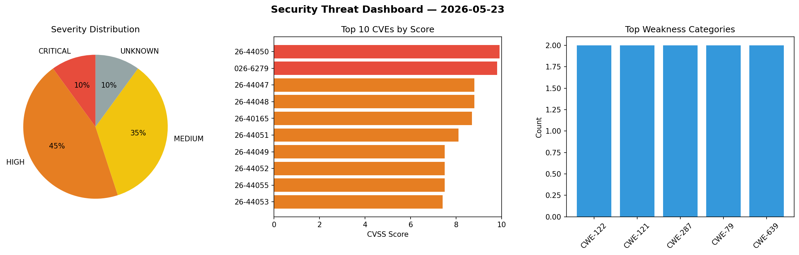
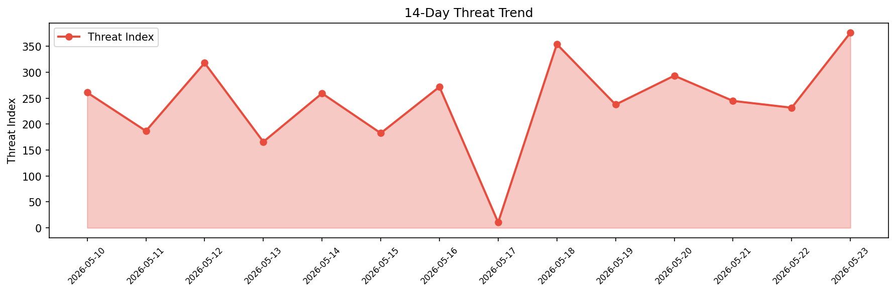

# Security Scan Report — 2026-05-23

**Scan ID:** `e5a6b15d84` | **CVEs:** 20 | **Threat Index:** 376.3

## Threat Overview

| Metric | Value |
|--------|-------|
| Threat Index | 376.3 |
| Critical CVEs | 2 |
| CRITICAL | 2 |
| HIGH | 9 |
| MEDIUM | 7 |
| UNKNOWN | 2 |

## Delta vs Yesterday

| Metric | Today | Yesterday | Change |
|--------|-------|-----------|--------|
| total_cves | 20 | 20 | ➡️ 0.0% |
| threat_index | 376.3 | 231.7 | 📈 62.4% |
| critical_count | 2 | 0 | ➡️ 0% |

## Top Weakness Categories

| CWE | Count |
|-----|-------|
| CWE-122 | 2 |
| CWE-121 | 2 |
| CWE-287 | 2 |
| CWE-79 | 2 |
| CWE-639 | 2 |

## CVE Details

| CVE ID | Score | Severity | Description |
|--------|-------|----------|-------------|
| CVE-2026-44050 | 9.9 | CRITICAL | A heap-based buffer overflow in the CNID daemon comm_rcv() function in Netatalk ... |
| CVE-2026-6279 | 9.8 | CRITICAL | The Avada Builder (fusion-builder) plugin for WordPress is vulnerable to Unauthe... |
| CVE-2026-44047 | 8.8 | HIGH | An SQL injection vulnerability in the MySQL CNID backend in Netatalk 3.1.0 throu... |
| CVE-2026-44048 | 8.8 | HIGH | A stack-based buffer overflow via UCS-2 type confusion in convert_charset() in N... |
| CVE-2026-40165 | 8.7 | HIGH | authentik is an open-source identity provider. Versions 2025.12.4 and prior, and... |
| CVE-2026-44051 | 8.1 | HIGH | An improper link resolution vulnerability in Netatalk 3.0.2 through 4.4.2 allows... |
| CVE-2026-44049 | 7.5 | HIGH | An out-of-bounds write due to improper null termination in convert_charset() in ... |
| CVE-2026-44052 | 7.5 | HIGH | Netatalk 2.1.0 through 4.4.2 inserts LDAP simple-bind passwords into log output ... |
| CVE-2026-44055 | 7.5 | HIGH | A logic error involving bitwise OR operations in Netatalk 3.1.4 through 4.4.2 al... |
| CVE-2026-44053 | 7.4 | HIGH | Netatalk 1.5.0 through 4.2.2 uses a broken cryptographic algorithm in the DHCAST... |
| CVE-2026-44058 | 7.2 | HIGH | An authentication bypass vulnerability in Netatalk 2.2.2 through 4.4.2 allows a ... |
| CVE-2026-9149 | 6.5 | MEDIUM | A flaw was found in libsolv. This heap buffer overflow vulnerability occurs when... |
| CVE-2026-2734 | 6.5 | MEDIUM | In mlflow/mlflow versions up to 3.9.0, the `SearchModelVersions` REST API endpoi... |
| CVE-2026-44054 | 6.5 | MEDIUM | Netatalk 2.0.0 through 4.4.2 generates AFP session tokens derived from predictab... |
| CVE-2026-1543 | 6.4 | MEDIUM | The Avada (Fusion) Builder plugin for WordPress is vulnerable to Stored Cross-Si... |