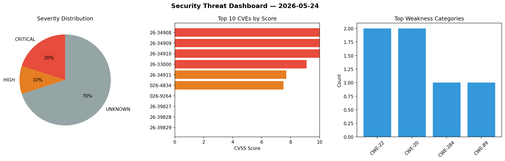
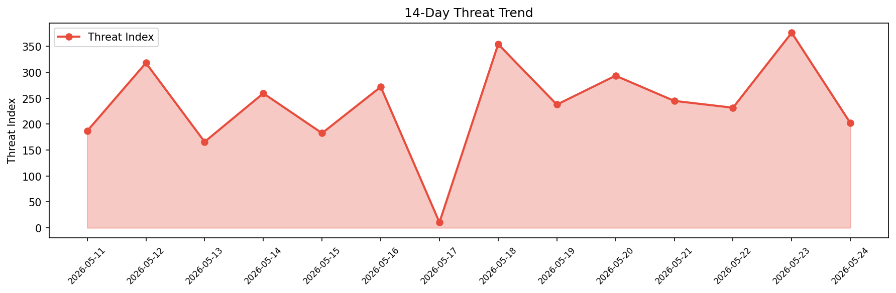

# Security Scan Report — 2026-05-24

**Scan ID:** `390d5a7f98` | **CVEs:** 20 | **Threat Index:** 202.0

## Threat Overview

| Metric | Value |
|--------|-------|
| Threat Index | 202.0 |
| Critical CVEs | 4 |
| CRITICAL | 4 |
| HIGH | 2 |
| UNKNOWN | 14 |

## Delta vs Yesterday

| Metric | Today | Yesterday | Change |
|--------|-------|-----------|--------|
| total_cves | 20 | 20 | ➡️ 0.0% |
| threat_index | 202.0 | 376.3 | 📉 -46.3% |
| critical_count | 4 | 2 | 📈 100.0% |

## Top Weakness Categories

| CWE | Count |
|-----|-------|
| CWE-22 | 2 |
| CWE-20 | 2 |
| CWE-284 | 1 |
| CWE-89 | 1 |

## CVE Details

| CVE ID | Score | Severity | Description |
|--------|-------|----------|-------------|
| CVE-2026-34908 | 10.0 | CRITICAL | A malicious actor with access to the network could exploit an Improper Access Co... |
| CVE-2026-34909 | 10.0 | CRITICAL | A malicious actor with access to the network could exploit a Path Traversal vuln... |
| CVE-2026-34910 | 10.0 | CRITICAL | A malicious actor with access to the network could exploit an Improper Input Val... |
| CVE-2026-33000 | 9.1 | CRITICAL | A malicious actor with access to the network and high privileges could exploit a... |
| CVE-2026-34911 | 7.7 | HIGH | A malicious actor with access to the network and low privileges could exploit a ... |
| CVE-2026-4834 | 7.5 | HIGH | The WP ERP Pro plugin for WordPress is vulnerable to SQL Injection via the 'sear... |
| CVE-2026-9264 | 0.0 | UNKNOWN | A cross-site scripting (XSS) vulnerability in SketchUp 2026's Dynamic Components... |
| CVE-2026-39827 | 0.0 | UNKNOWN | An authenticated SSH client that repeatedly opened channels which were rejected ... |
| CVE-2026-39828 | 0.0 | UNKNOWN | When an SSH server authentication callback returned PartialSuccessError with non... |
| CVE-2026-39829 | 0.0 | UNKNOWN | The RSA and DSA public key parsers did not enforce size limits on key parameters... |
| CVE-2026-39830 | 0.0 | UNKNOWN | A malicious SSH peer could send unsolicited global request responses to fill an ... |
| CVE-2026-39831 | 0.0 | UNKNOWN | The Verify() method for FIDO/U2F security key types (sk-ecdsa-sha2-nistp256@open... |
| CVE-2026-39832 | 0.0 | UNKNOWN | When adding a key to a remote agent constraint extensions such as restrict-desti... |
| CVE-2026-39833 | 0.0 | UNKNOWN | The in-memory keyring returned by NewKeyring() silently accepted keys with the C... |
| CVE-2026-39834 | 0.0 | UNKNOWN | When writing data larger than 4GB in a single Write call on an SSH channel, an i... |