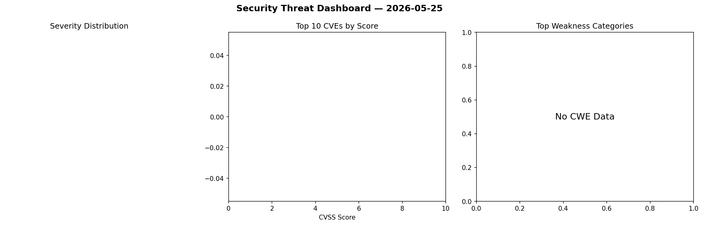
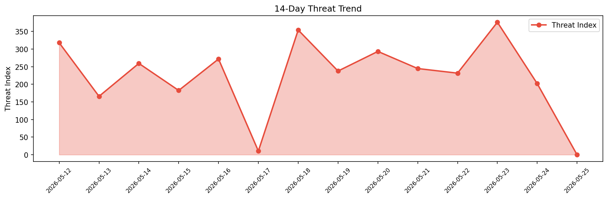

# Security Scan Report — 2026-05-25

**Scan ID:** `ce0a351e42` | **CVEs:** 0 | **Threat Index:** 0

## Threat Overview

| Metric | Value |
|--------|-------|
| Threat Index | 0 |
| Critical CVEs | 0 |

## Delta vs Yesterday

| Metric | Today | Yesterday | Change |
|--------|-------|-----------|--------|
| total_cves | 0 | 20 | 📉 -100.0% |
| threat_index | 0 | 202.0 | 📉 -100.0% |
| critical_count | 0 | 4 | 📉 -100.0% |

## CVE Details

| CVE ID | Score | Severity | Description |
|--------|-------|----------|-------------|