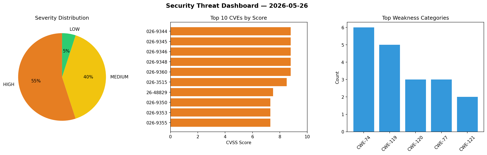
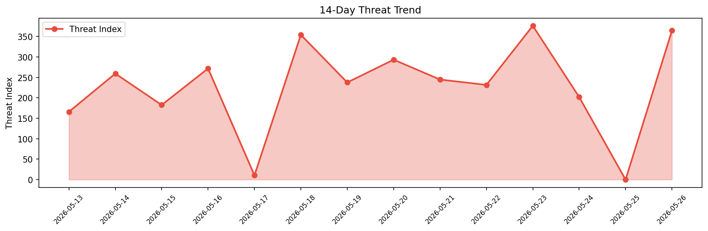

# Security Scan Report — 2026-05-26

**Scan ID:** `0aef0d6ef2` | **CVEs:** 20 | **Threat Index:** 364.7

## Threat Overview

| Metric | Value |
|--------|-------|
| Threat Index | 364.7 |
| Critical CVEs | 0 |
| HIGH | 11 |
| MEDIUM | 8 |
| LOW | 1 |

## Delta vs Yesterday

| Metric | Today | Yesterday | Change |
|--------|-------|-----------|--------|
| total_cves | 20 | 0 | ➡️ 0% |
| threat_index | 364.7 | 0 | ➡️ 0% |
| critical_count | 0 | 0 | ➡️ 0% |

## Top Weakness Categories

| CWE | Count |
|-----|-------|
| CWE-74 | 6 |
| CWE-119 | 5 |
| CWE-120 | 3 |
| CWE-77 | 3 |
| CWE-121 | 2 |

## CVE Details

| CVE ID | Score | Severity | Description |
|--------|-------|----------|-------------|
| CVE-2026-9344 | 8.8 | HIGH | A security vulnerability has been detected in Edimax EW-7438RPn up to 1.31. The ... |
| CVE-2026-9345 | 8.8 | HIGH | A vulnerability was detected in Edimax EW-7438RPn up to 1.31. This affects the f... |
| CVE-2026-9346 | 8.8 | HIGH | A flaw has been found in Edimax EW-7438RPn up to 1.31. This impacts the function... |
| CVE-2026-9348 | 8.8 | HIGH | A vulnerability was found in Edimax EW-7438RPn up to 1.31. Affected by this vuln... |
| CVE-2026-9360 | 8.8 | HIGH | A security flaw has been discovered in Edimax EW-7438RPn 1.28a. Affected by this... |
| CVE-2026-3515 | 8.5 | HIGH | A vulnerability in the `GitHubRepository` block of the `prefect-github` integrat... |
| CVE-2026-48829 | 7.5 | HIGH | In GNU SASL before 2.2.3, DIGEST-MD5 has a NULL pointer dereference affecting bo... |
| CVE-2026-9350 | 7.3 | HIGH | A vulnerability was identified in NousResearch hermes-agent up to 2026.4.16. Thi... |
| CVE-2026-9353 | 7.3 | HIGH | A security vulnerability has been detected in NousResearch hermes-agent up to 20... |
| CVE-2026-9355 | 7.3 | HIGH | A flaw has been found in SourceCodester Hospitals Patient Records Management Sys... |
| CVE-2026-9356 | 7.3 | HIGH | A vulnerability has been found in SourceCodester Hospitals Patient Records Manag... |
| CVE-2026-9351 | 6.5 | MEDIUM | A security flaw has been discovered in NousResearch hermes-agent up to 2026.4.16... |
| CVE-2026-9354 | 6.5 | MEDIUM | A vulnerability was detected in NousResearch hermes-agent up to 2026.4.16. The a... |
| CVE-2026-9347 | 6.3 | MEDIUM | A vulnerability has been found in Edimax EW-7438RPn up to 1.31. Affected is the ... |
| CVE-2026-9359 | 6.3 | MEDIUM | A vulnerability was identified in Edimax EW-7438RPn 1.28a. Affected by this vuln... |