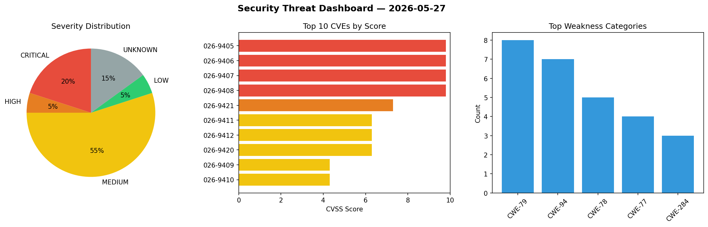
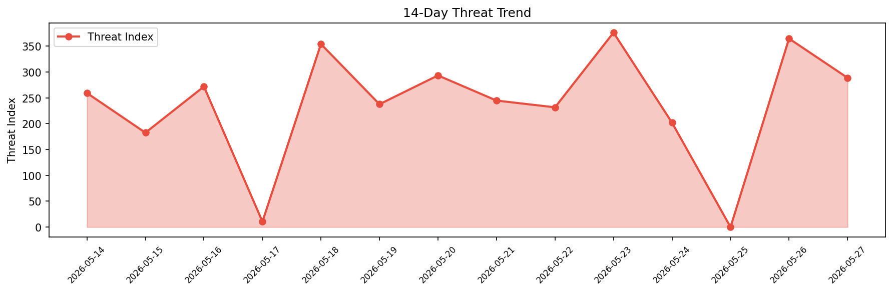

# Security Scan Report — 2026-05-27

**Scan ID:** `7f2ccbd38f` | **CVEs:** 20 | **Threat Index:** 288.8

## Threat Overview

| Metric | Value |
|--------|-------|
| Threat Index | 288.8 |
| Critical CVEs | 4 |
| CRITICAL | 4 |
| HIGH | 1 |
| MEDIUM | 11 |
| LOW | 1 |
| UNKNOWN | 3 |

## Delta vs Yesterday

| Metric | Today | Yesterday | Change |
|--------|-------|-----------|--------|
| total_cves | 20 | 20 | ➡️ 0.0% |
| threat_index | 288.8 | 364.7 | 📉 -20.8% |
| critical_count | 4 | 0 | ➡️ 0% |

## Top Weakness Categories

| CWE | Count |
|-----|-------|
| CWE-79 | 8 |
| CWE-94 | 7 |
| CWE-78 | 5 |
| CWE-77 | 4 |
| CWE-284 | 3 |

## CVE Details

| CVE ID | Score | Severity | Description |
|--------|-------|----------|-------------|
| CVE-2026-9405 | 9.8 | CRITICAL | A security flaw has been discovered in Totolink A8000RU 7.1cu.643_b20200521. Thi... |
| CVE-2026-9406 | 9.8 | CRITICAL | A weakness has been identified in Totolink A8000RU 7.1cu.643_b20200521. Affected... |
| CVE-2026-9407 | 9.8 | CRITICAL | A security vulnerability has been detected in Totolink A8000RU 7.1cu.643_b202005... |
| CVE-2026-9408 | 9.8 | CRITICAL | A vulnerability was detected in Totolink A8000RU 7.1cu.643_b20200521. Affected b... |
| CVE-2026-9421 | 7.3 | HIGH | A vulnerability was determined in KLiK SocialMediaWebsite 1.0. This vulnerabilit... |
| CVE-2026-9411 | 6.3 | MEDIUM | A vulnerability was found in SourceCodester Indian Invoicing System 1.0. This is... |
| CVE-2026-9412 | 6.3 | MEDIUM | A vulnerability was determined in SourceCodester Indian Invoicing System 1.0. Im... |
| CVE-2026-9420 | 6.3 | MEDIUM | A vulnerability was found in KLiK SocialMediaWebsite 1.0. This affects an unknow... |
| CVE-2026-9409 | 4.3 | MEDIUM | A flaw has been found in Sushmi-pal Invoice-System up to a0a3faa16dee2621b231ae2... |
| CVE-2026-9410 | 4.3 | MEDIUM | A vulnerability has been found in Sushmi-pal Invoice-System up to a0a3faa16dee26... |
| CVE-2026-9413 | 4.3 | MEDIUM | A vulnerability was identified in SourceCodester Indian Invoicing System 1.0. Th... |
| CVE-2026-9415 | 4.3 | MEDIUM | A weakness has been identified in code-projects Employee Management System 1.0. ... |
| CVE-2026-9416 | 4.3 | MEDIUM | A security vulnerability has been detected in code-projects Employee Management ... |
| CVE-2026-9417 | 4.3 | MEDIUM | A vulnerability was detected in code-projects Employee Management System 1.0. Af... |
| CVE-2026-9418 | 4.3 | MEDIUM | A flaw has been found in code-projects Employee Management System 1.0. Affected ... |