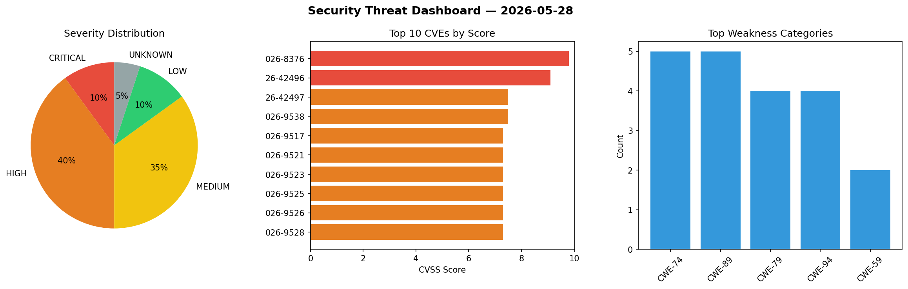
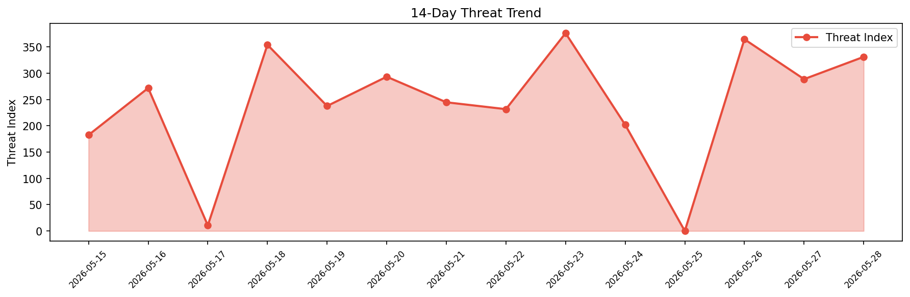

# Security Scan Report — 2026-05-28

**Scan ID:** `581c62ec70` | **CVEs:** 20 | **Threat Index:** 331.2

## Threat Overview

| Metric | Value |
|--------|-------|
| Threat Index | 331.2 |
| Critical CVEs | 2 |
| CRITICAL | 2 |
| HIGH | 8 |
| MEDIUM | 7 |
| LOW | 2 |
| UNKNOWN | 1 |

## Delta vs Yesterday

| Metric | Today | Yesterday | Change |
|--------|-------|-----------|--------|
| total_cves | 20 | 20 | ➡️ 0.0% |
| threat_index | 331.2 | 288.8 | 📈 14.7% |
| critical_count | 2 | 4 | 📉 -50.0% |

## Top Weakness Categories

| CWE | Count |
|-----|-------|
| CWE-74 | 5 |
| CWE-89 | 5 |
| CWE-79 | 4 |
| CWE-94 | 4 |
| CWE-59 | 2 |

## CVE Details

| CVE ID | Score | Severity | Description |
|--------|-------|----------|-------------|
| CVE-2026-8376 | 9.8 | CRITICAL | Perl versions through 5.43.10 have a heap buffer overflow when compiling regular... |
| CVE-2026-42496 | 9.1 | CRITICAL | Archive::Tar versions before 3.08 for Perl extract symlinks with attacker contro... |
| CVE-2026-42497 | 7.5 | HIGH | Archive::Tar versions before 3.08 for Perl extract hardlinks to attacker control... |
| CVE-2026-9538 | 7.5 | HIGH | Archive::Tar versions before 3.10 for Perl allow memory exhaustion via attacker ... |
| CVE-2026-9517 | 7.3 | HIGH | A vulnerability was determined in hemant6488 CodeIgniter-StudentManagementSystem... |
| CVE-2026-9521 | 7.3 | HIGH | A security vulnerability has been detected in fraillt bitsery up to 5.2.4. Affec... |
| CVE-2026-9523 | 7.3 | HIGH | A vulnerability was detected in Acrel Electrical EEMS Enterprise Power Operation... |
| CVE-2026-9525 | 7.3 | HIGH | A vulnerability has been found in itsourcecode Electronic Judging System 1.0. Th... |
| CVE-2026-9526 | 7.3 | HIGH | A vulnerability was found in itsourcecode Electronic Judging System 1.0. This vu... |
| CVE-2026-9528 | 7.3 | HIGH | A vulnerability was identified in itsourcecode Electronic Judging System 1.0. Im... |
| CVE-2026-4795 | 6.5 | MEDIUM | A missing authorization vulnerability in Zyxel GS1200-5v3 firmware versions thro... |
| CVE-2026-9515 | 6.3 | MEDIUM | A vulnerability was detected in Totolink CA750-PoE 6.2c.510. The affected elemen... |
| CVE-2026-9524 | 6.3 | MEDIUM | A flaw has been found in xianrendzw EasyReport up to 2.0.17.0522_Beta. Affected ... |
| CVE-2026-9518 | 4.3 | MEDIUM | A vulnerability was identified in hemant6488 CodeIgniter-StudentManagementSystem... |
| CVE-2026-9519 | 4.3 | MEDIUM | A security flaw has been discovered in stonith404 pingvin-share up to 1.13.0. Th... |