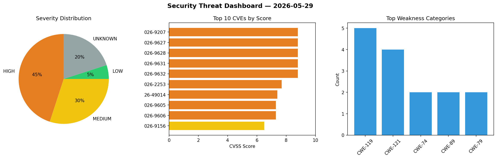
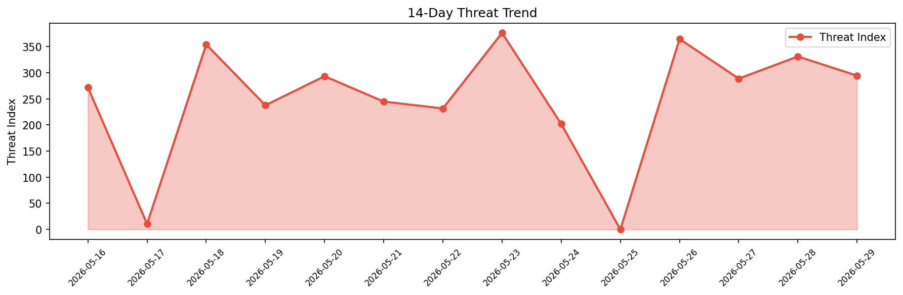

# Security Scan Report — 2026-05-29

**Scan ID:** `577182a675` | **CVEs:** 20 | **Threat Index:** 294.5

## Threat Overview

| Metric | Value |
|--------|-------|
| Threat Index | 294.5 |
| Critical CVEs | 0 |
| HIGH | 9 |
| MEDIUM | 6 |
| LOW | 1 |
| UNKNOWN | 4 |

## Delta vs Yesterday

| Metric | Today | Yesterday | Change |
|--------|-------|-----------|--------|
| total_cves | 20 | 20 | ➡️ 0.0% |
| threat_index | 294.5 | 331.2 | 📉 -11.1% |
| critical_count | 0 | 2 | 📉 -100.0% |

## Top Weakness Categories

| CWE | Count |
|-----|-------|
| CWE-119 | 5 |
| CWE-121 | 4 |
| CWE-74 | 2 |
| CWE-89 | 2 |
| CWE-79 | 2 |

## CVE Details

| CVE ID | Score | Severity | Description |
|--------|-------|----------|-------------|
| CVE-2026-9207 | 8.8 | HIGH | Tanium addressed an unauthorized code execution vulnerability in Connect.... |
| CVE-2026-9627 | 8.8 | HIGH | A security flaw has been discovered in UTT HiPER 1200GW up to 2.5.3-170306. This... |
| CVE-2026-9628 | 8.8 | HIGH | A weakness has been identified in UTT HiPER 1200GW up to 2.5.3-170306. Affected ... |
| CVE-2026-9631 | 8.8 | HIGH | A vulnerability was detected in UTT HiPER 1250GW up to 3.2.7-210907-180535. Affe... |
| CVE-2026-9632 | 8.8 | HIGH | A flaw has been found in UTT HiPER 1250GW up to 3.2.7-210907-180535. Affected by... |
| CVE-2026-2253 | 7.7 | HIGH | Hitachi Vantara Pentaho Data Integration & Analytics versions before 10.2.0.7 an... |
| CVE-2026-49014 | 7.4 | HIGH | In GDAL 3.1.0 through 3.13.0, scanForGeometryContainers in the netCDF driver all... |
| CVE-2026-9605 | 7.3 | HIGH | A flaw has been found in GNU libredwg up to 0.13.4.8160. This issue affects the ... |
| CVE-2026-9606 | 7.3 | HIGH | A vulnerability has been found in itsourcecode Courier Management System 1.0. Im... |
| CVE-2026-9156 | 6.5 | MEDIUM | Tanium addressed a denial of service vulnerability in Tanium Server.... |
| CVE-2026-6565 | 6.4 | MEDIUM | The Style Kits – Advanced Theme Styles for Elementor, Elementor Kits & Elementor... |
| CVE-2026-9607 | 6.3 | MEDIUM | A vulnerability was found in itsourcecode Courier Management System 1.0. The aff... |
| CVE-2026-2254 | 6.3 | MEDIUM | Hitachi Vantara Pentaho Data Integration & Analytics versions before 10.2.0.6 an... |
| CVE-2026-7493 | 5.3 | MEDIUM | The Appointment Booking Calendar — Simply Schedule Appointments Booking Plugin p... |
| CVE-2026-9609 | 4.7 | MEDIUM | A vulnerability was identified in QianFox FoxCMS up to 1.2.6. This affects the f... |