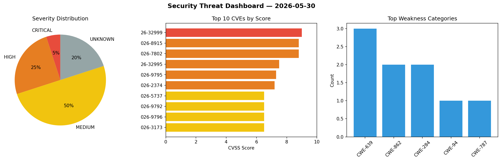
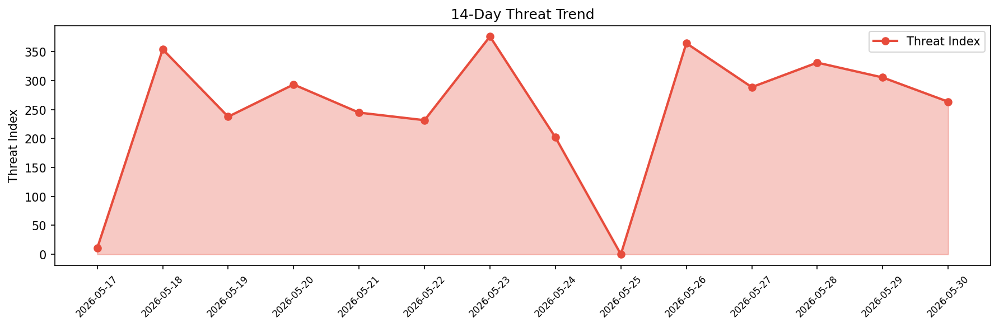

# Security Scan Report — 2026-05-30

**Scan ID:** `9cfe811c00` | **CVEs:** 20 | **Threat Index:** 263.6

## Threat Overview

| Metric | Value |
|--------|-------|
| Threat Index | 263.6 |
| Critical CVEs | 1 |
| CRITICAL | 1 |
| HIGH | 5 |
| MEDIUM | 10 |
| UNKNOWN | 4 |

## Delta vs Yesterday

| Metric | Today | Yesterday | Change |
|--------|-------|-----------|--------|
| total_cves | 20 | 20 | ➡️ 0.0% |
| threat_index | 263.6 | 305.5 | 📉 -13.7% |
| critical_count | 1 | 0 | ➡️ 0% |

## Top Weakness Categories

| CWE | Count |
|-----|-------|
| CWE-639 | 3 |
| CWE-862 | 2 |
| CWE-284 | 2 |
| CWE-94 | 1 |
| CWE-787 | 1 |

## CVE Details

| CVE ID | Score | Severity | Description |
|--------|-------|----------|-------------|
| CVE-2026-32999 | 9.0 | CRITICAL | Insufficient character filtering in backup agent signing module on Comet Backup ... |
| CVE-2026-8915 | 8.8 | HIGH | Out-of-bounds write vulnerability in Samsung Open Source Escargot allows Overflo... |
| CVE-2026-7802 | 8.8 | HIGH | The Frontend Admin by DynamiApps plugin for WordPress is vulnerable to authoriza... |
| CVE-2026-32995 | 7.5 | HIGH | The Rocket.Chat DDP method autoTranslate.translateMessage in versions <8.5.0, <8... |
| CVE-2026-9795 | 7.3 | HIGH | A flaw was found in Keycloak's Fine-Grained Admin Permissions (FGAPv2) feature. ... |
| CVE-2026-2374 | 7.2 | HIGH | The Login No Captcha reCAPTCHA plugin for WordPress is vulnerable to Stored Cros... |
| CVE-2026-5737 | 6.5 | MEDIUM | The Independent Analytics plugin for WordPress is vulnerable to Server-Side Requ... |
| CVE-2026-9792 | 6.5 | MEDIUM | A flaw was found in Keycloak's Client Policies, specifically within the `org.key... |
| CVE-2026-9796 | 6.5 | MEDIUM | A flaw was found in Keycloak. An authenticated administrator with the `manage-cl... |
| CVE-2026-3173 | 6.5 | MEDIUM | The Meta Field Block plugin for WordPress is vulnerable to Insecure Direct Objec... |
| CVE-2026-9793 | 5.9 | MEDIUM | A flaw was found in Keycloak. When a JSON Web Encryption (JWE) encrypted request... |
| CVE-2026-9794 | 5.3 | MEDIUM | A flaw was found in Keycloak. A remote, unauthenticated attacker can exploit thi... |
| CVE-2026-4888 | 4.3 | MEDIUM | The Everest Forms – Contact Form, Payment Form, Quiz, Survey & Custom Form Build... |
| CVE-2026-9228 | 4.3 | MEDIUM | The Timetable and Event Schedule by MotoPress plugin for WordPress is vulnerable... |
| CVE-2026-9241 | 4.3 | MEDIUM | The FOX – Currency Switcher Professional for WooCommerce plugin for WordPress is... |