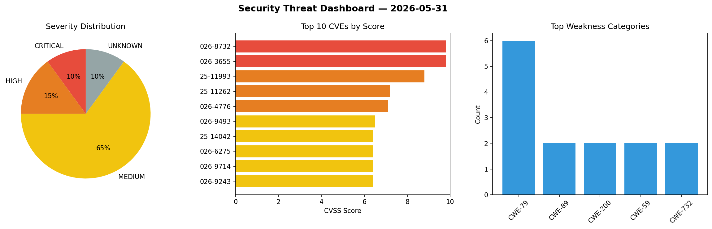
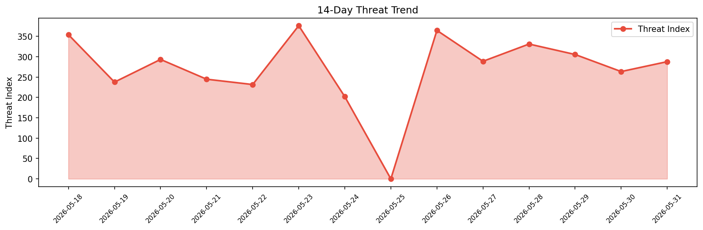

# Security Scan Report — 2026-05-31

**Scan ID:** `d43c4d0561` | **CVEs:** 20 | **Threat Index:** 287.9

## Threat Overview

| Metric | Value |
|--------|-------|
| Threat Index | 287.9 |
| Critical CVEs | 2 |
| CRITICAL | 2 |
| HIGH | 3 |
| MEDIUM | 13 |
| UNKNOWN | 2 |

## Delta vs Yesterday

| Metric | Today | Yesterday | Change |
|--------|-------|-----------|--------|
| total_cves | 20 | 20 | ➡️ 0.0% |
| threat_index | 287.9 | 263.6 | 📈 9.2% |
| critical_count | 2 | 1 | 📈 100.0% |

## Top Weakness Categories

| CWE | Count |
|-----|-------|
| CWE-79 | 6 |
| CWE-89 | 2 |
| CWE-200 | 2 |
| CWE-59 | 2 |
| CWE-732 | 2 |

## CVE Details

| CVE ID | Score | Severity | Description |
|--------|-------|----------|-------------|
| CVE-2026-8732 | 9.8 | CRITICAL | The WP Maps Pro plugin for WordPress is vulnerable to Privilege Escalation via A... |
| CVE-2026-3655 | 9.8 | CRITICAL | The OTP Login With Phone Number, OTP Verification plugin for WordPress is vulner... |
| CVE-2025-11993 | 8.8 | HIGH | The WooCommerce Infinite Scroll and Ajax Pagination plugin for WordPress is vuln... |
| CVE-2025-11262 | 7.2 | HIGH | The Link Whisper Free plugin for WordPress is vulnerable to Stored Cross-Site Sc... |
| CVE-2026-4776 | 7.1 | HIGH | An SQL injection vulnerability exists in Mautic's API contact filtering mechanis... |
| CVE-2026-9493 | 6.5 | MEDIUM | Service Center developed by BankPro E-Service Technology has an Insecure Direct ... |
| CVE-2025-14042 | 6.4 | MEDIUM | The Automotive Car Dealership Business WordPress Theme for WordPress is vulnerab... |
| CVE-2026-6275 | 6.4 | MEDIUM | The StatCounter – Free Real Time Visitor Stats plugin for WordPress is vulnerabl... |
| CVE-2026-9714 | 6.4 | MEDIUM | The Simple Divi Shortcode plugin for WordPress is vulnerable to Stored Cross-Sit... |
| CVE-2026-9243 | 6.4 | MEDIUM | The Plus Addons for Elementor plugin for WordPress is vulnerable to Stored Cross... |
| CVE-2026-2128 | 5.3 | MEDIUM | The Breeze plugin for WordPress is vulnerable to Exposure of Sensitive Informati... |
| CVE-2026-6891 | 5.0 | MEDIUM | Improper handling of symbolic links in the installer of My Image Garden for macO... |
| CVE-2026-6892 | 5.0 | MEDIUM | Improper handling of symbolic links in the installer of CUPS Printer Driver for ... |
| CVE-2026-10039 | 4.9 | MEDIUM | The Frontend Admin by DynamiApps plugin for WordPress is vulnerable to generic S... |
| CVE-2026-6324 | 4.8 | MEDIUM | A flaw was found in libsoup. A remote attacker could exploit an unsigned to sign... |