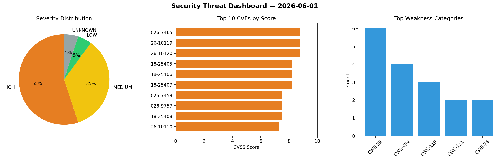
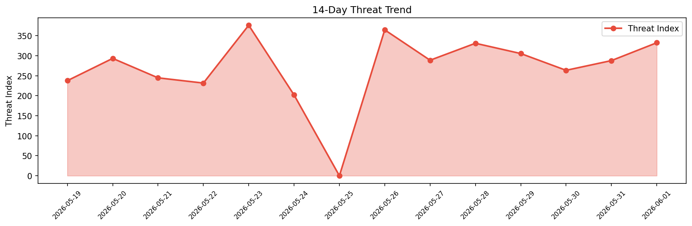

# Security Scan Report — 2026-06-01

**Scan ID:** `52c2a676fd` | **CVEs:** 20 | **Threat Index:** 332.5

## Threat Overview

| Metric | Value |
|--------|-------|
| Threat Index | 332.5 |
| Critical CVEs | 0 |
| HIGH | 11 |
| MEDIUM | 7 |
| LOW | 1 |
| UNKNOWN | 1 |

## Delta vs Yesterday

| Metric | Today | Yesterday | Change |
|--------|-------|-----------|--------|
| total_cves | 20 | 20 | ➡️ 0.0% |
| threat_index | 332.5 | 287.9 | 📈 15.5% |
| critical_count | 0 | 2 | 📉 -100.0% |

## Top Weakness Categories

| CWE | Count |
|-----|-------|
| CWE-89 | 6 |
| CWE-404 | 4 |
| CWE-119 | 3 |
| CWE-121 | 2 |
| CWE-74 | 2 |

## CVE Details

| CVE ID | Score | Severity | Description |
|--------|-------|----------|-------------|
| CVE-2026-7465 | 8.8 | HIGH | The Spectra Gutenberg Blocks – Website Builder for the Block Editor plugin for W... |
| CVE-2026-10119 | 8.8 | HIGH | A security vulnerability has been detected in TRENDnet TEW-432BRP 3.10B20. Impac... |
| CVE-2026-10120 | 8.8 | HIGH | A vulnerability was detected in TRENDnet TEW-432BRP 3.10B20. The affected elemen... |
| CVE-2018-25405 | 8.2 | HIGH | eNdonesia Portal 8.7 contains multiple SQL injection vulnerabilities that allow ... |
| CVE-2018-25406 | 8.2 | HIGH | eNdonesia Portal 8.7 contains multiple SQL injection vulnerabilities that allow ... |
| CVE-2018-25407 | 8.2 | HIGH | eNdonesia Portal 8.7 contains multiple SQL injection vulnerabilities that allow ... |
| CVE-2026-7459 | 7.5 | HIGH | The Simple History – Track, Log, and Audit WordPress Changes plugin for WordPres... |
| CVE-2026-9757 | 7.5 | HIGH | The GEO my WP plugin for WordPress is vulnerable to SQL Injection via the 'swlat... |
| CVE-2018-25408 | 7.5 | HIGH | The Open ISES Project 3.30A contains a path traversal vulnerability in the ajax/... |
| CVE-2026-10110 | 7.3 | HIGH | A vulnerability was detected in code-projects Student Details Management System ... |
| CVE-2026-10111 | 7.3 | HIGH | A flaw has been found in sambitraj STUDENT-MANAGEMENT-SYSTEM 1.0. This impacts a... |
| CVE-2026-5071 | 6.1 | MEDIUM | The SocketCAN implementation validates the length of a user-provided buffer cont... |
| CVE-2026-48840 | 5.3 | MEDIUM | Exim 4.88 before 4.99.4, in some proxy configurations, mishandles certain short ... |
| CVE-2026-10113 | 4.3 | MEDIUM | A vulnerability was found in Open5GS up to 2.7.7. Affected by this vulnerability... |
| CVE-2026-10114 | 4.3 | MEDIUM | A vulnerability was determined in Open5GS up to 2.7.7. Affected by this issue is... |