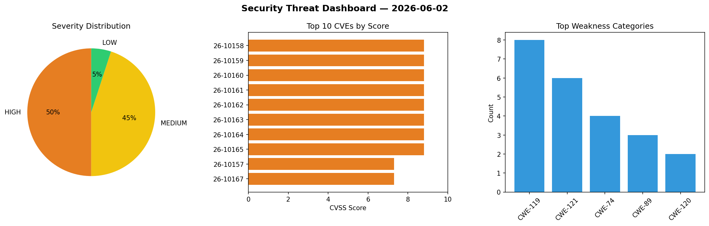
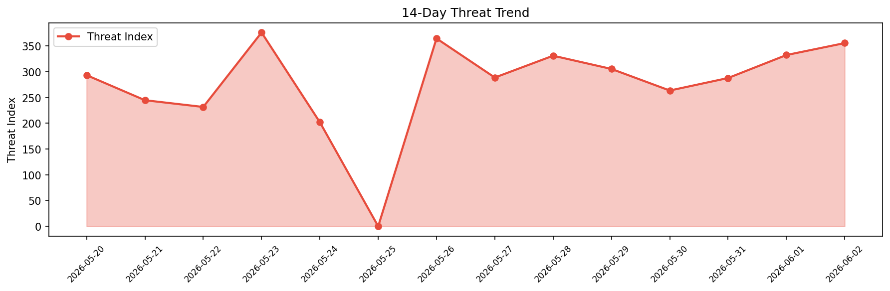

# Security Scan Report — 2026-06-02

**Scan ID:** `9001eef56f` | **CVEs:** 20 | **Threat Index:** 355.7

## Threat Overview

| Metric | Value |
|--------|-------|
| Threat Index | 355.7 |
| Critical CVEs | 0 |
| HIGH | 10 |
| MEDIUM | 9 |
| LOW | 1 |

## Delta vs Yesterday

| Metric | Today | Yesterday | Change |
|--------|-------|-----------|--------|
| total_cves | 20 | 20 | ➡️ 0.0% |
| threat_index | 355.7 | 332.5 | 📈 7.0% |
| critical_count | 0 | 0 | ➡️ 0% |

## Top Weakness Categories

| CWE | Count |
|-----|-------|
| CWE-119 | 8 |
| CWE-121 | 6 |
| CWE-74 | 4 |
| CWE-89 | 3 |
| CWE-120 | 2 |

## CVE Details

| CVE ID | Score | Severity | Description |
|--------|-------|----------|-------------|
| CVE-2026-10158 | 8.8 | HIGH | A security flaw has been discovered in TRENDnet TEW-432BRP 3.10B20. Affected is ... |
| CVE-2026-10159 | 8.8 | HIGH | A weakness has been identified in TRENDnet TEW-432BRP 3.10B20. Affected by this ... |
| CVE-2026-10160 | 8.8 | HIGH | A security vulnerability has been detected in TRENDnet TEW-432BRP 3.10B20. Affec... |
| CVE-2026-10161 | 8.8 | HIGH | A vulnerability was detected in TRENDnet TEW-432BRP 3.10B20. This affects the fu... |
| CVE-2026-10162 | 8.8 | HIGH | A flaw has been found in TRENDnet TEW-432BRP 3.10B20. This vulnerability affects... |
| CVE-2026-10163 | 8.8 | HIGH | A vulnerability has been found in Edimax BR-6478AC 1.23. This issue affects the ... |
| CVE-2026-10164 | 8.8 | HIGH | A vulnerability was found in Edimax BR-6478AC 1.23. Impacted is the function for... |
| CVE-2026-10165 | 8.8 | HIGH | A vulnerability was identified in Edimax BR-6478AC 1.23. The impacted element is... |
| CVE-2026-10157 | 7.3 | HIGH | A vulnerability was identified in Open5GS up to 2.7.6. This impacts an unknown f... |
| CVE-2026-10167 | 7.3 | HIGH | A weakness has been identified in OUSL-GROUP-BrinaryBrains School Student Manage... |
| CVE-2026-10166 | 6.3 | MEDIUM | A vulnerability was determined in Edimax BR-6478AC 1.23. The affected element is... |
| CVE-2026-10168 | 6.3 | MEDIUM | A security vulnerability has been detected in OUSL-GROUP-BrinaryBrains School St... |
| CVE-2026-10170 | 6.3 | MEDIUM | A flaw has been found in code-projects Visitor Management System 1.0. Affected b... |
| CVE-2026-10172 | 6.3 | MEDIUM | A security flaw has been discovered in Bdtask Multi-Store Inventory Management S... |
| CVE-2026-8382 | 5.3 | MEDIUM | The Advanced Custom Fields (ACF®) plugin for WordPress is vulnerable to authoriz... |