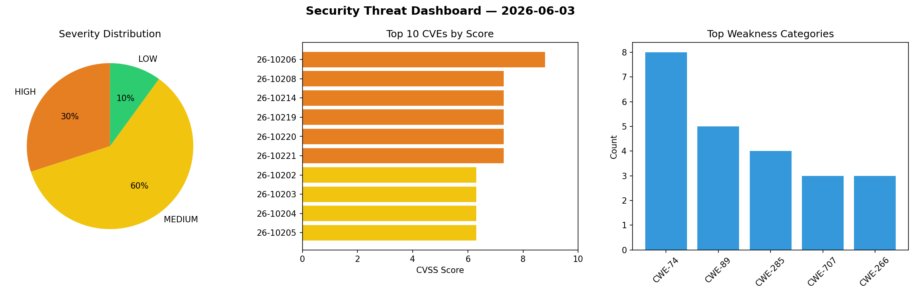
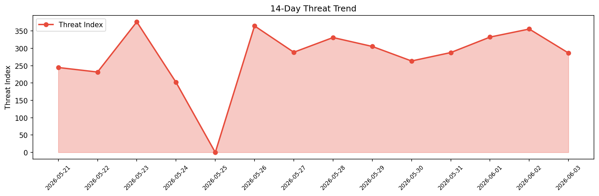

# Security Scan Report — 2026-06-03

**Scan ID:** `dd55844ad6` | **CVEs:** 20 | **Threat Index:** 286.5

## Threat Overview

| Metric | Value |
|--------|-------|
| Threat Index | 286.5 |
| Critical CVEs | 0 |
| HIGH | 6 |
| MEDIUM | 12 |
| LOW | 2 |

## Delta vs Yesterday

| Metric | Today | Yesterday | Change |
|--------|-------|-----------|--------|
| total_cves | 20 | 20 | ➡️ 0.0% |
| threat_index | 286.5 | 355.7 | 📉 -19.5% |
| critical_count | 0 | 0 | ➡️ 0% |

## Top Weakness Categories

| CWE | Count |
|-----|-------|
| CWE-74 | 8 |
| CWE-89 | 5 |
| CWE-285 | 4 |
| CWE-707 | 3 |
| CWE-266 | 3 |

## CVE Details

| CVE ID | Score | Severity | Description |
|--------|-------|----------|-------------|
| CVE-2026-10206 | 8.8 | HIGH | A vulnerability was detected in D-Link DI-8400 up to 16.07.26A1. This affects an... |
| CVE-2026-10208 | 7.3 | HIGH | A flaw has been found in code-projects Online Hospital Management System 1.php. ... |
| CVE-2026-10214 | 7.3 | HIGH | A weakness has been identified in zhayujie chatgpt-on-wechat up to 2.0.8. This i... |
| CVE-2026-10219 | 7.3 | HIGH | A vulnerability was found in nextlevelbuilder GoClaw up to 3.11.3. This impacts ... |
| CVE-2026-10220 | 7.3 | HIGH | A vulnerability was determined in NousResearch hermes-agent up to 2026.4.30. Aff... |
| CVE-2026-10221 | 7.3 | HIGH | A vulnerability was identified in NousResearch hermes-agent up to 0.12.0. Affect... |
| CVE-2026-10202 | 6.3 | MEDIUM | A vulnerability was identified in OFCMS 1.1.3. This issue affects the function Q... |
| CVE-2026-10203 | 6.3 | MEDIUM | A security flaw has been discovered in OFCMS 1.1.3. Impacted is the function Que... |
| CVE-2026-10204 | 6.3 | MEDIUM | A weakness has been identified in OFCMS 1.1.3. The affected element is the funct... |
| CVE-2026-10205 | 6.3 | MEDIUM | A security vulnerability has been detected in Metasoft 美特软件 MetaCRM 6.4.0. The i... |
| CVE-2026-10209 | 6.3 | MEDIUM | A vulnerability has been found in code-projects Online Hospital Management Syste... |
| CVE-2026-10210 | 6.3 | MEDIUM | A vulnerability was found in AstrBotDevs AstrBot 4.23.6. Affected by this vulner... |
| CVE-2026-10211 | 6.3 | MEDIUM | A vulnerability was determined in AstrBotDevs AstrBot 4.23.6. Affected by this i... |
| CVE-2026-10212 | 6.3 | MEDIUM | A vulnerability was identified in AstrBotDevs AstrBot 4.24.2. This affects the f... |
| CVE-2026-10217 | 6.3 | MEDIUM | A flaw has been found in nextlevelbuilder GoClaw up to 3.11.3. The impacted elem... |