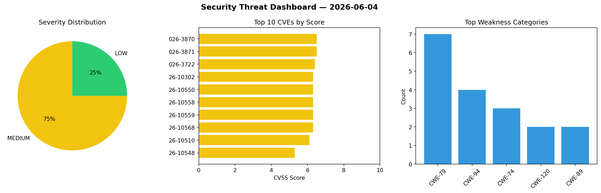
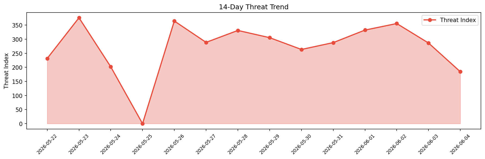

# Security Scan Report — 2026-06-04

**Scan ID:** `b12d7bdda9` | **CVEs:** 20 | **Threat Index:** 184.5

## Threat Overview

| Metric | Value |
|--------|-------|
| Threat Index | 184.5 |
| Critical CVEs | 0 |
| MEDIUM | 15 |
| LOW | 5 |

## Delta vs Yesterday

| Metric | Today | Yesterday | Change |
|--------|-------|-----------|--------|
| total_cves | 20 | 20 | ➡️ 0.0% |
| threat_index | 184.5 | 286.5 | 📉 -35.6% |
| critical_count | 0 | 0 | ➡️ 0% |

## Top Weakness Categories

| CWE | Count |
|-----|-------|
| CWE-79 | 7 |
| CWE-94 | 4 |
| CWE-74 | 3 |
| CWE-120 | 2 |
| CWE-89 | 2 |

## CVE Details

| CVE ID | Score | Severity | Description |
|--------|-------|----------|-------------|
| CVE-2026-3870 | 6.5 | MEDIUM | A buffer overflow vulnerability in the UPnP AddPortMapping() command in Zyxel VM... |
| CVE-2026-3871 | 6.5 | MEDIUM | A buffer overflow vulnerability in the UPnP DeletePortMapping() command in Zyxel... |
| CVE-2026-3722 | 6.4 | MEDIUM | The Auto Image Attributes From Filename With Bulk Updater (Add Alt Text, Image T... |
| CVE-2026-10302 | 6.3 | MEDIUM | A flaw has been found in itsourcecode Fees Management System 1.0. The impacted e... |
| CVE-2026-10550 | 6.3 | MEDIUM | A weakness has been identified in elunez eladmin up to 2.7. This vulnerability a... |
| CVE-2026-10558 | 6.3 | MEDIUM | A vulnerability was detected in SourceCodester Pizzafy Ecommerce System 1.0. Imp... |
| CVE-2026-10559 | 6.3 | MEDIUM | A flaw has been found in SourceCodester Pizzafy Ecommerce System 1.0. The affect... |
| CVE-2026-10568 | 6.3 | MEDIUM | A vulnerability was detected in itsourcecode Fees Management System 1.0. Affecte... |
| CVE-2026-10510 | 6.1 | MEDIUM | Cross-Site Scripting (XSS) in GeniexWebView component in Transsion AI Assistant ... |
| CVE-2026-10548 | 5.3 | MEDIUM | A security flaw has been discovered in NousResearch hermes-agent up to 2026.4.23... |
| CVE-2026-10566 | 5.3 | MEDIUM | A weakness has been identified in FoundationAgents MetaGPT up to 0.8.2. This aff... |
| CVE-2026-10100 | 4.4 | MEDIUM | The Simple Custom Login Page plugin for WordPress is vulnerable to Stored Cross-... |
| CVE-2026-10301 | 4.3 | MEDIUM | A vulnerability was detected in itsourcecode Fees Management System 1.0. The aff... |
| CVE-2026-9048 | 4.3 | MEDIUM | The Slider Revolution plugin for WordPress is vulnerable to Sensitive Informatio... |
| CVE-2026-9050 | 4.3 | MEDIUM | The Slider Revolution plugin for WordPress in versions 6.0.0-6.7.55 and 7.0.0-7.... |