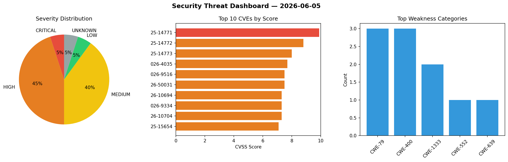
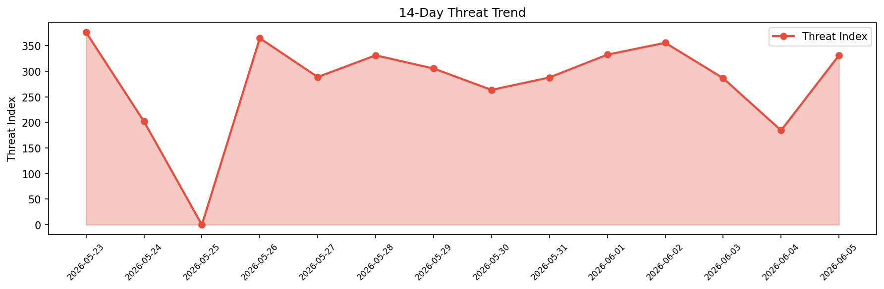

# Security Scan Report — 2026-06-05

**Scan ID:** `e7390d3d39` | **CVEs:** 20 | **Threat Index:** 331.2

## Threat Overview

| Metric | Value |
|--------|-------|
| Threat Index | 331.2 |
| Critical CVEs | 1 |
| CRITICAL | 1 |
| HIGH | 9 |
| MEDIUM | 8 |
| LOW | 1 |
| UNKNOWN | 1 |

## Delta vs Yesterday

| Metric | Today | Yesterday | Change |
|--------|-------|-----------|--------|
| total_cves | 20 | 20 | ➡️ 0.0% |
| threat_index | 331.2 | 184.5 | 📈 79.5% |
| critical_count | 1 | 0 | ➡️ 0% |

## Top Weakness Categories

| CWE | Count |
|-----|-------|
| CWE-79 | 3 |
| CWE-400 | 3 |
| CWE-1333 | 2 |
| CWE-552 | 1 |
| CWE-639 | 1 |

## CVE Details

| CVE ID | Score | Severity | Description |
|--------|-------|----------|-------------|
| CVE-2025-14771 | 9.9 | CRITICAL | Files or directories accessible to external parties vulnerability in ABB T-MAC P... |
| CVE-2025-14772 | 8.8 | HIGH | Authorization bypass through User-Controlled key vulnerability in ABB T-MAC Plus... |
| CVE-2025-14773 | 8.0 | HIGH | Improper neutralization of input during web page generation ('cross-site scripti... |
| CVE-2026-4035 | 7.7 | HIGH | A vulnerability in mlflow/mlflow versions prior to 3.11.0 allows for the resolut... |
| CVE-2026-9516 | 7.5 | HIGH | Cpanel::JSON::XS versions before 4.41 for Perl allow denial of service via UTF-8... |
| CVE-2026-50031 | 7.5 | HIGH | ipmi-oem in FreeIPMI before 1.6.18 has exploitable buffer overflows on response ... |
| CVE-2026-10694 | 7.3 | HIGH | A vulnerability was detected in SourceCodester Online Food Ordering System 2.0. ... |
| CVE-2026-9334 | 7.3 | HIGH | Cpanel::JSON::XS versions before 4.41 for Perl allow type confusion via duplicat... |
| CVE-2026-10704 | 7.3 | HIGH | A vulnerability was detected in SourceCodester Pizzafy E-Commerce System 1.0. Af... |
| CVE-2025-15654 | 7.1 | HIGH | Improper Neutralization of Input During Web Page Generation ('Cross-site Scripti... |
| CVE-2026-10690 | 6.3 | MEDIUM | A vulnerability was identified in wonderwhy-er DesktopCommanderMCP 0.2.37. This ... |
| CVE-2026-10693 | 6.3 | MEDIUM | A security vulnerability has been detected in SourceCodester Online Boat Reserva... |
| CVE-2026-10703 | 6.3 | MEDIUM | A security vulnerability has been detected in EIPStackGroup OpENer up to 2.3.0. ... |
| CVE-2026-5078 | 5.3 | MEDIUM | Impact: The morgan logging middleware's :remote-user token extracts the Basic au... |
| CVE-2026-7421 | 4.4 | MEDIUM | The Passeum Ticketing plugin for WordPress is vulnerable to Stored Cross-Site Sc... |