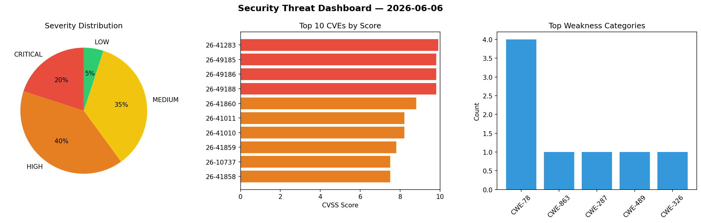
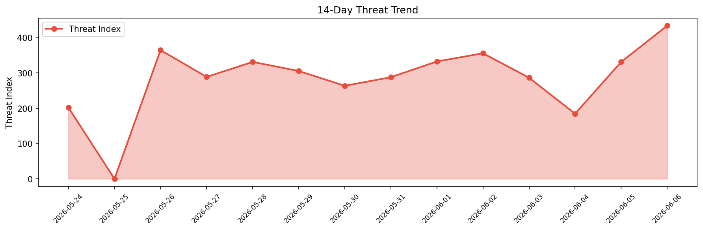

# Security Scan Report — 2026-06-06

**Scan ID:** `2f6a8ccba9` | **CVEs:** 20 | **Threat Index:** 433.9

## Threat Overview

| Metric | Value |
|--------|-------|
| Threat Index | 433.9 |
| Critical CVEs | 4 |
| CRITICAL | 4 |
| HIGH | 8 |
| MEDIUM | 7 |
| LOW | 1 |

## Delta vs Yesterday

| Metric | Today | Yesterday | Change |
|--------|-------|-----------|--------|
| total_cves | 20 | 20 | ➡️ 0.0% |
| threat_index | 433.9 | 331.2 | 📈 31.0% |
| critical_count | 4 | 1 | 📈 300.0% |

## Top Weakness Categories

| CWE | Count |
|-----|-------|
| CWE-78 | 4 |
| CWE-863 | 1 |
| CWE-287 | 1 |
| CWE-489 | 1 |
| CWE-326 | 1 |

## CVE Details

| CVE ID | Score | Severity | Description |
|--------|-------|----------|-------------|
| CVE-2026-41283 | 9.9 | CRITICAL | OpenStack Mistral through 22.0.0 allows Arbitrary Remote Code Execution when the... |
| CVE-2026-49185 | 9.8 | CRITICAL | The FieldX MDM adb messaging topic passes unverified payloads directly into Runt... |
| CVE-2026-49186 | 9.8 | CRITICAL | The local MQTT broker does not enforce topic-level Access Control Lists (ACLs). ... |
| CVE-2026-49188 | 9.8 | CRITICAL | The ai_cmd utility executes with full root permissions. It pipes socket inputs d... |
| CVE-2026-41860 | 8.8 | HIGH | CWE-326 in BOSH allows a local attacker to steal Basic-auth credentials or redir... |
| CVE-2026-41011 | 8.2 | HIGH | PackagePersister.validate_tgz builds "tar -tf #{tgz} 2>&1" where tgz = File.join... |
| CVE-2026-41010 | 8.2 | HIGH | ReleaseJob#unpack builds job_dir = File.join(@release_dir, 'jobs', name) and job... |
| CVE-2026-41859 | 7.8 | HIGH | A network man-in-the-middle between nats-sync and the BOSH director can steal th... |
| CVE-2026-10737 | 7.5 | HIGH | The SP Project & Document Manager plugin for WordPress is vulnerable to unauthor... |
| CVE-2026-41858 | 7.5 | HIGH | Weak Randomness / Insecure Cryptographic Primitive (CWE-338) in Get-RandomPasswo... |
| CVE-2026-8829 | 7.5 | HIGH | HTML::Entities versions before 3.84 for Perl read freed heap memory in _decode_e... |
| CVE-2026-49187 | 7.5 | HIGH | The hard-coded APK resource files never expire, and the shared scepter leads to ... |
| CVE-2026-7764 | 6.8 | MEDIUM | An out-of-bounds read vulnerability in the morse.ko HaLow Wi-Fi kernel driver in... |
| CVE-2026-10805 | 6.7 | MEDIUM | A flaw was found in NetworkManager. This local privilege escalation vulnerabilit... |
| CVE-2026-8722 | 6.5 | MEDIUM | Net::Async::Statsd::Client versions through 0.005 for Perl allow metric injectio... |