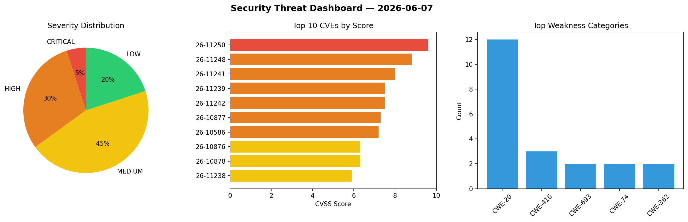
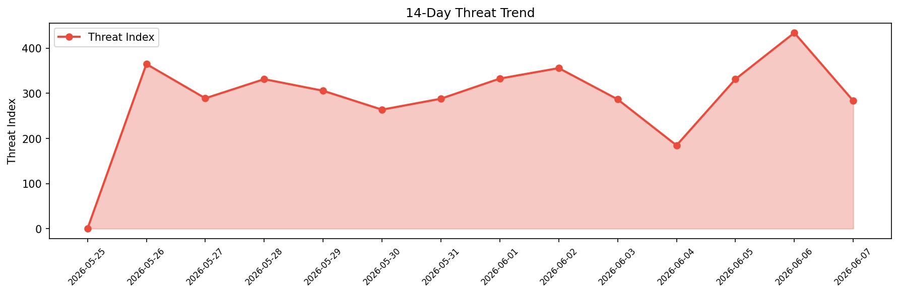

# Security Scan Report — 2026-06-07

**Scan ID:** `45b001145b` | **CVEs:** 20 | **Threat Index:** 283.3

## Threat Overview

| Metric | Value |
|--------|-------|
| Threat Index | 283.3 |
| Critical CVEs | 1 |
| CRITICAL | 1 |
| HIGH | 6 |
| MEDIUM | 9 |
| LOW | 4 |

## Delta vs Yesterday

| Metric | Today | Yesterday | Change |
|--------|-------|-----------|--------|
| total_cves | 20 | 20 | ➡️ 0.0% |
| threat_index | 283.3 | 433.9 | 📉 -34.7% |
| critical_count | 1 | 4 | 📉 -75.0% |

## Top Weakness Categories

| CWE | Count |
|-----|-------|
| CWE-20 | 12 |
| CWE-416 | 3 |
| CWE-693 | 2 |
| CWE-74 | 2 |
| CWE-362 | 2 |

## CVE Details

| CVE ID | Score | Severity | Description |
|--------|-------|----------|-------------|
| CVE-2026-11250 | 9.6 | CRITICAL | Inappropriate implementation in DevTools in Google Chrome prior to 149.0.7827.53... |
| CVE-2026-11248 | 8.8 | HIGH | Inappropriate implementation in Google Lens in Google Chrome prior to 149.0.7827... |
| CVE-2026-11241 | 8.0 | HIGH | Insufficient validation of untrusted input in Cast in Google Chrome prior to 149... |
| CVE-2026-11239 | 7.5 | HIGH | Inappropriate implementation in Extensions in Google Chrome prior to 149.0.7827.... |
| CVE-2026-11242 | 7.5 | HIGH | Insufficient validation of untrusted input in Plugins in Google Chrome prior to ... |
| CVE-2026-10877 | 7.3 | HIGH | A security vulnerability has been detected in SourceCodester Ship Ferry Ticket R... |
| CVE-2026-10586 | 7.2 | HIGH | The Gutenberg Essential Blocks – Page Builder for Gutenberg Blocks & Patterns pl... |
| CVE-2026-10876 | 6.3 | MEDIUM | A weakness has been identified in SourceCodester Ship Ferry Ticket Reservation S... |
| CVE-2026-10878 | 6.3 | MEDIUM | A vulnerability was detected in D-Link DWR-M920 1.1.50/1.1.70. Affected is the f... |
| CVE-2026-11238 | 5.9 | MEDIUM | Inappropriate implementation in DevTools in Google Chrome prior to 149.0.7827.53... |
| CVE-2026-11243 | 5.4 | MEDIUM | Inappropriate implementation in Downloads in Google Chrome prior to 149.0.7827.5... |
| CVE-2026-11246 | 5.3 | MEDIUM | Insufficient validation of untrusted input in IndexedDB in Google Chrome prior t... |
| CVE-2026-11249 | 4.7 | MEDIUM | Use after free in Network in Google Chrome prior to 149.0.7827.53 allowed a remo... |
| CVE-2026-11245 | 4.3 | MEDIUM | Inappropriate implementation in Payments in Google Chrome prior to 149.0.7827.53... |
| CVE-2026-11252 | 4.3 | MEDIUM | Insufficient policy enforcement in Content Settings in Google Chrome prior to 14... |