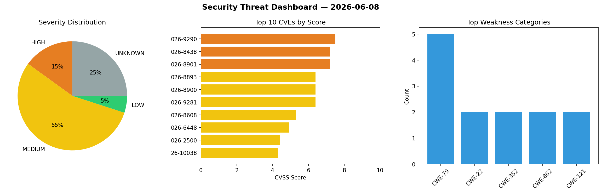
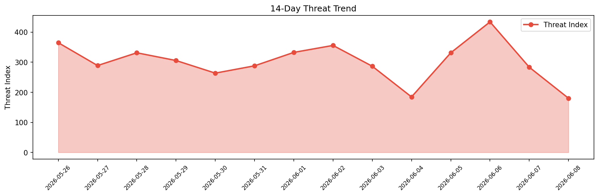

# Security Scan Report — 2026-06-08

**Scan ID:** `6d2c1bac4c` | **CVEs:** 20 | **Threat Index:** 180.1

## Threat Overview

| Metric | Value |
|--------|-------|
| Threat Index | 180.1 |
| Critical CVEs | 0 |
| HIGH | 3 |
| MEDIUM | 11 |
| LOW | 1 |
| UNKNOWN | 5 |

## Delta vs Yesterday

| Metric | Today | Yesterday | Change |
|--------|-------|-----------|--------|
| total_cves | 20 | 20 | ➡️ 0.0% |
| threat_index | 180.1 | 283.3 | 📉 -36.4% |
| critical_count | 0 | 1 | 📉 -100.0% |

## Top Weakness Categories

| CWE | Count |
|-----|-------|
| CWE-79 | 5 |
| CWE-22 | 2 |
| CWE-352 | 2 |
| CWE-862 | 2 |
| CWE-121 | 2 |

## CVE Details

| CVE ID | Score | Severity | Description |
|--------|-------|----------|-------------|
| CVE-2026-9290 | 7.5 | HIGH | The WP User Manager – User Profile Builder & Membership plugin for WordPress is ... |
| CVE-2026-8438 | 7.2 | HIGH | The All-In-One Security (AIOS) – Security and Firewall plugin for WordPress is v... |
| CVE-2026-8901 | 7.2 | HIGH | The Integration for Freshsales – Contact Form 7, WPForms, Elementor, Gravity For... |
| CVE-2026-8893 | 6.4 | MEDIUM | The Express Payment For Stripe plugin for WordPress is vulnerable to Stored Cros... |
| CVE-2026-8900 | 6.4 | MEDIUM | The Simple SEO Slideshow plugin for WordPress is vulnerable to Stored Cross-Site... |
| CVE-2026-9281 | 6.4 | MEDIUM | The Master Addons For Elementor – Widgets, Extensions, Theme Builder, Popup Buil... |
| CVE-2026-8608 | 5.3 | MEDIUM | The Event Monster – Event Management, Events Calendar, Tickets plugin for WordPr... |
| CVE-2026-6448 | 4.9 | MEDIUM | The Quiz and Survey Master (QSM) – Easy Quiz and Survey Maker plugin for WordPre... |
| CVE-2026-2500 | 4.4 | MEDIUM | The Quick Playground plugin for WordPress is vulnerable to Path Traversal in all... |
| CVE-2026-10038 | 4.3 | MEDIUM | The Charitable – Donation Plugin for WordPress – Fundraising with Recurring Dona... |
| CVE-2026-7047 | 4.3 | MEDIUM | The Frontend User Notes plugin for WordPress is vulnerable to Cross-Site Request... |
| CVE-2026-8976 | 4.3 | MEDIUM | The RSS Aggregator by Feedzy – Feed to Post, Autoblogging, News & YouTube Video ... |
| CVE-2026-9719 | 4.3 | MEDIUM | The LatePoint – Calendar Booking Plugin for Appointments and Events plugin for W... |
| CVE-2026-9008 | 4.3 | MEDIUM | The Page-list plugin for WordPress is vulnerable to Missing Authorization in all... |
| CVE-2025-12656 | 3.8 | LOW | The Migration, Backup, Staging – WPvivid Backup & Migration plugin for WordPress... |