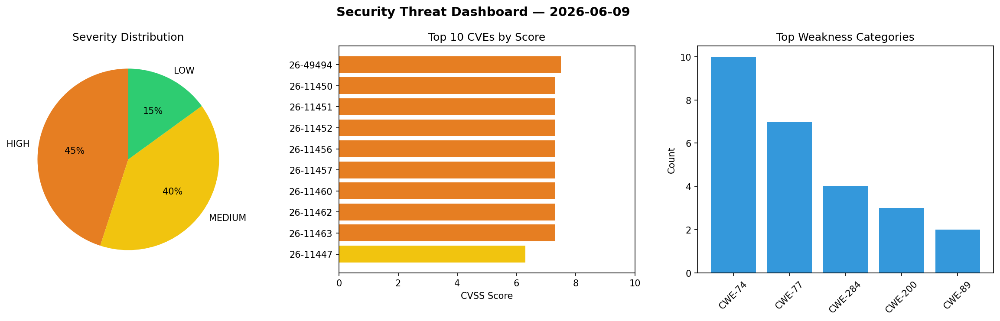
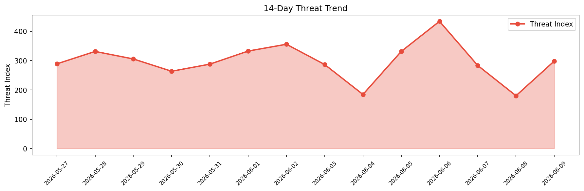

# Security Scan Report — 2026-06-09

**Scan ID:** `e5c7587be9` | **CVEs:** 20 | **Threat Index:** 298.4

## Threat Overview

| Metric | Value |
|--------|-------|
| Threat Index | 298.4 |
| Critical CVEs | 0 |
| HIGH | 9 |
| MEDIUM | 8 |
| LOW | 3 |

## Delta vs Yesterday

| Metric | Today | Yesterday | Change |
|--------|-------|-----------|--------|
| total_cves | 20 | 20 | ➡️ 0.0% |
| threat_index | 298.4 | 180.1 | 📈 65.7% |
| critical_count | 0 | 0 | ➡️ 0% |

## Top Weakness Categories

| CWE | Count |
|-----|-------|
| CWE-74 | 10 |
| CWE-77 | 7 |
| CWE-284 | 4 |
| CWE-200 | 3 |
| CWE-89 | 2 |

## CVE Details

| CVE ID | Score | Severity | Description |
|--------|-------|----------|-------------|
| CVE-2026-49494 | 7.5 | HIGH | Comodo Internet Security's firewall driver Inspect.sys contains an integer under... |
| CVE-2026-11450 | 7.3 | HIGH | A vulnerability was detected in GL.iNet GL-MT3000 4.4.5. This affects the functi... |
| CVE-2026-11451 | 7.3 | HIGH | A flaw has been found in GL.iNet GL-MT3000 4.4.5. This impacts the function snpr... |
| CVE-2026-11452 | 7.3 | HIGH | A vulnerability has been found in GL.iNet GL-MT3000 up to 4.4.5. Affected is the... |
| CVE-2026-11456 | 7.3 | HIGH | A vulnerability was identified in Chanjet CRM 1.0. This affects an unknown part ... |
| CVE-2026-11457 | 7.3 | HIGH | A security flaw has been discovered in erzhongxmu JeeWMS up to 141740afb2ba14d44... |
| CVE-2026-11460 | 7.3 | HIGH | A flaw has been found in Boost Serialization up to 1.91. The impacted element is... |
| CVE-2026-11462 | 7.3 | HIGH | A vulnerability was found in Chengdu Everbrite Network Technology BeikeShop up t... |
| CVE-2026-11463 | 7.3 | HIGH | A vulnerability was determined in USCiLab Cereal up to 1.3.2. Affected is an unk... |
| CVE-2026-11447 | 6.3 | MEDIUM | A security flaw has been discovered in GL.iNet GL-MT3000 up to 4.4.5. Impacted i... |
| CVE-2026-11449 | 6.3 | MEDIUM | A security vulnerability has been detected in GL.iNet GL-MT3000 4.4.5. The impac... |
| CVE-2026-11453 | 6.3 | MEDIUM | A vulnerability was found in Tiobon Employee Self-Service System up to 7.2. Affe... |
| CVE-2026-11461 | 6.3 | MEDIUM | A vulnerability has been found in NousResearch hermes-agent up to 0.12.0. This a... |
| CVE-2026-11466 | 5.4 | MEDIUM | A weakness has been identified in zilliztech deep-searcher up to 0.0.2. This aff... |
| CVE-2026-11458 | 5.3 | MEDIUM | A weakness has been identified in erzhongxmu JeeWMS up to 141740afb2ba14d441c82a... |