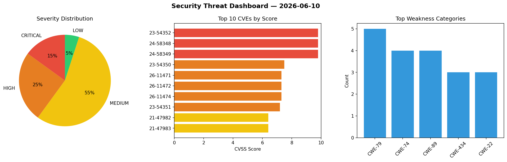
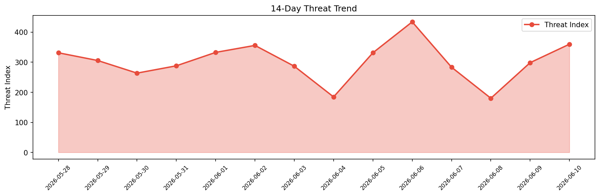

# Security Scan Report — 2026-06-10

**Scan ID:** `1e98a62d22` | **CVEs:** 20 | **Threat Index:** 359.8

## Threat Overview

| Metric | Value |
|--------|-------|
| Threat Index | 359.8 |
| Critical CVEs | 3 |
| CRITICAL | 3 |
| HIGH | 5 |
| MEDIUM | 11 |
| LOW | 1 |

## Delta vs Yesterday

| Metric | Today | Yesterday | Change |
|--------|-------|-----------|--------|
| total_cves | 20 | 20 | ➡️ 0.0% |
| threat_index | 359.8 | 298.4 | 📈 20.6% |
| critical_count | 3 | 0 | ➡️ 0% |

## Top Weakness Categories

| CWE | Count |
|-----|-------|
| CWE-79 | 5 |
| CWE-74 | 4 |
| CWE-89 | 4 |
| CWE-434 | 3 |
| CWE-22 | 3 |

## CVE Details

| CVE ID | Score | Severity | Description |
|--------|-------|----------|-------------|
| CVE-2023-54352 | 9.8 | CRITICAL | WordPress Seotheme contains a remote code execution vulnerability that allows un... |
| CVE-2024-58348 | 9.8 | CRITICAL | WordPress Background Image Cropper version 1.2 contains a remote code execution ... |
| CVE-2024-58349 | 9.8 | CRITICAL | WordPress Theme Travelscape 1.0.3 contains an arbitrary file upload vulnerabilit... |
| CVE-2023-54350 | 7.5 | HIGH | WordPress Augmented-Reality plugin contains a remote code execution vulnerabilit... |
| CVE-2026-11471 | 7.3 | HIGH | A vulnerability was found in SourceCodester Class and Exam Timetabling System 1.... |
| CVE-2026-11472 | 7.3 | HIGH | A vulnerability was determined in SourceCodester Class and Exam Timetabling Syst... |
| CVE-2026-11474 | 7.3 | HIGH | A security flaw has been discovered in Kushan2k student-management-system up to ... |
| CVE-2023-54351 | 7.2 | HIGH | WordPress Sonaar Music Plugin 4.7 contains a stored cross-site scripting vulnera... |
| CVE-2021-47982 | 6.4 | MEDIUM | WordPress Plugin WP-Paginate 2.1.3 contains a stored cross-site scripting vulner... |
| CVE-2021-47983 | 6.4 | MEDIUM | WordPress Plugin Stripe Payments 2.0.39 contains a stored cross-site scripting v... |
| CVE-2021-47984 | 6.4 | MEDIUM | WordPress Plugin WP24 Domain Check 1.6.2 contains a stored cross-site scripting ... |
| CVE-2026-11470 | 6.3 | MEDIUM | A vulnerability has been found in hs-web hsweb-framework up to 5.0.1. The affect... |
| CVE-2026-11473 | 6.3 | MEDIUM | A vulnerability was identified in jflyfox jfinal_cms up to 5.1.0. This impacts t... |
| CVE-2026-11475 | 6.3 | MEDIUM | A weakness has been identified in Kushan2k student-management-system up to f16a4... |
| CVE-2026-11476 | 6.3 | MEDIUM | A security vulnerability has been detected in Kushan2k student-management-system... |