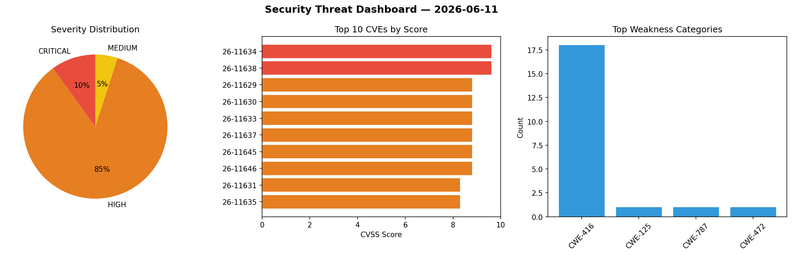
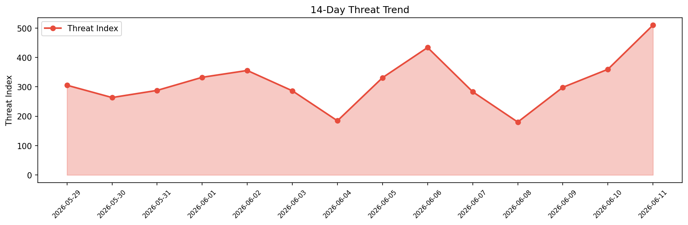

# Security Scan Report — 2026-06-11

**Scan ID:** `02d147114c` | **CVEs:** 20 | **Threat Index:** 510.1

## Threat Overview

| Metric | Value |
|--------|-------|
| Threat Index | 510.1 |
| Critical CVEs | 2 |
| CRITICAL | 2 |
| HIGH | 17 |
| MEDIUM | 1 |

## Delta vs Yesterday

| Metric | Today | Yesterday | Change |
|--------|-------|-----------|--------|
| total_cves | 20 | 20 | ➡️ 0.0% |
| threat_index | 510.1 | 359.8 | 📈 41.8% |
| critical_count | 2 | 3 | 📉 -33.3% |

## Top Weakness Categories

| CWE | Count |
|-----|-------|
| CWE-416 | 18 |
| CWE-125 | 1 |
| CWE-787 | 1 |
| CWE-472 | 1 |

## CVE Details

| CVE ID | Score | Severity | Description |
|--------|-------|----------|-------------|
| CVE-2026-11634 | 9.6 | CRITICAL | Use after free in Gamepad in Google Chrome on Windows prior to 149.0.7827.103 al... |
| CVE-2026-11638 | 9.6 | CRITICAL | Use after free in Printing in Google Chrome prior to 149.0.7827.103 allowed a re... |
| CVE-2026-11629 | 8.8 | HIGH | Use after free in Ozone in Google Chrome prior to 149.0.7827.103 allowed a remot... |
| CVE-2026-11630 | 8.8 | HIGH | Use after free in File Input in Google Chrome prior to 149.0.7827.103 allowed a ... |
| CVE-2026-11633 | 8.8 | HIGH | Use after free in Bluetooth in Google Chrome on Mac prior to 149.0.7827.103 allo... |
| CVE-2026-11637 | 8.8 | HIGH | Use after free in Views in Google Chrome on Mac prior to 149.0.7827.103 allowed ... |
| CVE-2026-11645 | 8.8 | HIGH | Out of bounds read and write in V8 in Google Chrome prior to 149.0.7827.103 allo... |
| CVE-2026-11646 | 8.8 | HIGH | Use after free in ViewTransitions in Google Chrome prior to 149.0.7827.103 allow... |
| CVE-2026-11631 | 8.3 | HIGH | Use after free in Aura in Google Chrome on Windows prior to 149.0.7827.103 allow... |
| CVE-2026-11635 | 8.3 | HIGH | Use after free in Bluetooth in Google Chrome on Mac prior to 149.0.7827.103 allo... |
| CVE-2026-11640 | 8.3 | HIGH | Integer overflow in libyuv in Google Chrome prior to 149.0.7827.103 allowed a re... |
| CVE-2026-11642 | 8.3 | HIGH | Use after free in Web Apps in Google Chrome prior to 149.0.7827.103 allowed a re... |
| CVE-2026-11647 | 8.3 | HIGH | Use after free in Printing in Google Chrome on Android prior to 149.0.7827.103 a... |
| CVE-2026-11643 | 8.1 | HIGH | Use after free in Proxy in Google Chrome prior to 149.0.7827.103 allowed a remot... |
| CVE-2026-11632 | 7.5 | HIGH | Use after free in TabStrip in Google Chrome prior to 149.0.7827.103 allowed a re... |