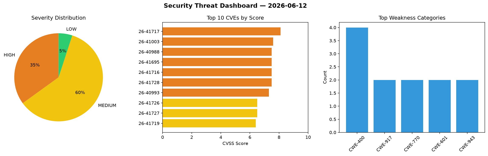
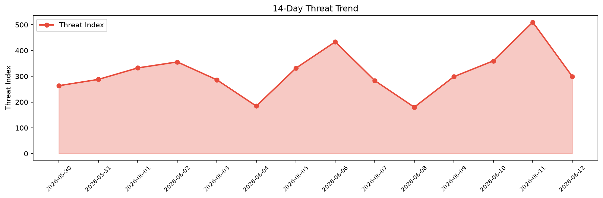

# Security Scan Report — 2026-06-12

**Scan ID:** `ffa5e4c197` | **CVEs:** 20 | **Threat Index:** 299.5

## Threat Overview

| Metric | Value |
|--------|-------|
| Threat Index | 299.5 |
| Critical CVEs | 0 |
| HIGH | 7 |
| MEDIUM | 12 |
| LOW | 1 |

## Delta vs Yesterday

| Metric | Today | Yesterday | Change |
|--------|-------|-----------|--------|
| total_cves | 20 | 20 | ➡️ 0.0% |
| threat_index | 299.5 | 510.1 | 📉 -41.3% |
| critical_count | 0 | 2 | 📉 -100.0% |

## Top Weakness Categories

| CWE | Count |
|-----|-------|
| CWE-400 | 4 |
| CWE-917 | 2 |
| CWE-770 | 2 |
| CWE-601 | 2 |
| CWE-943 | 2 |

## CVE Details

| CVE ID | Score | Severity | Description |
|--------|-------|----------|-------------|
| CVE-2026-41717 | 8.1 | HIGH | Spring Data MongoDB contains a SpEL (Spring Expression Language) expression inje... |
| CVE-2026-41003 | 7.6 | HIGH | An attacker able to influence values in RelyingPartyRegistration may be able to ... |
| CVE-2026-40988 | 7.5 | HIGH | An application using spring-security-saml2-service-provider and the REDIRECT bin... |
| CVE-2026-41695 | 7.5 | HIGH | Spring Data Commons applications may be vulnerable to denial of service through ... |
| CVE-2026-41716 | 7.5 | HIGH | Spring Data's internal property-lookup cache accepts and permanently retains att... |
| CVE-2026-41728 | 7.5 | HIGH | Spring Data REST's JSON Patch (application/json-patch+json) implementation does ... |
| CVE-2026-40993 | 7.3 | HIGH | An attacker with write permissions to the database table managed by JdbcAssertin... |
| CVE-2026-41726 | 6.5 | MEDIUM | When an application opts into DelegatingDeserializer, a producer can grow the co... |
| CVE-2026-41727 | 6.5 | MEDIUM | Spring Kafka's retry topic infrastructure did not sufficiently validate user-con... |
| CVE-2026-41719 | 6.4 | MEDIUM | A SpEL Injection vulnerability exists in the Spring Data KeyValue if unsanitized... |
| CVE-2026-41008 | 6.1 | MEDIUM | Spring Security Authorization Server's authorization endpoint performs insuffici... |
| CVE-2026-41706 | 6.1 | MEDIUM | Spring Security's CookieRequestCache and CookieServerRequestCache store the pre-... |
| CVE-2026-40991 | 5.9 | MEDIUM | When using spring-restdocs-webtestclient or spring-restdocs-restassured to docum... |
| CVE-2026-41696 | 5.9 | MEDIUM | Spring Data MongoDB repository query methods annotated with @Query that use rege... |
| CVE-2026-41711 | 5.9 | MEDIUM | Applications using Spring Data Commons may be vulnerable to a Denial of Service ... |