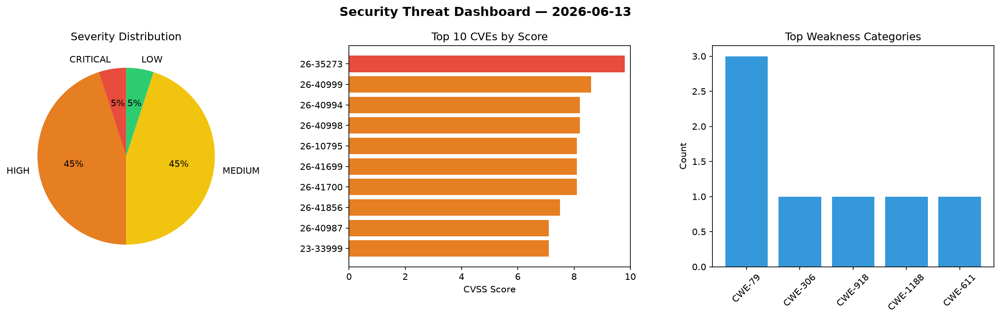
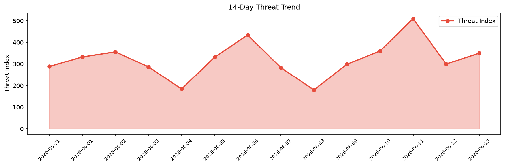

# Security Scan Report — 2026-06-13

**Scan ID:** `56f77a0334` | **CVEs:** 20 | **Threat Index:** 349.9

## Threat Overview

| Metric | Value |
|--------|-------|
| Threat Index | 349.9 |
| Critical CVEs | 1 |
| CRITICAL | 1 |
| HIGH | 9 |
| MEDIUM | 9 |
| LOW | 1 |

## Delta vs Yesterday

| Metric | Today | Yesterday | Change |
|--------|-------|-----------|--------|
| total_cves | 20 | 20 | ➡️ 0.0% |
| threat_index | 349.9 | 299.5 | 📈 16.8% |
| critical_count | 1 | 0 | ➡️ 0% |

## Top Weakness Categories

| CWE | Count |
|-----|-------|
| CWE-79 | 3 |
| CWE-306 | 1 |
| CWE-918 | 1 |
| CWE-1188 | 1 |
| CWE-611 | 1 |

## CVE Details

| CVE ID | Score | Severity | Description |
|--------|-------|----------|-------------|
| CVE-2026-35273 | 9.8 | CRITICAL | Vulnerability in the PeopleSoft Enterprise PeopleTools product of Oracle PeopleS... |
| CVE-2026-40999 | 8.6 | HIGH | When WS-Addressing is used with non-anonymous ReplyTo or FaultTo addresses, Spri... |
| CVE-2026-40994 | 8.2 | HIGH | Wss4jSecurityInterceptor initialized its BSP (WS-I Basic Security Profile) compl... |
| CVE-2026-40998 | 8.2 | HIGH | Jaxp13XPathTemplate evaluated XPath expressions for StreamSource and SAXSource i... |
| CVE-2026-10795 | 8.1 | HIGH | The UpdraftPlus: WP Backup & Migration Plugin plugin for WordPress is vulnerable... |
| CVE-2026-41699 | 8.1 | HIGH | Spring for GraphQL applications are vulnerable to Unsafe Deserialization when pr... |
| CVE-2026-41700 | 8.1 | HIGH | Spring for GraphQL applications that have enabled the WebSocket transport are vu... |
| CVE-2026-41856 | 7.5 | HIGH | The Spring GraphQL annotation detection mechanism for @Controller data fetchers ... |
| CVE-2026-40987 | 7.1 | HIGH | A malicious or compromised FTP/SFTP/SMB server can write arbitrary files anywher... |
| CVE-2023-33999 | 7.1 | HIGH | Improper neutralization of input during web page generation ('cross-site scripti... |
| CVE-2026-40985 | 6.4 | MEDIUM | Applications that configure the WebFlowELExpressionParser are vulnerable to the ... |
| CVE-2026-40995 | 5.4 | MEDIUM | X509AuthenticationProvider could issue a fully authenticated X509AuthenticationT... |
| CVE-2026-40997 | 5.3 | MEDIUM | Several Spring WS integration paths with Spring Security could surface detailed ... |
| CVE-2026-41001 | 5.3 | MEDIUM | Spring Boot's ArtemisEmbeddedConfigurationFactory uses a fixed, static path for ... |
| CVE-2023-40200 | 5.3 | MEDIUM | Authorization bypass through User-Controlled key vulnerability in Essential Plug... |