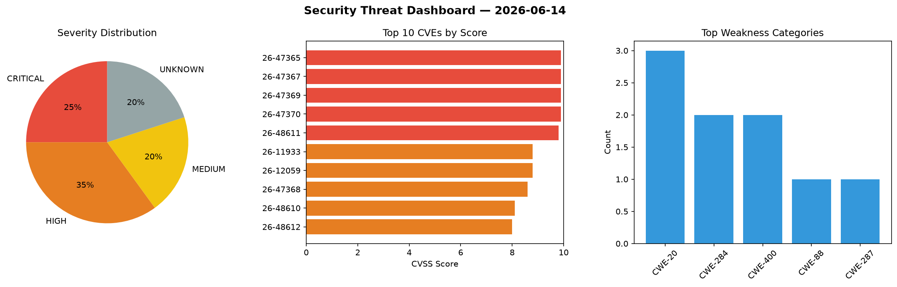
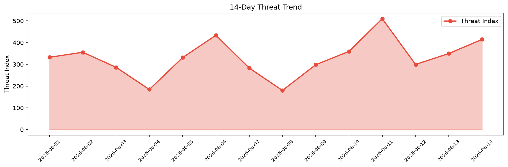

# Security Scan Report — 2026-06-14

**Scan ID:** `e7b308bede` | **CVEs:** 20 | **Threat Index:** 414.8

## Threat Overview

| Metric | Value |
|--------|-------|
| Threat Index | 414.8 |
| Critical CVEs | 5 |
| CRITICAL | 5 |
| HIGH | 7 |
| MEDIUM | 4 |
| UNKNOWN | 4 |

## Delta vs Yesterday

| Metric | Today | Yesterday | Change |
|--------|-------|-----------|--------|
| total_cves | 20 | 20 | ➡️ 0.0% |
| threat_index | 414.8 | 349.9 | 📈 18.5% |
| critical_count | 5 | 1 | 📈 400.0% |

## Top Weakness Categories

| CWE | Count |
|-----|-------|
| CWE-20 | 3 |
| CWE-284 | 2 |
| CWE-400 | 2 |
| CWE-88 | 1 |
| CWE-287 | 1 |

## CVE Details

| CVE ID | Score | Severity | Description |
|--------|-------|----------|-------------|
| CVE-2026-47365 | 9.9 | CRITICAL | Argument injection vulnerability in WordPress Toolkit before 6.11.0 as used in c... |
| CVE-2026-47367 | 9.9 | CRITICAL | A malicious actor with access to the network and low privileges could exploit an... |
| CVE-2026-47369 | 9.9 | CRITICAL | A malicious actor with access to the network and low privileges could exploit an... |
| CVE-2026-47370 | 9.9 | CRITICAL | A malicious actor with access to the network and low privileges could exploit an... |
| CVE-2026-48611 | 9.8 | CRITICAL | Improper authentication checks in the OAuth implementation allow account hijacki... |
| CVE-2026-11933 | 8.8 | HIGH | A use-after-free vulnerability exists in MongoDB Server's server-side JavaScript... |
| CVE-2026-12059 | 8.8 | HIGH | The SSH service of CelloOS developed by Cellopoint has an Improper Access Contro... |
| CVE-2026-47368 | 8.6 | HIGH | A malicious actor with access to the network could exploit a Path Traversal vuln... |
| CVE-2026-48610 | 8.1 | HIGH | Under certain network configurations, a malicious actor with access to network c... |
| CVE-2026-48612 | 8.0 | HIGH | Improper state verification in the OAuth implementation could allow an attacker ... |
| CVE-2026-44892 | 7.5 | HIGH | Netty is a network application framework for development of protocol servers and... |
| CVE-2026-47366 | 7.2 | HIGH | Improper verification of access permissions when modifying permissions through t... |
| CVE-2026-12060 | 6.5 | MEDIUM | Heptabase developed by Hepta Platforms has a Exposed Dangerous Method or Functio... |
| CVE-2026-9125 | 6.4 | MEDIUM | The Presto Player plugin for WordPress is vulnerable to Stored Cross-Site Script... |
| CVE-2026-48613 | 5.9 | MEDIUM | SQL injection vulnerability in phpBB profile field migration due to improper han... |