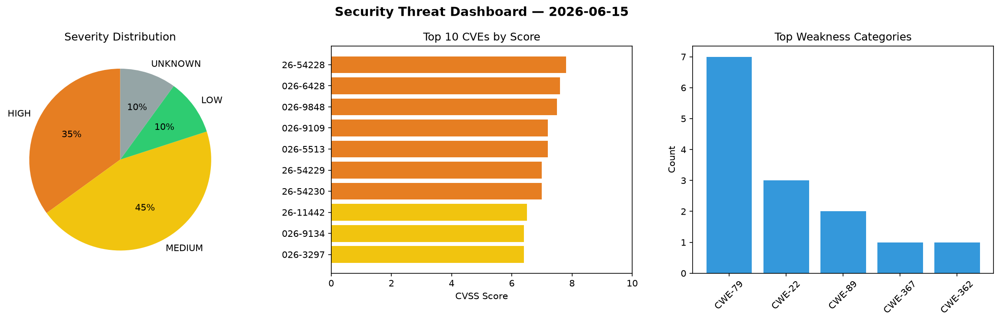
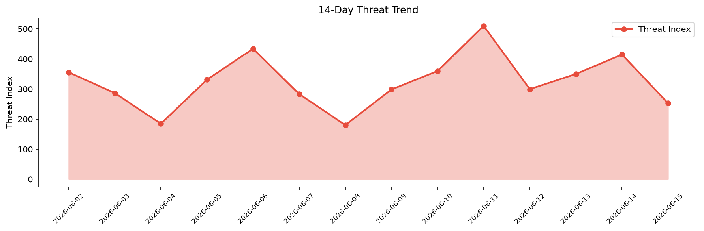

# Security Scan Report — 2026-06-15

**Scan ID:** `821838a7e6` | **CVEs:** 20 | **Threat Index:** 259.4

## Threat Overview

| Metric | Value |
|--------|-------|
| Threat Index | 259.4 |
| Critical CVEs | 0 |
| HIGH | 7 |
| MEDIUM | 9 |
| LOW | 2 |
| UNKNOWN | 2 |

## Delta vs Yesterday

| Metric | Today | Yesterday | Change |
|--------|-------|-----------|--------|
| total_cves | 20 | 20 | ➡️ 0.0% |
| threat_index | 259.4 | 414.8 | 📉 -37.5% |
| critical_count | 0 | 5 | 📉 -100.0% |

## Top Weakness Categories

| CWE | Count |
|-----|-------|
| CWE-79 | 7 |
| CWE-22 | 3 |
| CWE-89 | 2 |
| CWE-367 | 1 |
| CWE-362 | 1 |

## CVE Details

| CVE ID | Score | Severity | Description |
|--------|-------|----------|-------------|
| CVE-2026-54228 | 7.8 | HIGH | A time-of-check time-of-use (TOCTOU) race condition was found in the abrt-dbus D... |
| CVE-2026-6428 | 7.6 | HIGH | SQL Injection in reports/catalogue_out.pl in Koha Community Koha through 22.11.3... |
| CVE-2026-9848 | 7.5 | HIGH | The WP Ticket plugin for WordPress is vulnerable to SQL Injection via the WordPr... |
| CVE-2026-9109 | 7.2 | HIGH | The GPTranslate – Multilingual AI Translation for WordPress: Automatically Trans... |
| CVE-2026-5513 | 7.2 | HIGH | The Online Scheduling and Appointment Booking System – Bookly plugin for WordPre... |
| CVE-2026-54229 | 7.0 | HIGH | A race condition was found in the abrt-dbus D-Bus service's ChownProblemDir meth... |
| CVE-2026-54230 | 7.0 | HIGH | A symlink following vulnerability was found in the ABRT post-create event handle... |
| CVE-2026-11442 | 6.5 | MEDIUM | Allegra exportReport Directory Traversal Information Disclosure Vulnerability. T... |
| CVE-2026-9134 | 6.4 | MEDIUM | The FooGallery plugin for WordPress is vulnerable to Stored Cross-Site Scripting... |
| CVE-2026-3297 | 6.4 | MEDIUM | The Page Builder: Pagelayer – Drag and Drop website builder plugin for WordPress... |
| CVE-2026-9629 | 6.4 | MEDIUM | The Canvas plugin for WordPress is vulnerable to Stored Cross-Site Scripting via... |
| CVE-2026-54231 | 5.5 | MEDIUM | A content injection vulnerability was found in the ABRT post-create event handle... |
| CVE-2026-12089 | 4.9 | MEDIUM | The LWS Optimize – All-in-One Speed Booster & Cache Tools plugin for WordPress i... |
| CVE-2026-11443 | 4.6 | MEDIUM | Allegra downloadAttachment Cross-Site Scripting Authentication Bypass Vulnerabil... |
| CVE-2026-2470 | 4.3 | MEDIUM | The Page Builder: Pagelayer – Drag and Drop website builder plugin for WordPress... |