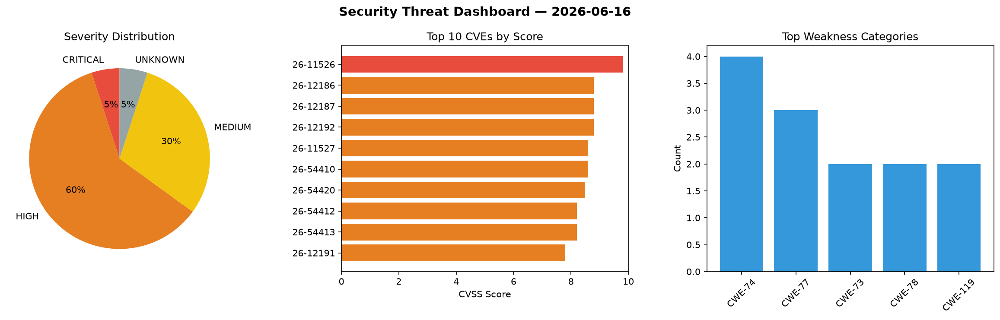
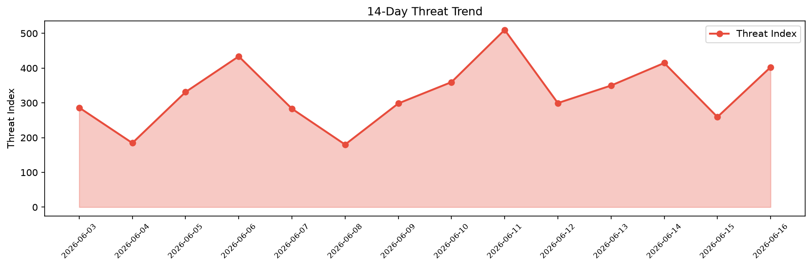

# Security Scan Report — 2026-06-16

**Scan ID:** `6e27ecd479` | **CVEs:** 20 | **Threat Index:** 402.8

## Threat Overview

| Metric | Value |
|--------|-------|
| Threat Index | 402.8 |
| Critical CVEs | 1 |
| CRITICAL | 1 |
| HIGH | 12 |
| MEDIUM | 6 |
| UNKNOWN | 1 |

## Delta vs Yesterday

| Metric | Today | Yesterday | Change |
|--------|-------|-----------|--------|
| total_cves | 20 | 20 | ➡️ 0.0% |
| threat_index | 402.8 | 259.4 | 📈 55.3% |
| critical_count | 1 | 0 | ➡️ 0% |

## Top Weakness Categories

| CWE | Count |
|-----|-------|
| CWE-74 | 4 |
| CWE-77 | 3 |
| CWE-73 | 2 |
| CWE-78 | 2 |
| CWE-119 | 2 |

## CVE Details

| CVE ID | Score | Severity | Description |
|--------|-------|----------|-------------|
| CVE-2026-11526 | 9.8 | CRITICAL | GD versions before 2.86 for Perl allow OS command injection and file overwrite v... |
| CVE-2026-12186 | 8.8 | HIGH | A weakness has been identified in GL.iNet GL-MT3000 up to 4.4.5. Affected is the... |
| CVE-2026-12187 | 8.8 | HIGH | A security vulnerability has been detected in GL.iNet GL-MT3000 up to 4.4.5. Aff... |
| CVE-2026-12192 | 8.8 | HIGH | A vulnerability was determined in GALAYOU Y4 1.0.0. Impacted is an unknown funct... |
| CVE-2026-11527 | 8.6 | HIGH | Config::IniFiles versions before 3.001000 for Perl allow OS command injection an... |
| CVE-2026-54410 | 8.6 | HIGH | nanoMODBUS through v1.23.0 contains an off-by-one buffer overflow in the recv_ms... |
| CVE-2026-54420 | 8.5 | HIGH | LiteSpeed cPanel plugin before 2.4.8 (as distributed in LiteSpeed WHM PlugIn bef... |
| CVE-2026-54412 | 8.2 | HIGH | LiamBindle MQTT-C through version 1.1.6 contains a heap-based out-of-bounds read... |
| CVE-2026-54413 | 8.2 | HIGH | driftregion iso14229 through 0.9.0 contains an integer underflow and downstream ... |
| CVE-2026-12191 | 7.8 | HIGH | A vulnerability was found in Comma AI Openpilot 0.11. This issue affects the fun... |
| CVE-2026-12193 | 7.8 | HIGH | A vulnerability was identified in VS Revo RevoUninstaller 2.5.x/2.6.x. The affec... |
| CVE-2026-12198 | 7.3 | HIGH | A weakness has been identified in Microweber up to 2.0.20. This affects the func... |
| CVE-2026-12197 | 7.2 | HIGH | A security flaw has been discovered in Ruijie EG105G-P 2.340. The impacted eleme... |
| CVE-2026-54421 | 6.8 | MEDIUM | In OpenStack Ironic through 35.0.1, when applying a PATCH to update fields in vo... |
| CVE-2026-12188 | 6.3 | MEDIUM | A vulnerability was detected in Grit42 Grit up to 0.11.0. Affected by this issue... |