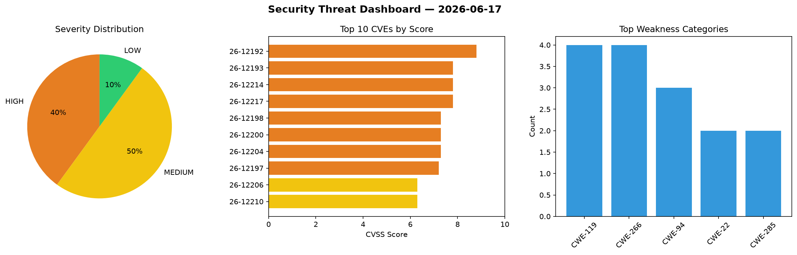
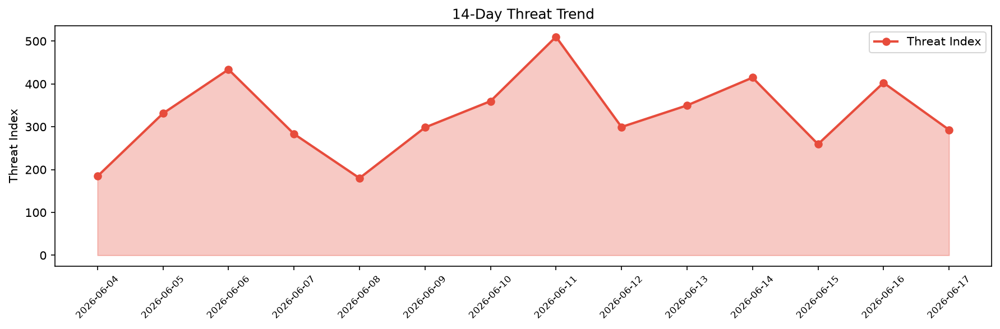

# Security Scan Report — 2026-06-17

**Scan ID:** `9423e1a0d7` | **CVEs:** 20 | **Threat Index:** 293.0

## Threat Overview

| Metric | Value |
|--------|-------|
| Threat Index | 293.0 |
| Critical CVEs | 0 |
| HIGH | 8 |
| MEDIUM | 10 |
| LOW | 2 |

## Delta vs Yesterday

| Metric | Today | Yesterday | Change |
|--------|-------|-----------|--------|
| total_cves | 20 | 20 | ➡️ 0.0% |
| threat_index | 293.0 | 402.8 | 📉 -27.3% |
| critical_count | 0 | 1 | 📉 -100.0% |

## Top Weakness Categories

| CWE | Count |
|-----|-------|
| CWE-119 | 4 |
| CWE-266 | 4 |
| CWE-94 | 3 |
| CWE-22 | 2 |
| CWE-285 | 2 |

## CVE Details

| CVE ID | Score | Severity | Description |
|--------|-------|----------|-------------|
| CVE-2026-12192 | 8.8 | HIGH | A vulnerability was determined in GALAYOU Y4 1.0.0. Impacted is an unknown funct... |
| CVE-2026-12193 | 7.8 | HIGH | A vulnerability was identified in VS Revo RevoUninstaller 2.5.x/2.6.x. The affec... |
| CVE-2026-12214 | 7.8 | HIGH | A security flaw has been discovered in Qihoo 360 Total Security 6.0. This vulner... |
| CVE-2026-12217 | 7.8 | HIGH | A security vulnerability has been detected in DVDFab Virtual Drive 2.0.0.5. Impa... |
| CVE-2026-12198 | 7.3 | HIGH | A weakness has been identified in Microweber up to 2.0.20. This affects the func... |
| CVE-2026-12200 | 7.3 | HIGH | A security vulnerability has been detected in Ritlabs TinyWeb Server up to 1.94 ... |
| CVE-2026-12204 | 7.3 | HIGH | A vulnerability was determined in ShopXO up to 6.7.1. This vulnerability affects... |
| CVE-2026-12197 | 7.2 | HIGH | A security flaw has been discovered in Ruijie EG105G-P 2.340. The impacted eleme... |
| CVE-2026-12206 | 6.3 | MEDIUM | A vulnerability was identified in Grit42 Grit up to 0.11.0. This issue affects t... |
| CVE-2026-12210 | 6.3 | MEDIUM | A vulnerability was detected in universal-tool-calling-protocol python-utcp 1.1.... |
| CVE-2026-12201 | 5.3 | MEDIUM | A flaw has been found in IObit Malware Fighter up to 13.2.0. Affected by this vu... |
| CVE-2026-12203 | 5.3 | MEDIUM | A vulnerability was found in HKUDS AI-Trader up to 74caf996f78dcc0c657df8365c854... |
| CVE-2026-12208 | 5.3 | MEDIUM | A weakness has been identified in jsonata-js jsonata up to 2.2.0. The affected e... |
| CVE-2026-12209 | 5.3 | MEDIUM | A security vulnerability has been detected in RubyLouvre avalon up to 2.2.10. Th... |
| CVE-2026-12216 | 5.3 | MEDIUM | A weakness has been identified in svaarala duktape up to 2.99.99. This issue aff... |